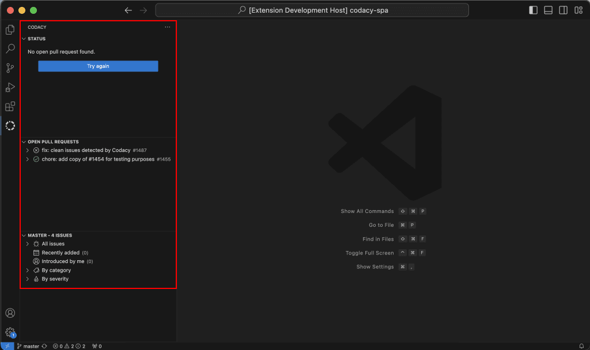

# Integrating Codacy with Visual Studio Code

If you're using Visual Studio Code, integrating Codacy into your setup can enhance your workflow, provide valuable insights into your code, and streamline your code review process without leaving the editor.

To integrate Codacy into your setup, install the Codacy extension for VS Code by following the instructions below. This extension notifies you about the quality of a pull request, highlights problematic code patterns, and displays code quality metrics, all within VS Code.

## Installing the Codacy VS Code extension

!!! note
    Before installing the extension, make sure you meet the following requirements:

    -   You have a [Codacy account](https://www.codacy.com/signup-codacy).
    -   The repository you’re working on has been [added to Codacy Cloud](../organizations/managing-repositories.md#adding-a-repository) and analyzed.
    -   You have at least [Repository Read permissions](../organizations/roles-and-permissions-for-organizations.md) for the repository you’re working on.

You can install the extension from the [Visual Studio Marketplace](https://marketplace.visualstudio.com/items?itemName=codacy-app.codacy) or through the [Extensions view](https://code.visualstudio.com/docs/editor/extension-marketplace#_browse-for-extensions) in Visual Studio Code. Alternatively, you can [download the latest release as a VSIX package](https://github.com/codacy/codacy-vscode-extension/releases) and install it manually.

## Fetching pull request quality and coverage data from Codacy

1.  Open the repository directory in VS Code. 

    !!! note
        Make sure that you’ve [added the repository to Codacy](../organizations/managing-repositories.md#adding-a-repository).

1.  Open the main view by clicking the **Codacy logo** in the status bar or the **Codacy tab** in the activity bar.

    

1.  If you’re not signed in, click the **Sign In** button to authorize VS Code on Codacy.

1.  Check out the relevant branch.

    !!! note
        The branch must match an open pull request analyzed by Codacy.

After completing these steps, Codacy displays any found problems for the pull request in the main view and in VS Code's Problems tab.

## Reviewing found problems

To review all found problems, open the main view by clicking the **Codacy logo** in the status bar or the **Codacy tab** in the activity bar.

The main view displays the following metrics for the pull request:

-   The **Quality status** of the pull request, either up to standards or not up to standards, based on the repository’s [Quality gates](../repositories-configure/adjusting-quality-gates.md).

-   Any **Quality issues** introduced or fixed by the pull request. These are the same issues you find in the [Quality Issues tabs](../repositories/pull-requests.md#issues-tabs) in the Codacy app.

    !!! tip
        -   The number immediately next to each file name is the total number of issues in that file.

        -   The number farther to the right of each file name is the number of issues with severity Medium or higher in that file. The file is also highlighted in yellow if there are any such issues.

-   The **diff coverage and coverage variation** introduced by the pull request. These are the same values you find in the [Pull request coverage overview](../repositories-coverage/pull-requests.md#coverage-overview) panel in the Codacy app.

    !!! tip
        The percentage next to each file name is the coverage variation for that file.

-   Sequences of **duplicate code** (clones). These are the same ones you find in the [Quality Duplication tabs](../repositories/pull-requests.md#duplication-tabs) in the Codacy app. 

-   Variations in **code complexity**.

## Navigating to found issues

To navigate to found issues:

1.  Open the **Problems tab** (use `Ctrl+Shift+M` on Windows/Linux or `Cmd+Shift+M` on macOS)

1.  Click the name of the problem you wish to review.

    Line-based navigation is currently only supported for Quality issues.
    
    

1.  Hover over a highlighted issue in the code editor to view more details and available quick fixes.

    For a list of tools that support quick fixes, see [Supported languages and tools](./supported-languages-and-tools.md#supported-languages-and-tools)

## Refreshing pull request data

The Codacy extension refreshes the pull request data every time you push new changes to the Git provider, after the analysis is complete. The analysis usually takes less than 5 minutes.

To refresh the pull request data manually, click the Refresh Pull Request button in the main view.

## Troubleshooting

### Could not find repository

If you encounter this error, confirm that the repository has been [added to Codacy Cloud](../organizations/managing-repositories.md#adding-a-repository) and that you have at least [Repository Read permissions](../organizations/roles-and-permissions-for-organizations.md) for the repository.
