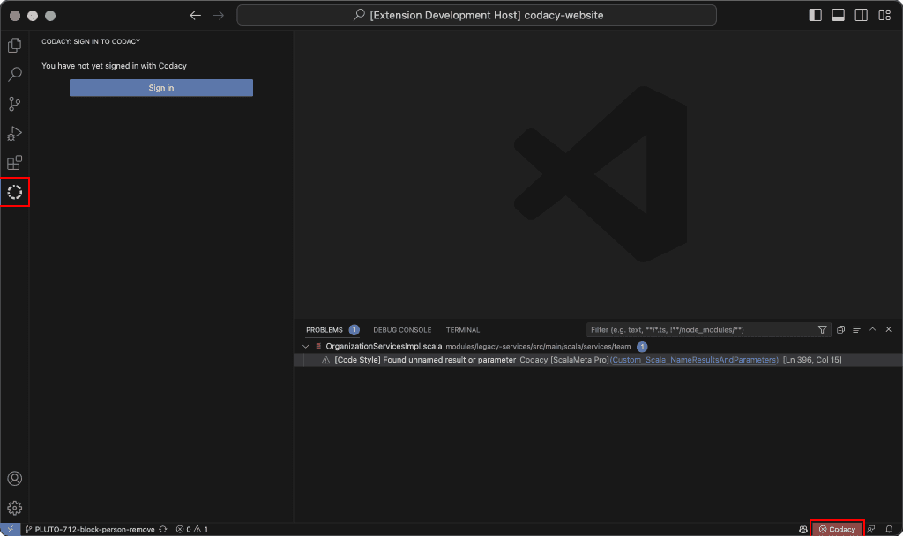

# Integrating Codacy with Visual Studio Code

<!-- TODO ALA-697

## Content
x There is a new Open Pull Requests tab, listing, for each PR:
    x Who opened the PR
    x Source and target branches of the PR
    x Same metrics as the open PR
        x Except the quality status, which appears on hover and uses a symbol to clarify
        x The symbol also displays if it’s analyzing
            - [CONFIRM] Just the symbol changes to signal this
- [CONFIRM] Confirm that only analyzed PRs are listed.
x Each open pull request lets the user:
    x Check out the associated branch
        x By clicking an arrow that appears on click/hover
        x By using a contextual right-click menu
x If switching to an analyzed branch with no open pull request, the extension shows issues for that branch
- For a full list of Codacy commands, Cmd + Shift + P

## Structure
- Refactor page IA to follow concept-task-reference
- Review titles of the section "The main view" and subsections
- Remove mention of the Codacy status bar icon.
--> 

The [Codacy Visual Studio Code extension](https://github.com/codacy/codacy-vscode-extension) is an open-source project that enables developers to review directly in VS Code the result of Codacy analysis for the pull requests they’re working on.

Use this extension to get the full list of problems found by Codacy for a pull request and navigate to any Quality issue that you want to review and fix.

!!! info "To use this extension you need a [Codacy account](https://www.codacy.com/signup-codacy)"

## Installing the Codacy VS Code extension

1.  Make sure that the repository you’re working on is analyzed by Codacy and that you have at least [Repository Read permissions](../organizations/roles-and-permissions-for-organizations.md).

    !!! tip
        If this is your first time using Codacy, see [how to add and analyze your first repository](./codacy-quickstart.md#adding-your-first-repository).

1.  Install the extension from the [Visual Studio Marketplace](https://marketplace.visualstudio.com/items?itemName=codacy-app.codacy) or through the [Extensions view in VS Code](https://code.visualstudio.com/docs/editor/extension-marketplace#_browse-for-extensions).

    Alternatively, you can install it manually by [downloading the latest release as a VSIX package](https://github.com/codacy/codacy-vscode-extension/releases).

## Getting pull request quality and coverage data

To see Codacy quality and coverage data for a pull request, follow these steps:

1.  Open the repository directory in VS Code.

    !!! note
        If the repository isn't on Codacy yet, [add it to Codacy](../organizations/managing-repositories.md#adding-a-repository) first.

1.  Open the main view by clicking the **Codacy logo** in the activity bar or the **Codacy tab** in the status bar.<!-- TODO ALA-697: Confirm that the status bar icon is still there. -->

    

1.  If you’re not signed in, click the **Sign in** button to authorize VS Code on Codacy.

1.  Checkout the pull request of interest, either manually or from the **Open Pull Requests** tab, by clicking the arrow button or using the contextual right-click menu.

After completing these steps, the main view shows the result of the latest Codacy analysis for the pull request. The VS Code Problems tab lists the Quality issues found.

## The main view

The main view displays the information about the code quality changes introduced by the pull request you're working on. It has three tabs: **Status**, **Open Pull Requests tab**, and **Settings**.

### Status tab

The pull request **Status** tab displays the following information for the currently checked out pull request:

-   The **Quality status** of the pull request, either up to standards or not up to standards, based on the [Quality gates](../repositories-configure/adjusting-quality-gates.md) set for the repository.

-   Any **Quality issues** introduced or fixed by the pull request. These are the same issues you find in the [Quality Issues tabs](../repositories/pull-requests.md#issues-tabs) in the Codacy app and are also visible in VS Code's Problems tab.

    The number next to each file name is the total number of Quality issues that the pull request adds to or removes from that file. The number farther to the right is the number of new Medium or Critical Quality issues. If there are any such issues, the file name is also highlighted in yellow (Medium) or red (Critical).

    

-   The **diff coverage and coverage variation** introduced by the pull request. These are the same values you find in the [Pull request coverage overview](../repositories-coverage/pull-requests.md#coverage-overview) panel in the Codacy app.

    The percentage next to each file name is the coverage variation for that file.

-   Sequences of **duplicate code** (clones) introduced by the pull request. These are the same ones you find in the [Quality Duplication tabs](../repositories/pull-requests.md#duplication-tabs) in the Codacy app.

-   Variations in **code complexity** introduced by the pull request.

### Open pull requests tab

The **Open Pull Requests** tab lists all open pull requests for the repository, including the following information for each pull request:

-   The **Quality status** of the pull request, either up to standards or not up to standards, based on the [Quality gates](../repositories-configure/adjusting-quality-gates.md) set for the repository, which is visible on hover.

-   The author of the pull request.

-   The source and target branches of the pull request.

-   Any **Quality issues** introduced or fixed by the pull request. These are the same issues you find in the [Quality Issues tabs](../repositories/pull-requests.md#issues-tabs) in the Codacy app.

-   Sequences of **duplicate code** (clones) introduced by the pull request. These are the same ones you find in the [Quality Duplication tabs](../repositories/pull-requests.md#duplication-tabs) in the Codacy app.

-   Variations in **code complexity** introduced by the pull request.

### Analyzed branch tab

If you switch to an analyzed branch that doesn't have an open pull request, such as the `main` or `master` branch, the **Analyzed Branch** tab appears and shows an overview of the Quality issues found in the branch, grouped by recently added, introduced by the current user, issue category, and issue severity.

## Reviewing pull request issues

In the Problems tab, Codacy displays the same Quality issues you find in the [**Status tab**](#status-tab) and lets you navigate to the exact line of code where the issue was found.

!!! note
    Code coverage, duplicates, and complexity aren't currently shown in the Problems tab.

To review Quality issues:

1.  Open the **Problems tab** (use `Ctrl+Shift+M` on Windows/Linux or `Cmd+Shift+M` on macOS).

1.  Click the name of the issue you want to review.

    

1.  Hover over a highlighted issue in the code editor to view available actions and suggested quick fixes (if available).

    For a list of tools that support quick fixes, see [Supported languages and tools](./supported-languages-and-tools.md#supported-languages-and-tools).

1.  Once you've addressed the problems in your code, push your changes to the Git provider so that Codacy analyzes the updated code.

When the analysis is complete, the Codacy extension automatically refreshes the pull request analysis result. You can also refresh the pull request data manually by clicking the Refresh Pull Request button in the main view.

## See also

-   [Troubleshooting the Codacy VS Code extension](https://github.com/codacy/codacy-vscode-extension#troubleshooting)
