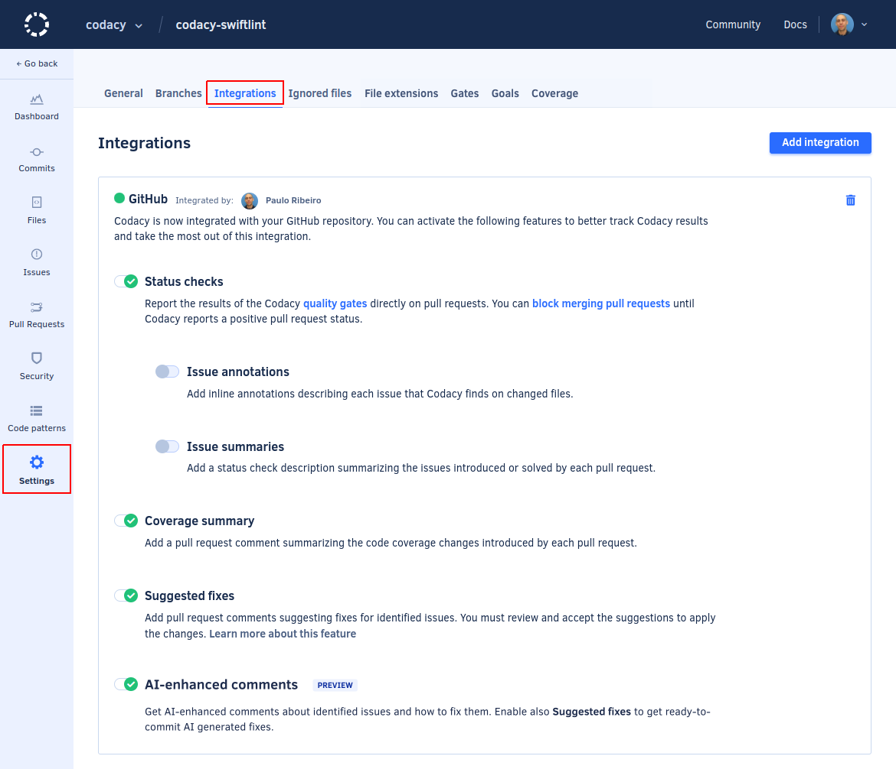

# Integrating Codacy with your Git workflow

<!--TODO Edit the intro, merging the available info-->
Depending on factors such as the current code quality of your repository and the maturity of your team practices, consider the balance between implementing stricter quality gates and the possibility of delaying or blocking the development progress.

Set up your repository so that Codacy reports the results of the analysis directly on your pull requests as status checks.

To integrate Codacy with your Git workflow, follow these steps:

1.  [Configuring the quality gate rules](#configuring-gate)
1.  [Activating the Git provider integration](#git-provider-integration)
1.  [Blocking merging pull requests](#blocking-pull-requests)

## 1. Configuring the quality gate rules {: id="configuring-gate"}

[Review and adjust the quality settings](../../repositories-configure/adjusting-quality-settings.md) of your repository to decide which pull requests should fail the Codacy quality gate.

!!! tip
    The default values of the quality gate rules are designed to help maintain the current code quality of your repository. In particular, the default value for the coverage rule might be demanding.

    Because of this, Codacy generally recommends that on a first stage you configure rules that focus on stopping new critical issues from entering your code base, such as:

    -   High severity issues
    -   Security issues
    -   Considerable drops in code coverage

!!! important
    **If you want to use code coverage** to block merging pull requests that don't meet your standards, make sure that you enable the rule **Diff coverage is under** or **Coverage variation is under**. This is required for Codacy to report the coverage status directly on your pull requests.

## 2. Enabling the Codacy pull request status checks {: id="enabling-status-checks"}

To do this, follow the instructions for [GitHub](../../repositories-configure/integrations/github-integration.md#enabling), [GitLab](../../repositories-configure/integrations/gitlab-integration.md#enabling), or [Bitbucket](../../repositories-configure/integrations/bitbucket-integration.md#enabling) depending on your Git provider, and make sure that you:

1.  Enable the Git provider integration
1.  Enable the option **Status checks** (GitHub) or **Pull request status** (GitLab and Bitbucket)

## 3. Configuring your Git provider to block merging pull requests {: id="configuring-git-provider"}

<!--TODO Add discussion about when it's time for customers to actually block merging pull requests-->
!!! important
    At this stage we recommend that you:

    -   Validate that Codacy is reporting the intended status on your pull requests
    -   Double check you repository's [tool and code pattern settings](../../repositories-configure/configuring-code-patterns.md) and [quality gate settings](../../repositories-configure/adjusting-quality-settings.md)

    This is important to eliminate any false positives that could inadvertently block the work of your team.

Finally, follow the instructions from your Git provider to block merging pull requests if they don't pass the Codacy status check:

-   **GitHub:** [Set Codacy as a required status check](https://docs.github.com/en/repositories/configuring-branches-and-merges-in-your-repository/defining-the-mergeability-of-pull-requests/managing-a-branch-protection-rule)
-   **GitLab:** [Only allow merge requests to be merged if the pipeline succeeds](https://docs.gitlab.com/ee/user/project/merge_requests/merge_when_pipeline_succeeds.html#only-allow-merge-requests-to-be-merged-if-the-pipeline-succeeds)
-   **Bitbucket:** [configure Bitbucket to prevent a merge with unresolved merge checks](https://support.atlassian.com/bitbucket-cloud/docs/suggest-or-require-checks-before-a-merge/)

## Next steps

**Congratulations!**  🎉 You've successfully integrated and set up your first repository.
