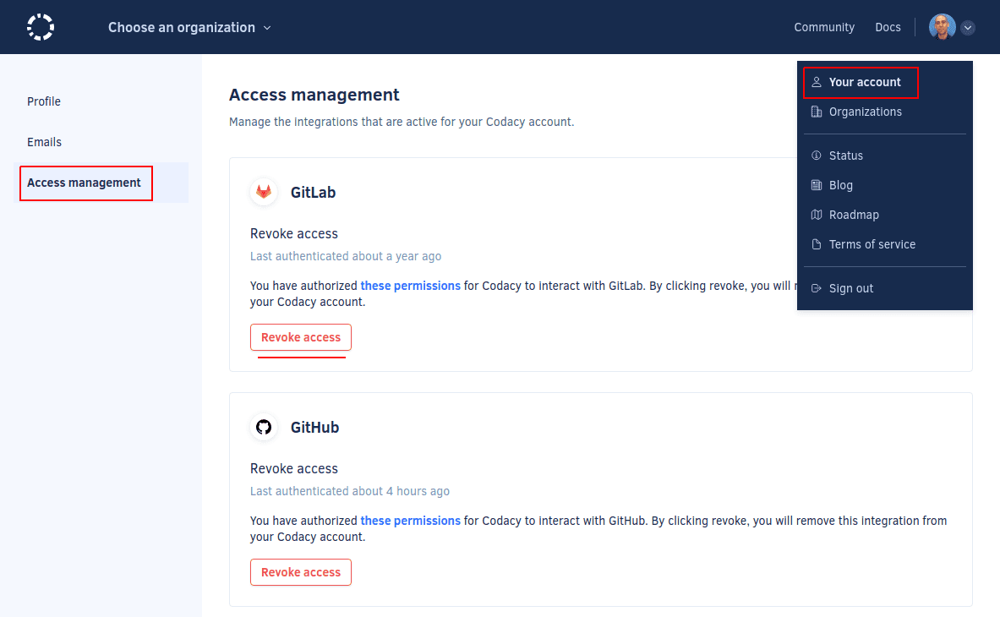

# Which permissions does Codacy need from my account?

Codacy Cloud uses [OAuth](https://oauth.net/) to handle logins and supports the following providers:

-   [GitHub Cloud](#github-cloud)
-   [GitLab Cloud](#gitlab-cloud)
-   [Bitbucket Cloud](#bitbucket-cloud)
-   [Google Sign-In](#google-sign-in)

Codacy requests only the necessary permissions from your Git provider to analyze your code and [keeps your information secure](https://security.codacy.com/). See the sections below for the detailed list of permissions that Codacy asks for depending on the provider.

## GitHub Cloud

If you log in with GitHub, Codacy requires the following [app permissions](https://developer.github.com/v3/apps/permissions/):

<table>
  <colgroup>
    <col width="20%"/>
    <col width="20%"/>
    <cel width="60%"/>
  </colgroup>
  <thead>
    <tr>
      <th>Scope</th>
      <th>Permissions</th>
      <th>Description</th>
    </tr>
  </thead>
  <tbody>
    <tr>
      <td colspan="3"><strong>Repository permissions:</strong></td>
    <tr>
      <td>Checks</td>
      <td>Read & Write</td>
      <td>Codacy creates and updates check runs with the results of code analysis.</td>
    </tr>
    <tr>
      <td>Issues</td>
      <td>Read & Write</td>
      <td>Codacy can create GitHub issues from issues found during code analysis.</td>
    </tr>
    <tr>
      <td>Metadata</td>
      <td>Read Only</td>
      <td>Codacy retrieves repository metadata, such as name, languages, collaborators and commit information.</td>
    </tr>
    <tr>
      <td>Pull requests</td>
      <td>Read & Write</td>
      <td>Codacy retrieves pull request information to display on its side. Codacy might also create comments and suggestions on the pull request, according to the results of code analysis.</td>
    </tr>
    <tr>
      <td>Webhooks</td>
      <td>Read & Write</td>
      <td>Codacy creates webhooks for code pushes and pull request events (created, merged, etc.). These events might trigger code analysis.</td>
    </tr>
    <tr>
      <td>Commit statuses</td>
      <td>Read & Write</td>
      <td>Codacy sets the status of commits according to the result of code analysis.</td>
    </tr>
    <tr>
      <td>Administration</td>
      <td>Read & Write</td>
      <td><a href="#why-does-codacy-ask-for-permission-to-create-ssh-keys">Codacy creates an SSH key</a> on the repository to allow cloning and integrating with your repository.</td>
    </tr>
    <tr>
      <td colspan="3"><strong>Organization permissions:</strong></td>
    </tr>
    <tr>
      <td>Webhooks</td>
      <td>Read & Write</td>
      <td>Codacy creates webhooks for organization and repository events (creation, deletion, member added, etc.) to enable <a href="../../organizations/what-are-synced-organizations/">synced organizations</a>.</td>
    </tr>
    <tr>
      <td>Members</td>
      <td>Read Only</td>
      <td>Codacy retrieves information about organization members and teams to enforce permissions, enable synced organizations and user management.</td>
    </tr>
    <tr>
      <td colspan="3">
<strong>User permissions:</strong>

                      
These permissions are granted on an individual user basis as part of the user authorization flow. They will be also be displayed during account installation for transparency.
</td>
    </tr>
    <tr>
      <td>Email addresses</td>
      <td>Read Only</td>
      <td>Codacy retrieves the user's email addresses to enforce which commits are eligible for analysis.</td>
    </tr>
    <tr>
      <td>Git SSH keys</td>
      <td>Read & Write</td>
      <td><a href="#why-does-codacy-ask-for-permission-to-create-ssh-keys">Codacy creates an SSH key</a> on the repository to allow cloning and integrating with your repository.</td>
    </tr>
  </tbody>
</table>

## GitLab Cloud

If you sign up with GitLab Cloud, Codacy requires the following [permissions/scopes](https://docs.gitlab.com/ee/integration/oauth_provider.html#authorized-applications):

<table>
  <colgroup>
    <col width="25%"/>
    <col width="75%"/>
  </colgroup>
  <thead>
    <tr>
      <th>Scope</th>
      <th>Description</th>
    </tr>
  </thead>
  <tbody>
    <tr>
      <td><code>api</code></td>
      <td>Codacy uses GitLab's API to read and update pull requests, create webhooks for code push events, list commits, repositories, groups, members and permissions.</td>
    </tr>
    <tr>
      <td><code>read_user</code></td>
      <td>Codacy retrieves the user's email addresses to enforce which commits are eligible for analysis.</td>
    </tr>
    <tr>
      <td><code>read_repository</code></td>
      <td>Codacy retrieves repository metadata, such as name, languages and collaborators.</td>
    </tr>
    <tr>
      <td><code>openid</code></td>
      <td>Codacy uses this permission for authentication using <a href="https://docs.gitlab.com/ee/integration/openid_connect_provider.html#shared-information">OpenID Connect</a>.</td>
    </tr>
  </tbody>
</table>

## Bitbucket Cloud

If you log in with Bitbucket, Codacy requires the following [permissions/scopes](https://developer.atlassian.com/cloud/bitbucket/bitbucket-cloud-rest-api-scopes/):

<table>
  <colgroup>
    <col width="25%"/>
    <col width="75%"/>
  </colgroup>
  <thead>
    <tr>
      <th>Scope and permissions</th>
      <th>Description</th>
    </tr>
  </thead>
  <tbody>
    <tr>
      <td><code>account:write</code></td>
      <td>Codacy retrieves the user's email addresses to enforce which commits are eligible for analysis. Furthermore, <a href="#why-does-codacy-ask-for-permission-to-create-ssh-keys">Codacy creates an SSH key</a> on the repository to allow cloning and integrating with your repository.</td>
    </tr>
    <tr>
      <td><code>repository:admin</code></td>
      <td>Codacy retrieves repository metadata, such as name, languages and collaborators, and commit information. <a href="#why-does-codacy-ask-for-permission-to-create-ssh-keys">Codacy creates an SSH key</a> on the repository to allow cloning and integrating with your repository (see box above).</td>
    </tr>
    <tr>
      <td><code>pullrequest:write</code></td>
      <td>Codacy retrieves pull request information to display on its side. Codacy might also create comments on the pull request, according to the results of code analysis.</td>
    </tr>
    <tr>
      <td><code>issue:write</code></td>
      <td>Codacy can create Bitbucket issues from issues found during code analysis.</td>
    </tr>
    <tr>
      <td><code>webhook</code></td>
      <td>Codacy creates webhooks for code pushes and pull request events (created, merged, etc.). These events might trigger code analysis. Codacy also creates repository webhooks to enable <a href="../../organizations/what-are-synced-organizations/">synced organizations</a>.</td>
    </tr>
    <tr>
      <td><code>team</code></td>
      <td>Codacy uses your group/team membership information to enforce permissions.</td>
    </tr>
    <tr>
      <td></td>
      <td>Read your workspace's project settings and read repositories contained within your workspace's projects.</td>
    </tr>
  </tbody>
</table>

## Google Sign-In

If you log in with Google, Codacy requires the `email` [scope](https://developers.google.com/identity/protocols/oauth2/scopes#google-sign-in).

## Revoking access to integrations

To revoke the access from Codacy to one or more of the OAuth providers:

1.  Click on your avatar on the top right-hand corner and select **Your Account**, tab **Access Management**.
2.  The **Access Management** page lists all current integrations with Git providers or Google that you used to sign in or log in to Codacy. To revoke access to an integration, click the button **Revoke access** for the intended integration.

    

3.  To ensure that the integration is removed not only on Codacy but also on the integration side, we recommend that you follow the instructions on how to revoke the Codacy OAuth application on your provider:

    -   [GitHub Cloud](https://help.github.com/en/github/authenticating-to-github/reviewing-your-authorized-integrations)
    -   [GitLab Cloud](https://docs.gitlab.com/ee/integration/oauth_provider.html#authorized-applications)
    -   [Bitbucket Cloud](https://support.atlassian.com/bitbucket-cloud/docs/bitbucket-cloud-apps-overview/#OAuth-consumer-permissions)
    -   [Google Sign-in](https://support.google.com/accounts/answer/3466521#remove-access)

After revoking an integration, Codacy will no longer be able to access or manipulate resources that require API calls, such as detecting new pull requests or adding comments to pull requests. However, Codacy will still be able to perform operations that only require using the Git protocol either via SSH or HTTPS, such as detecting new commits and calculating diffs. To remove your repositories from Codacy and stop the analysis you must [delete them from your Codacy account](../repositories-configure/removing-your-repository.md).

If you need to use an integration that you have previously revoked, log in again to Codacy with that integration so that Codacy can request the required permissions from the provider.

## Why does Codacy ask for permission to create SSH keys?

Codacy asks for permission to create SSH keys because it needs to create an SSH key in your account in the following situations:

-   If your repository uses submodules, so that Codacy can clone the repositories for each submodule
-   If Codacy fails to integrate with a repository using the repository key, so that Codacy can continue to perform analysis

**Codacy only adds read-only SSH keys to be able to clone repositories** and won't have access to any of your existing SSH keys. You have full control over which organizations and repositories Codacy is authorized to access, and you can also [revoke the keys created by Codacy at any time](https://docs.github.com/en/github/authenticating-to-github/reviewing-your-ssh-keys). Codacy doesn't change the contents or member privileges of any repository you authorize it to analyze.

We understand the desire for security and privacy and find that the SSH protocol is preferable to HTTPS as it separates Codacy's access rights from the one of the users.
