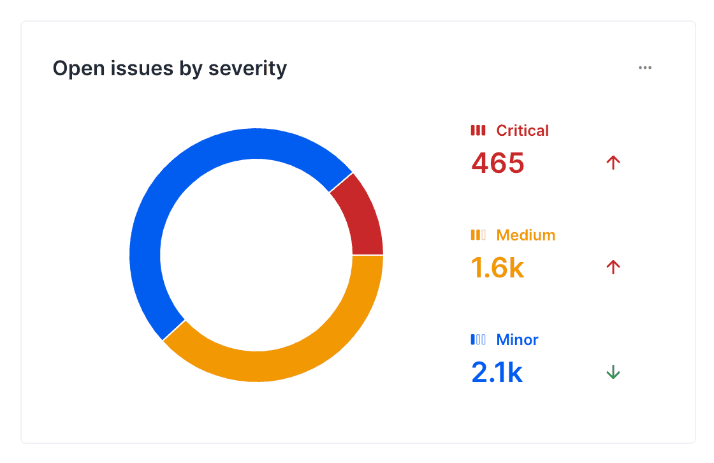
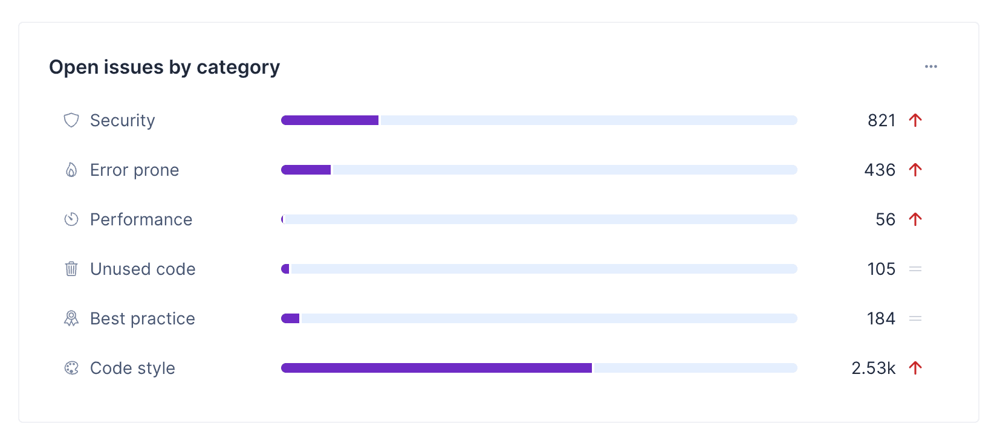
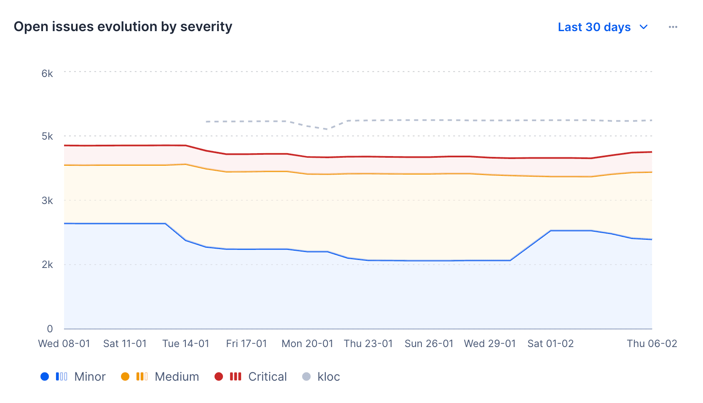
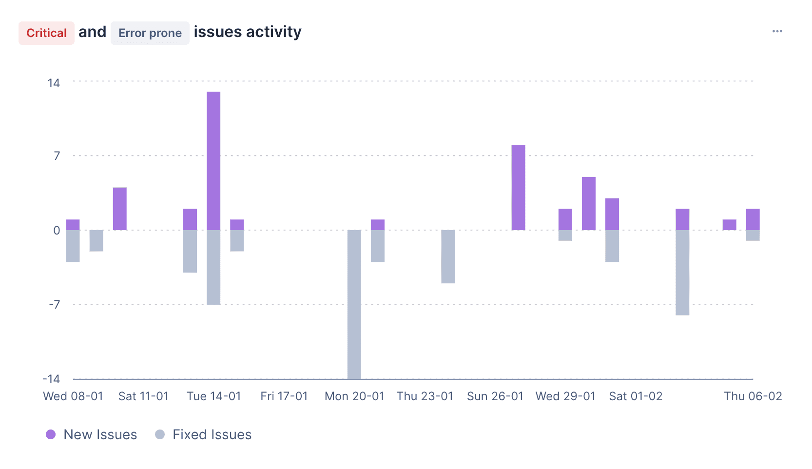

# AI Compliance

The **AI Compliance** dashboard provides an overview of all the AI issues detected in the repositories applied to the organization's AI Policy standard and your organization's risk level based on your AI practices. Here, you can navigate through the issues detected in your repositories and filter them by severity and category. You can also filter the issues by selecting specific repositories or using [the segments that you have set up](segments.md).

!!! important
    Currently this tab is a preview of a Business tier feature.

TODO FIX THIS IMAGE

To access the AI Compliance dashboard, select an organization from the top navigation bar and click on the **AI Compliance** tab at the top of the page.

The AI Compliance dashboard includes the following sections to help you monitor AI risk in your organization:

- [AI Policy Compliance](#ai-policy-compliance)
- [Repositories with the most AI issues](#repositories-with-the-most-ai-issues)
- [Risk Level](#risk-level)
- [AI Risk Checklist](#ai-risk-checklist)
- [AI Materials](#ai-materials)
- [AI Developer Tooling](#ai-developer-tooling)

## AI Policy Compliance

This section shows how Codacy can help you protect against AI vulnerabilities. You can enable Codacy's AI Policy by clicking on the button on the right side of the section. This creates a coding standard that applies AI related patterns to your repositories, safeguarding them from AI risks.
When the policy is enabled, you are able to view a real distribution of the AI issues found distributed by severity and AI category.

TODO IMAGE

## Repositories with most AI issues

This list displays repositories in descending order based on the number of AI issues. Depending on the filters applied, the list will show repositories with the most AI open issues, grouped by severity or category.

TODO IMAGE

## Risk Level

This chart shows the trend of open issues in your repositories over time, either by severity or by category, depending on the filters applied. You can hover over the chart to see the number of open issues on a specific date. You can also click on the chart to filter results in the **Issues Activity** chart and the **Repositories with the Most Issues** list.

!!! important
    Data for each period represents an average of the values during that period.

## Issues Activity

This chart displays the number of issues fixed and introduced in your repositories over time. You can hover over the chart to see the number of issues fixed and introduced on a specific date. You can also click on the chart to filter results in the **Repositories with the Most Issues** list.

