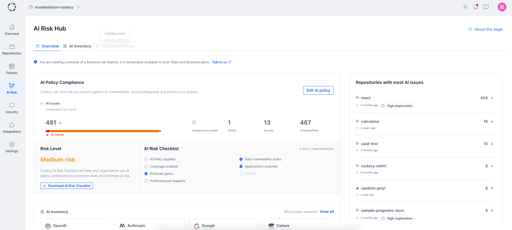
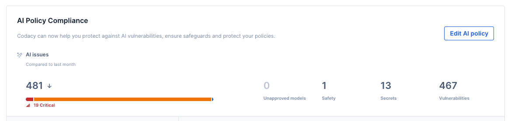
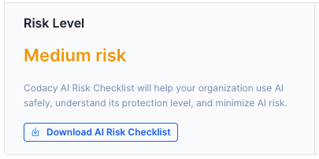
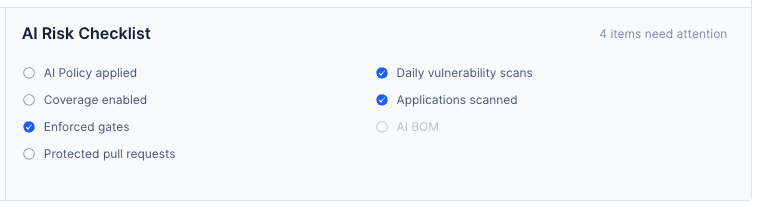
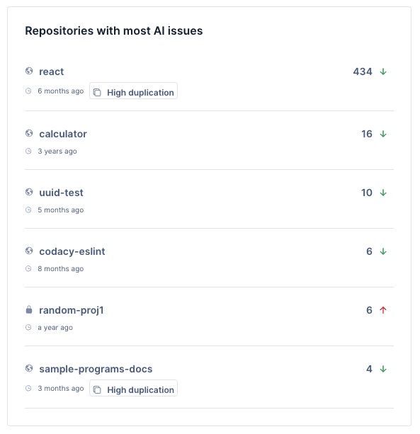
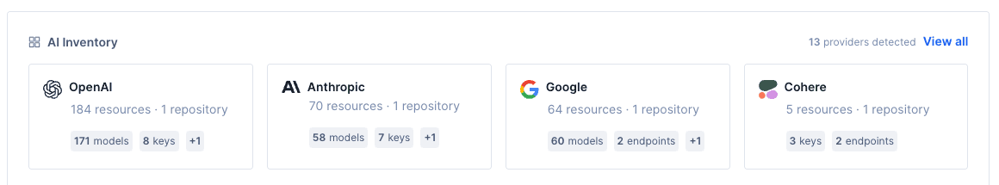
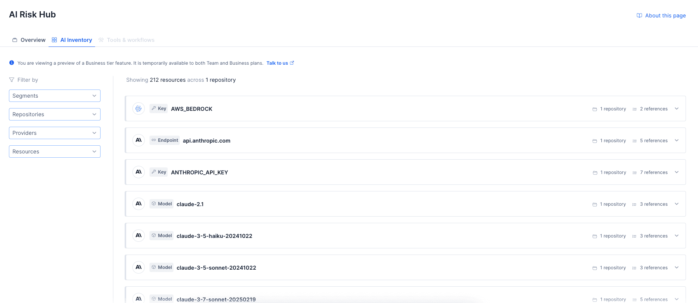
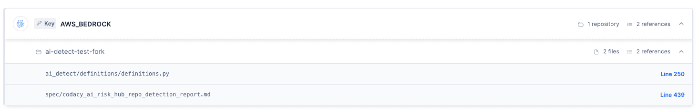
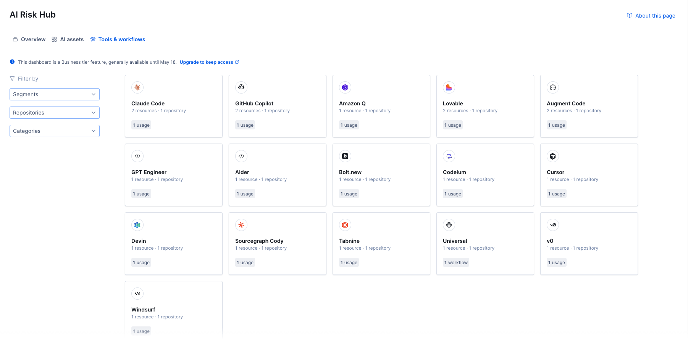
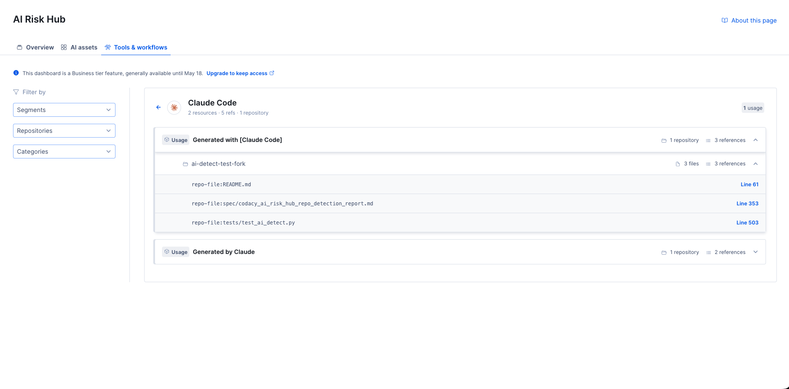

# AI Risk Hub

The **AI Risk Hub** gives you visibility into the AI usage, dependencies, and risks across your organization's repositories. It brings together AI policy compliance, risk assessment, and a detailed inventory of AI resources found in your codebase.
It also provides an overview of all the AI issues detected in the repositories applied to the organization's AI Policy standard and your organization's risk level based on your AI practices. Here, you can navigate through the issues detected in your repositories and filter them by severity and category. You can also filter the issues by selecting specific repositories or using [the segments that you have set up](segments.md).

!!! important
    This dashboard is a Business tier feature, generally available until May 18.

To access the AI Risk Hub, select an organization from the top navigation bar and click on **AI Risk** on the left navigation sidebar.

Inside this hub, you can find the following pages to help you monitor the AI risk of your organization:

- [Overview](#overview)
- [AI Inventory](#ai-inventory)
- [Tools & workflows](#tools--workflows)

---

## Overview

The **Overview** tab is the main dashboard for monitoring AI risk across your organization. It includes:

- [AI Policy Compliance](#ai-policy-compliance)
- [Risk Level](#risk-level)
- [AI Risk Checklist](#ai-risk-checklist)
- [Repositories with most AI issues](#repositories-with-most-ai-issues)
- [AI Inventory summary](#ai-inventory-summary)

### AI Policy Compliance

This section shows whether your organization has an AI Policy enabled and how your repositories are performing against it.

The AI Policy is a curated set of rules designed to detect AI-related risks in your code. When enabled, Codacy applies AI-specific patterns to your repositories and enforces them on pull request checks. You can enable the policy directly from this section.

Once enabled, the section displays a breakdown of AI issues by **severity** and **category**.

If you already have the AI Policy enabled, an **Edit** button lets you manage which repositories have the policy applied.

The AI Policy covers four categories of AI-specific risks:

#### Unapproved model calls

Detects usage of disallowed or non-compliant AI models in your codebase, giving you visibility into potential compliance violations.

#### AI Safety

Flags missing or incorrect safety practices when using AI-generated or AI-integrated code.

#### Hardcoded secrets

Detects hardcoded API keys, credentials, and secrets related to AI services.

#### Vulnerabilities (insecure dependencies / SCA)

Identifies vulnerable AI-related dependencies and packages through software composition analysis.

---

### Risk Level

This panel shows your organization's overall **AI Risk Level**: **High**, **Medium**, or **Low**.

The risk level is calculated based on whether essential AI safeguards have been enabled in Codacy. These safeguards are listed in the [AI Risk Checklist](#ai-risk-checklist).

---

### AI Risk Checklist

The AI Risk Checklist outlines the source code controls that Codacy recommends enabling across your organization:

- **AI Policy enabled:** Enable the AI Policy inside the AI Risk Hub tab.
- **Coverage enabled:** Set up code coverage for your repositories.
- **Enforced gates:** Add quality gates to your repositories and apply gate policies across your organization.
- **Protected pull requests:** Protect pull requests by enforcing quality gates in your Git workflow.
- **Daily vulnerability scans:** Enable Proactive SCA to protect your repositories from dependency vulnerabilities.
- **Applications scanned:** Enable App scanning to scan web applications and APIs for security vulnerabilities.

The more controls you have enabled, the lower your organization's AI risk level.

---

### Repositories with most AI issues

This panel shows your repositories ranked by number of open AI issues, in descending order.

You can filter the list by:

- **AI category** (unapproved model calls, AI safety, hardcoded secrets, vulnerabilities)
- **Severity** (critical, high, medium, low, info)
- **Checklist status**
- **Repository** or **segment**

Each entry shows how the repository's AI issue count has changed compared to the previous month.

---

### AI Inventory summary

This section shows a high-level view of the AI resources discovered across your repositories, broken down by provider. For each provider, you can see the number of resources and repositories involved, as well as a breakdown by resource type.

The section surfaces the top AI providers detected in your organization. You can click through to the full [AI Inventory](#ai-inventory) for a detailed view.

---

## AI Inventory

The **AI Inventory** tab gives you a detailed, searchable view of all AI resources discovered across your organization's repositories. Resources are detected through static analysis and represent actual AI usage found in the code — not just configuration.

### Resource types

Codacy detects four types of AI resources:

| Type | Pattern ID | Description |
|------|------------|-------------|
| Model usage | `ai_model_usage` | Direct calls to AI model APIs |
| Dependency | `ai_dependency` | AI SDKs and packages included as dependencies |
| API key | `ai_key` | AI service API keys and credentials found in code |
| Endpoint / env variable | `ai_env_endpoint` | Environment variables and endpoint references for AI services |

### Supported providers

Codacy detects resources from the following AI providers:

- OpenAI
- Anthropic
- Google
- Microsoft
- Amazon
- Mistral
- Cohere
- Groq
- Together AI
- Replicate
- DeepSeek
- Pinecone
- Community models

### How it works

The inventory is built from static analysis of your repositories' source code. For each AI resource found, Codacy records:

- Which **provider** the resource belongs to (e.g. OpenAI, Anthropic)
- What **type** of resource it is (model usage, dependency, API key, endpoint)
- The **marker** that identifies it (e.g. model name, package name)
- How many **repositories** contain it
- How many total **references** to it exist

### Navigating the inventory

Resources are listed as expandable entries. You can drill into each one to see:

1. **Repositories** — which repositories contain the resource, with file counts and reference counts per repository
2. **Files** — within each repository, the specific files where the resource appears
3. **Lines** — within each file, the exact lines where the resource is referenced, with direct links to the file in your Git provider

### Filtering

You can filter the inventory using the sidebar on the left:

- **Providers** — filter by one or more AI vendors
- **Resource types** — filter by resource type (model usage, dependency, API key, endpoint)
- **Repositories** — filter by specific repository names
- **Segments** — filter by repository segments if segmentation is enabled for your organization

You can reset all filters at once using the **Reset filters** button.

---

## Tools & workflows

The **Tools & workflows** tab shows AI tools and coding assistants detected across your organization's repositories.

Tools are displayed as cards showing the tool name, number of detected resources, repositories involved, and a badge indicating whether the tool was detected as a **usage** or **workflow**.

### Detection categories

Detections are grouped into two categories:

- **Usage** — tool detected via code-level patterns:
    - **Code marker** — tool signatures or attribution markers found in source code
    - **Commit** — references to the tool in commit messages or metadata
- **Workflow** — tool detected via configuration or process files, such as commands, `.gitignore` entries, hooks, instructions, settings, skills, agent definitions, governance files, or IDE configuration

### Navigating tool details

Clicking a tool card opens a detail view grouped by detection pattern (for example, "Generated with [Claude Code]" or "Generated by Claude"). For each detection pattern, you can drill into:

1. **Repositories** — which repositories contain this detection, with file and reference counts
2. **Files** — the specific files within each repository
3. **Lines** — the exact lines where the tool is referenced, with direct links to the file in your Git provider

### Filtering

You can filter the tools list using the sidebar on the left:

- **Segments** — filter by repository segments
- **Repositories** — filter by specific repository names
- **Categories** — filter by detection category and subcategory:
    - Usage: Code marker, Commit
    - Workflow: Commands, Gitignore, Hooks, Instructions, Settings, Skills
