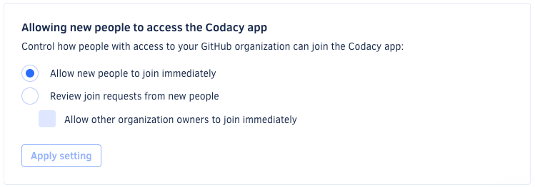

# Changing your plan and billing

Each organization on Codacy has a dedicated plan and associated billing. To make changes to the plan and billing of an organization, open your organization **Settings**, page **Plan and billing**.

<!--start-github-marketplace-->
!!! note
    **If you're using GitHub Marketplace,** make changes to your billing details or cancel your plan directly on your [GitHub Billing page](https://github.com/settings/billing).
<!--end-github-marketplace-->

-   **To upgrade** to the Pro plan click **Choose plan**, choose between monthly or yearly billing, and provide your payment and invoice details

-   **To make changes** to your Pro plan or invoice details click **Edit plan details** or click **Edit invoice details**

If you have any questions or need help with your account, please contact <mailto:support@codacy.com>.

## Accepting new people to your organization

**On Codacy Cloud**, organization owners control if team members need an approval before joining their organization. Codacy updates the billing automatically when new users join an organization.

!!! note
    **If you're using GitHub Marketplace,** this configuration isn't available and team members must always wait for an organization owner to manually approve their requests to join the organization.

Choose one of the following options in your organization **Settings**, page **Plan and billing**:

-   **Allow new people to join immediately:** team members with access to the organization on the Git provider can join the organization on Codacy immediately.
-   **Review join requests from new people:** when team members with access to the organization on the Git provider join the organization on Codacy, an organization owner must manually approve their requests to join on the page **People**.

Team members that have already been invited to join the organization are automatically approved, and you can also skip the approval process for organization owners.

