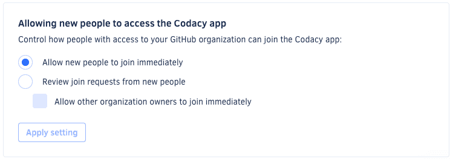

# Changing your plan and billing

Each Codacy organization is associated with your billing details and one or more active Codacy products. To update your billing details or change the active products and their pricing plans, open your organization **Settings**, page **Plan and billing**.

<!--github-marketplace-start-->
!!! note
    **If you're using GitHub Marketplace,** make changes to your billing details or cancel your plan directly on your [GitHub Billing page](https://github.com/settings/billing).<!--TODO Will we have this option for Coverage?-->
<!--github-marketplace-end-->

<!--TODO Update-->

-   **To activate** a new product and enjoy a free trial click **Try Quality** or **Try Coverage**

-   **To upgrade** to a Pro plan click **Choose plan**, choose between monthly or yearly billing, and provide your payment and invoice details

-   **To make changes** to your billing details click **Change your billing details**

If you have any questions or need help with your account, please contact <mailto:support@codacy.com>.

## Allowing new people to join your organization

**On Codacy Cloud**, organization owners control if team members need an approval before joining their organization. Codacy updates your seats automatically when new users join an organization.

!!! note
    -   **If you're using GitHub Marketplace,** this configuration isn't available and team members must always wait for an organization owner to manually approve their requests to join the organization.

    -   In some **Enterprise plans**, Codacy automatically adds to the organization new people that commit to your private repositories. However, they still need to join the organization on the Codacy app if they want to use the UI.

Choose one of the following options in your organization **Settings**, page **Plan and billing**:

-   **Allow new people to join immediately:** team members with access to the organization on the Git provider can join the organization on the Codacy app immediately, as long as there are seats available.

-   **Review join requests from new people:** when team members with access to the organization on the Git provider join the organization on Codacy app, an organization owner must manually approve their requests to join on the page **People**.

    Team members that have already been invited to join or were added to the organization are automatically approved, and you can also skip the approval process for organization owners.

