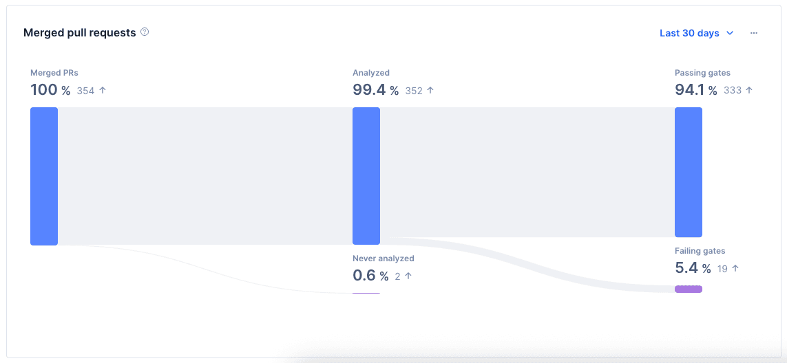
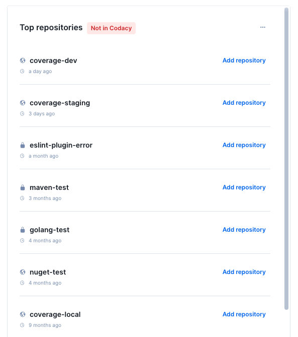

# Codacy usage

The **Codacy usage** dashboard offers an overview of your organization's adoption of Codacy. You can filter the displayed list of repositories by their Git provider, as well as by their gate and coverage information within Codacy. Additionally, you can filter by selecting specific repositories or by using [the segments that you have set up](segments.md).

!!! important
    Repositories not in Codacy is only available to GitHub accounts.

To view the **Codacy usage** dashboard:

- Select an organization from the top navigation bar.
- On the organization overview page, click the Codacy usage tab.

The Codacy usage dashboard includes the following sections to help you monitor Codacy adoption:

- [Repositories](#repositories)
- [Repositories evolution](#repositories-evolution)
- [Merged pull requests](#merged-pull-requests)
- [Top repositories](#top-repositories)

!!! tip
    In each section, you can click on the ellipsis icon in the top right corner to export that section's data to CSV or JSON.

## Repositories

This chart displays the distribution of repositories in Codacy and repositories that aren't. The doughnut chart also details the breakdown of Codacy repositories based on their configuration: those without quality gates, without coverage, without either gates or coverage, and those with both gates and coverage. Users can interact with the doughnut chart or the numerical data to filter the results. Applying a filter will also affect the repositories displayed in the evolution chart and the results will appear in the "Top repositories" list.

## Repositories evolution

This chart shows the trend of repositories in your organization over time, considering the filters applied. You can hover over the chart to see the number of repositories on a specific date. You can also click on the chart to filter results.

## Merged pull requests

This chart tracks the total volume of pull requests merged across your Codacy-managed repositories. It serves as a high-level health check to ensure that your team's development velocity is aligned with your quality standards.

### Understanding the categories

- Passing Gates: These PRs met all your quality standards (e.g., coverage, complexity, security) before being merged.
- Failing Gates: PRs merged despite failing one or more quality checks.
- Without Gates: PRs merged into repositories where no quality gates are configured. 
- Never Analyzed: PRs that reached a "Merged" status without Codacy completing an analysis.

#### Why are some PRs "Never analyzed"?

If you see high numbers here, it usually boils down to two scenarios:

1. A developer merged the PR immediately after opening it, before the Codacy analysis could finish.
2. In self-service organizations, if a PR is authored by an email/user not yet added to your Codacy seat count, the analysis may be skipped.

If you notice a high volume of PRs in Without gates, or Never analyzed categories, consider the following actions:

#### Without gates:

To ensure your code meets organizational standards, you should define a Quality Gate rule for the repository, such as setting thresholds for "New issues > 0" or "Coverage < 80%".

#### Never analyzed:

To ensure your team adjusts their workflow to wait for the "Codacy/Analysis" check to turn green before merging. Additionally, you should check your [seat management](../organizations/managing-people.md) to confirm that all active contributors are correctly mapped to a Codacy seat.

Interacting with the chart allows you to filter the data, with the resulting repositories displayed in the "Top repositories" list.

!!! note
    Merged pull requests data is only from repositories that are in Codacy.

## Top repositories

The list shows a maximum of 10 repositories from your Git provider. You can use filters to display repositories that aren't yet in Codacy, or repositories that are already in Codacy. For repositories in Codacy, the list can also group them by specific metrics such as gates, coverage, and merged pull request information.

