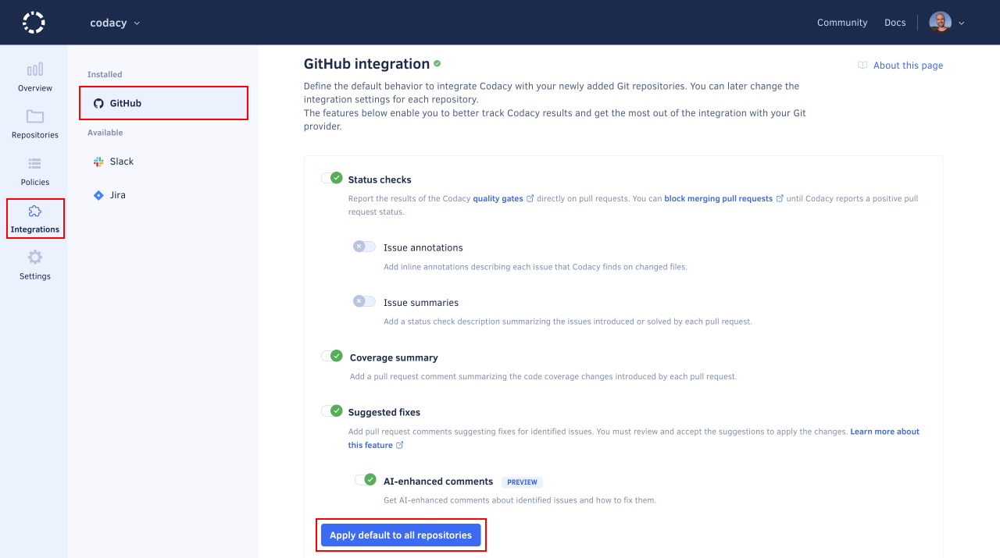

# Configuring default Git provider integration settings

You can configure the default settings that Codacy uses to integrate with your Git provider when you add a new repository to Codacy. This enables you to apply the same settings across your organization repositories.

To configure these default settings, open your organization **Integrations** page and select your Git provider.

The organization-level Git provider integration settings define the defaults that Codacy applies to new repositories. You can then customize the settings for each individual repository, which depend on your Git provider, [GitHub](../repositories-configure/integrations/github-integration.md), [GitLab](../repositories-configure/integrations/gitlab-integration.md) or [Bitbucket](../repositories-configure/integrations/bitbucket-integration.md).

## Applying default settings to all repositories {: id="apply-all"}

To ensure that all your repositories are configured with the default Git provider integration settings defined for your organization, click the button **Apply default to all repositories**.

## See also

-   [Integrating Codacy with your Git workflow](../getting-started/integrating-codacy-with-your-git-workflow.md)
