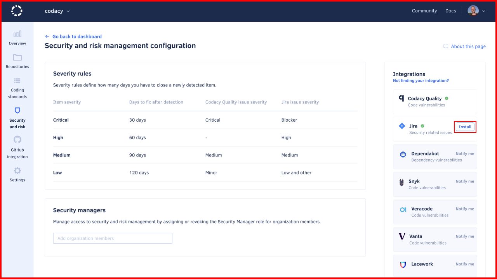

# Configuring the Jira integration<!-- TODO TAROT-2285 tentative title -->

<!--
    TODO TAROT-2285 introduction and concepts:

    - Intro: The Jira integration lets you import Jira issues as Codacy items to the Security and Risk management dashboard.
    - Benefits: The Jira integration lets you manage all your Jira security issues in one place, and track their status and resolution.
    - What are the concepts of the Jira integration? TODO
    - Prerequisites: To use the Jira integration, you need a Jira account with admin permissions.
    - Limitations: The Jira integration is only available for Jira Cloud.
-->

## Installing the Jira Cloud integration

<!-- TODO TAROT-2285 update instructions to match the new section structure -->

To install the Jira Cloud integration:

1.  Open your organization **Security and Risk** page and click the **Configure** button to open the configuration page.

1.  On the right-hand side of the page, under the Integrations list, find the Jira entry and click the **Install** button to open the installation modal. Confirm by clicking **Install Jira** to proceed to Atlassian's website.

    

1.  On Atlassian's website, authorize Codacy to access your Atlassian account. Once successful, you're redirected back to Codacy.

Upon installation, Codacy imports all open Jira issues that were created within the 90-day period preceding the integration and tagged with the label "security" (case-insensitive) and displays them on the item list, along with items from other sources.

Items are then synchronized daily with the matching Jira issues throughout their lifecycle.

!!! note
    Use a Jira account with admin permissions when authorizing Codacy. This lets Codacy access all issues, since the integration inherits the permissions of the authorizing account.

### Uninstalling the Jira Cloud integration

<!-- TODO TAROT-2285 update instructions to match the new section structure -->

To uninstall the Jira Cloud integration:

1.  Open your organization **Security and Risk** page and click the button **Configure** to open the configuration page.

1.  Find the Jira entry under the Integrations list and click the **Options** button (identified by three dots), then select **Uninstall** and confirm.

## See also

-   [Managing security and risk](./managing-security-and-risk.md)
