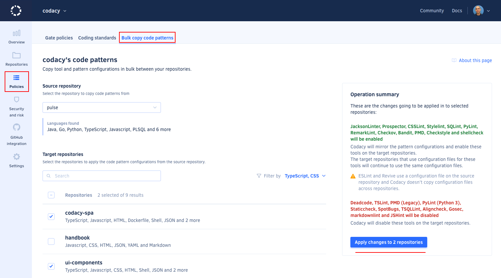

# Copying code patterns between repositories

Copy [tool and pattern configurations](../repositories-configure/code-patterns.md) in bulk between your repositories to help you bootstrap and standardize the coding standard in your organization.

For example, when adding new repositories on Codacy you can copy the tool and pattern configurations from an existing repository that's already configured, and then tweak and adapt the settings for your new repositories.



To copy the tool and pattern configurations from one repository to other repositories:

1.  Open your organization **Patterns** page.

1.  Follow the instructions to select:

    -   The source repository from where to copy the configurations

    -   One or more target repositories to apply the configurations

    You can use the language filter to help you find target repositories that use the same language as the source repository that you selected.

    

1.  Use the **Operation summary** to review the changes that will be applied and click **Apply changes**.

Codacy will use the updated configurations on the next analysis in each target repository.

## See also

-   [Code patterns](../repositories-configure/code-patterns.md)
-   [Importing pattern configurations from another repository](../repositories-configure/code-patterns.md#import-patterns)
