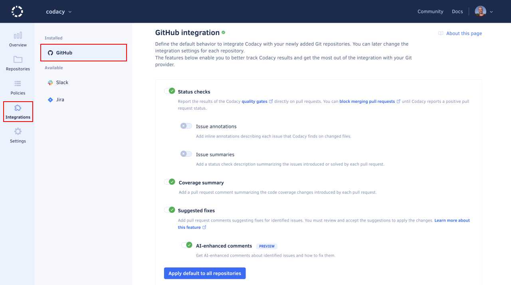

# Configuring default Git provider integration settings

You can configure the default settings that Codacy uses to integrate with your Git provider when you add a new repository to Codacy. This enables you to apply the same settings across your organization repositories.

To configure these default settings, go to the Git provider integration page for your organization. The integration features depend on your provider, [GitHub](../repositories-configure/integrations/github-integration.md#configuring), [GitLab](../repositories-configure/integrations/gitlab-integration.md#configuring) or [Bitbucket](../repositories-configure/integrations/bitbucket-integration.md#configuring).

You can later change the integration settings for a specific repository on the repository **Settings**, tab **Integrations**.

## See also

-   [Integrating Codacy with your Git workflow](../getting-started/integrating-codacy-with-your-git-workflow.md)
-   [GitHub integration](../repositories-configure/integrations/github-integration.md)
-   [GitLab integration](../repositories-configure/integrations/gitlab-integration.md)
-   [Bitbucket integration](../repositories-configure/integrations/bitbucket-integration.md)
