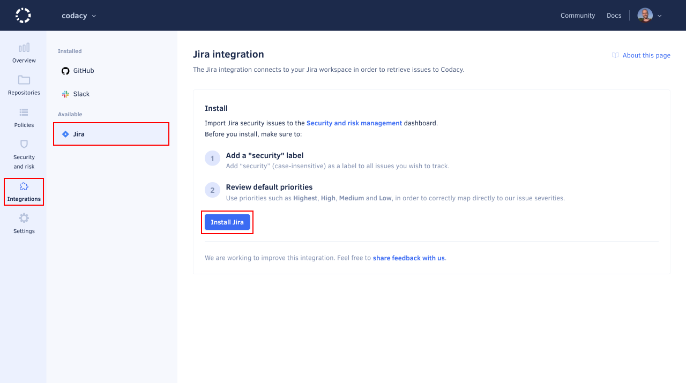

# Jira integration for Security and risk management

This integration imports all Jira issues labeled as **security** to the [Security and risk management dashboard](../managing-security-and-risk.md), allowing you to manage your Jira security issues and track their resolution in one place.

## Installing the Jira integration

!!! note
    -   Use a Jira account with admin permissions when installing this integration. This lets Codacy access all issues, since the integration inherits the permissions of the authorizing account.

    -   Before installing Jira, make sure to tag the Jira issues you wish to import with the label **security** (case-insensitive).

    -   This integration is only available for Jira Cloud.

To install the Jira integration:

1.  Open your organization **Integrations**, page **Jira**, and click **Install Jira** to proceed to Atlassian's website.

    

1.  On Atlassian's website, authorize Codacy to access your Atlassian account. Once successful, you're redirected back to Codacy.

Upon installation, Codacy imports all open Jira issues that were created within the 90-day period preceding the integration and labeled as **security** (case-insensitive) and displays them on the item list, along with items from other sources.

Items are then synchronized daily with the matching Jira issues throughout their lifecycle.

## Uninstalling the Jira integration

To uninstall the Jira integration, open your organization **Integrations**, page **Jira**, then click **Uninstall Jira** and confirm.

## See also

-   [Managing security and risk](../managing-security-and-risk.md)
-   [Repository Jira integration](../../repositories-configure/integrations/jira-integration.md)
