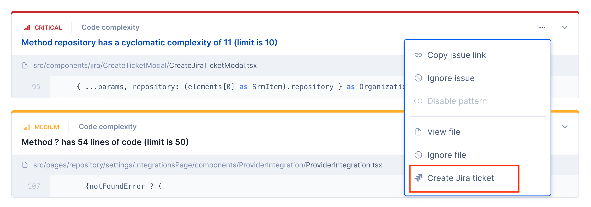
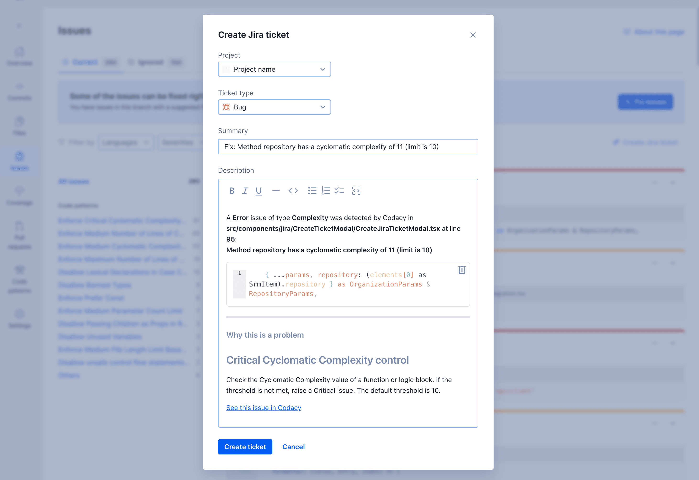
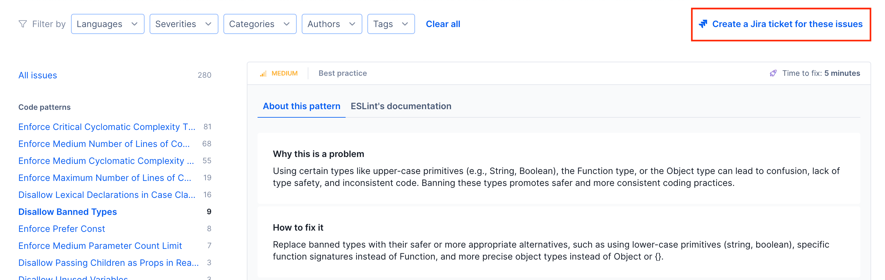

# Organization Jira integration

!!! info "This integration is only available for Jira Cloud"

Integrate Jira with Codacy to be able to create Jira tickets directly from Codacy findings, and import your Jira issues for [Security and risk management](../managing-security-and-risk.md) to manage them all in one place as security items.

## What permissions does Codacy need from my account?

Codacy requests only the necessary [permissions/scopes from your Atlassian account](https://developer.atlassian.com/cloud/jira/platform/scopes-for-oauth-2-3LO-and-forge-apps/) to collect and create issues in your Jira instance and [keeps your information secure](https://security.codacy.com/). See below the detailed list of permissions.

<table>
  <colgroup>
    <col width="25%"/>
    <col width="75%"/>
  </colgroup>
  <thead>
    <tr>
      <th>Classic scope</th>
      <th>Description</th>
    </tr>
  </thead>
  <tbody>
    <tr>
      <td><code>read:jira-user</code></td>
      <td>Codacy retrieves the Atlassian account ID and email of the user installing the integration.</td>
    </tr>
    <tr>
      <td><code>read:jira-work</code> and <code>write:jira-work</code></td>
      <td>
        Codacy retrieves issue details and metadata, and project details, to enable:
        <ul>
          <li>Creating Codacy security findings from Jira issues.</li>
          <li>Creating and managing issues in Jira from Codacy.</li>
        </ul>
      </td>
    </tr>
    <tr>
      <td><code>manage:jira-webhook</code></td>
      <td>Codacy creates webhooks to be notified of changes in the issues it's managing.</td>
    </tr>
  </tbody>
</table>

## Installing the Jira integration

To install the Jira integration:

1.  On Jira, add the label **security** (case-insensitive) to the issues you wish to import and confirm that they use [the right Jira priorities to correctly map to item severities](../managing-security-and-risk.md#item-severities-and-deadlines).

    !!! tip
        Add the **security** label as a default to all new Jira issues that track security-related work in your organization.

1.  Open your organization **Integrations**, page **Jira**, and click **Install Jira** to proceed to Atlassian's website.

    !!! note
        Use a Jira account with admin permissions when installing this integration. This lets Codacy access all issues, since the integration inherits the permissions of the account that installs it.

    

1.  On Atlassian's website, authorize Codacy. Once successful, you're redirected back to Codacy.

After installing, Codacy imports all open Jira issues labeled **security** and created up to 90 days before the integration and then retrieves updates from Jira once a day.

For more information on how this integration works, see [how Codacy manages security items](../managing-security-and-risk.md#opening-and-closing-items) and [how Codacy assigns security item severities](../managing-security-and-risk.md#item-severities-and-deadlines).

## Uninstalling the Jira integration

To uninstall the Jira integration, open your organization **Integrations**, page **Jira**, then click **Uninstall Jira** and confirm.

!!! important
    Uninstalling the Jira integration as described above deletes all associated open items. You can alternatively uninstall the Jira integration on the Jira website: this doesn't delete anything, but it prevents Codacy from opening new Jira-related items.

## Creating Jira tickets from issues, dependencies and files

Installing the Jira integration enables the feature of creating Jira tickets from issues, dependencies and files

### Creating a Jira ticket for an issue

1.  Navigate to the list of issues.

1.  Click on the options button of the issue you want to create a ticket for, and then click on **Create Jira ticket** button.

    

1.  A modal will open where you can select the Jira project, ticket type, summary and description.

    

    !!! important
        The Jira ticket creation doesn't support projects with mandatory custom fields

### Jira tickets for multiple issues

To create a Jira ticket for multiple issues, you can do so by navigating to a list of issues and clicking on the **Create a Jira ticket for these issues** button at the top of the list

!!! note
    You can create a Jira ticket for up to 50 issues / ticket

### Jira tickets for dependencies

To create a Jira ticket for a dependency, navigate to the page of the dependency and click on **Create a Jira ticket for this dependency**

### Jira tickets for files

To create a Jira ticket for a file, navigate to the page of the file and click on **Create a Jira ticket for this file**

