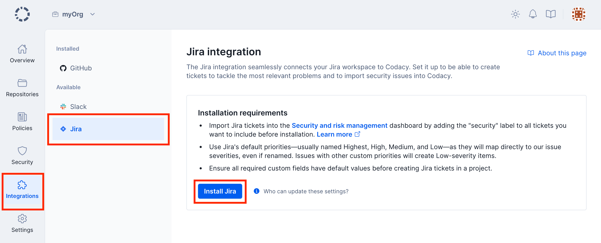

# Organization Jira integration for Security and risk management

!!! info "This integration is only available for Jira Cloud"

Integrate Jira with [Security and risk management](../managing-security-and-risk.md) to import your Jira issues and manage them all in one place as security items.

## Installing the Jira integration

!!! note
    -   Before installing the Jira integration, make sure to tag the Jira issues you wish to import with the label **security** (case-insensitive).

    -   Use a Jira account with admin permissions when installing this integration. This lets Codacy access all issues, since the integration inherits the permissions of the account that installs it.

To install the Jira integration:

1.  Open your organization **Integrations**, page **Jira**, and click **Install Jira** to proceed to Atlassian's website.

    

1.  On Atlassian's website, authorize Codacy. Once successful, you're redirected back to Codacy.

After installing, Codacy imports all open Jira issues created up to 90 days before the integration.

For more information on how this integration works, see [how Codacy manages security items](../managing-security-and-risk.md#opening-and-closing-items) and [how Codacy assigns security item severities](../managing-security-and-risk.md#item-severities-and-deadlines).

## Uninstalling the Jira integration

To uninstall the Jira integration, open your organization **Integrations**, page **Jira**, then click **Uninstall Jira** and confirm.

!!! important
    Uninstalling the Jira integration as described above deletes all associated open items. You can alternatively uninstall the Jira integration on the Jira website: this doesn't delete anything, but it prevents Codacy from opening new Jira-related items.

## See also

-   [Repository Jira integration](../../repositories-configure/integrations/jira-integration.md)
