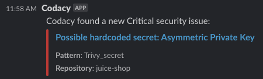

# Organization Slack integration for Security issues

The organization Slack integration for Security issues sends notifications to a Slack channel of your choice whenever Codacy detects new critical Security issues in any repository within your organization.

## Installing the Slack integration

To install the Slack integration:

1. **On Slack**:

    1.  [Create an Incoming Webhook](https://api.slack.com/messaging/webhooks) and set it to post to a channel of your choice.

    1.  From the page [Your Apps](https://api.slack.com/apps), click the application linked to the webhook you've just created and open the associated **Incoming Webhooks** page.

    1.  Copy the Incoming Webhook URL (it starts with `https://hooks.slack.com/services/`).

1.  **On Codacy**:

    1. Open your organization **Integrations**, page **Slack**.

    1. Paste the Incoming Webhook URL in the field and click **Install Slack**.

    

Once the Slack integration is installed, Codacy sends a confirmation message to the Slack channel you configured when creating the Incoming Webhook. From there on, Codacy notifies you on the same channel whenever a new critical Security issue is detected in any repository within your organization.

## Uninstalling the Slack integration

To uninstall the Slack integration, open your organization **Integrations**, page **Slack**, then click **Uninstall Slack** and confirm.

## See also

-   [Repository Slack integration](../../repositories-configure/integrations/slack-integration.md)
