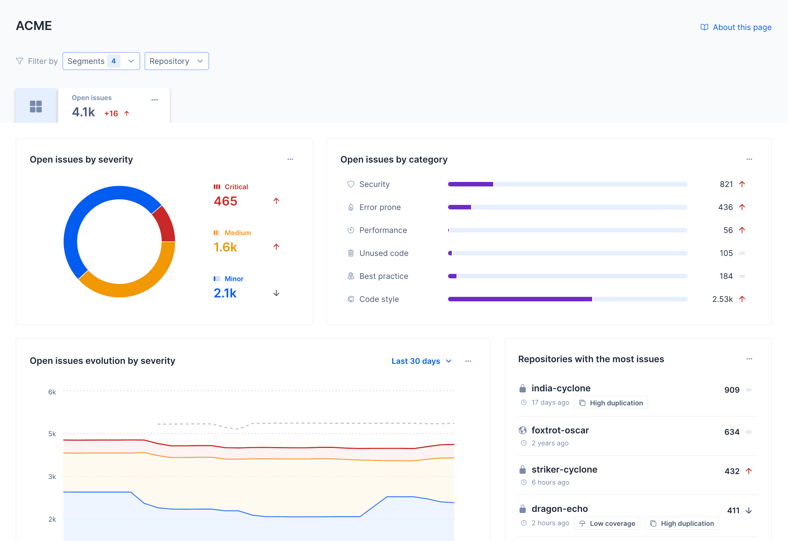
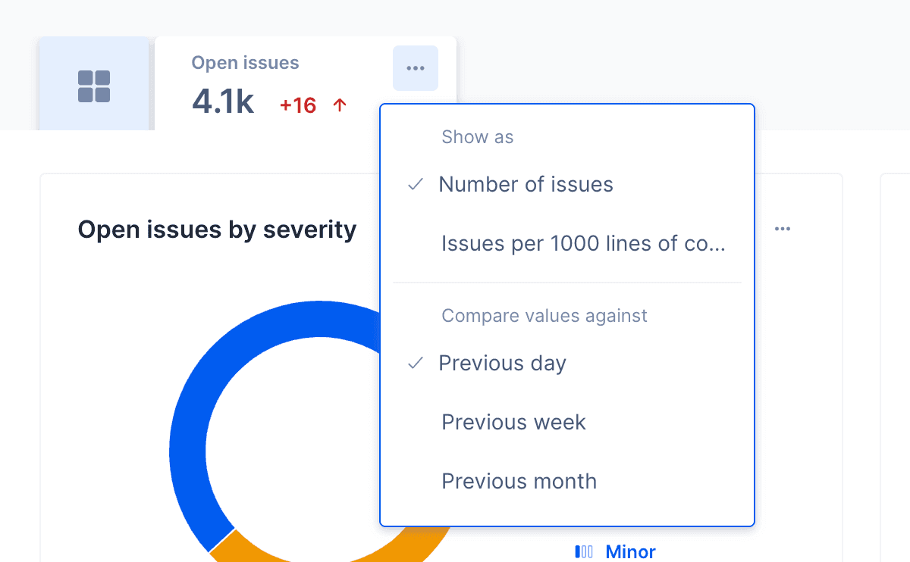
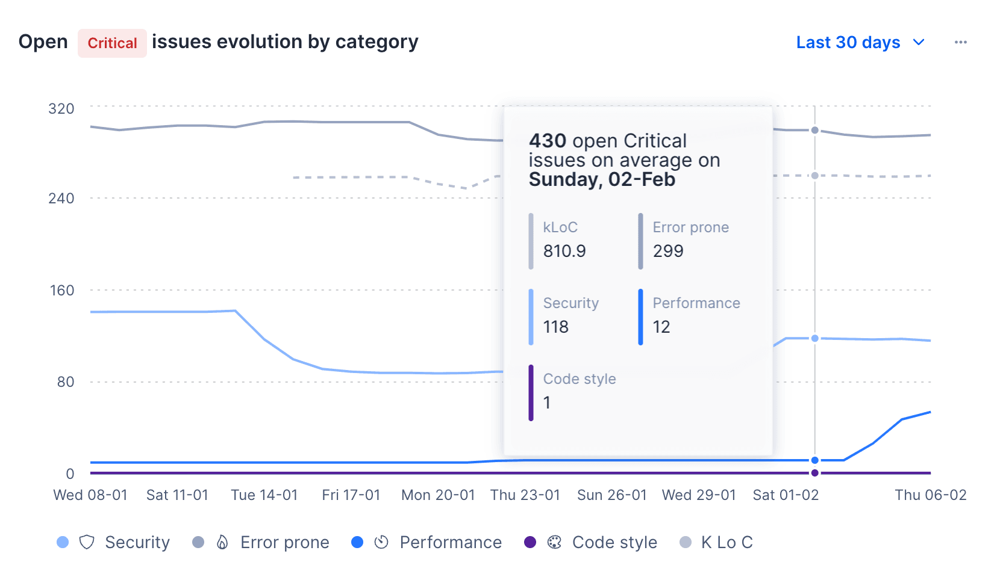
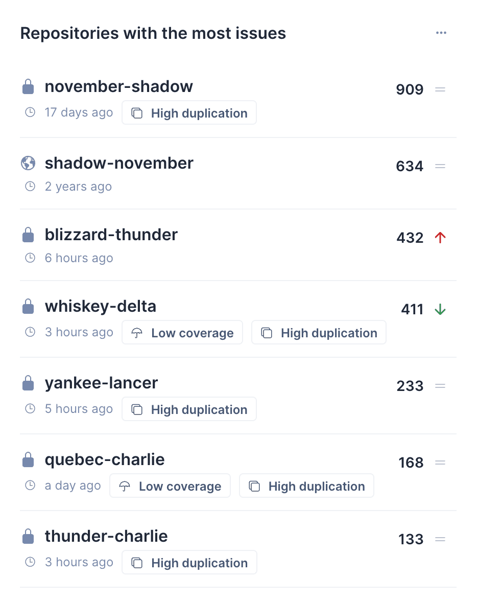

# Issues metrics
The **Issues metrics** dashboard provides an overview of all of the issues detected in the repositories belonging to your Git provider organization. Here you can navigate through the issues detected in your repositories and filter them by severity and category. You can also filter the issues by the repositories that you select, or using [the segments that you have set up](segments.md).

To access the Issues metrics dashboard, select an organization from the top navigation bar and click on the **Open Issues** tab at the top of the page.

As default, the Issues metrics dashboard will display metrics as absolute value of number of issues. You can change the display to **Issues per 1000 lines of code** by clicking on the ellipsis icon at the top right of the Open Issues tab. From here you can also customize against which period you want to compare the issues detected in your repositories. When available, comparisons against the previous selected period will be shown next to each value, and you can hover over the comparison to see the variation value.

On the Issues metrics dashboard you have the following areas to help you monitor the issues detected in your repositories:

- [Open issues by severity](#open-issues-by-severity)
- [Open issues by category](#open-issues-by-category)
- [Open issues evolution](#open-issues-evolution)
- [Issues activity](#issues-activity)
- [Repositories with most issues](#repositories-with-most-issues)

!!! tip
    On every section you can click on the ellipsis icon on top right to export that section's data to CSV or JSON.

## Open issues by severity
This chart displays the current number of open issues detected in your repositories, grouped by severity. You can click on each severity to filter results in the rest of the dashboard.

## Open issues by category
This chart displays the current number of open issues detected in your repositories, grouped by category. You can click on each category to filter results in the rest of the dashboard.

## Open issues evolution
This chart displays the evolution of the number of open issues detected in your repositories over time, either by severity or by category, depending on the filters applied. You can hover over the chart to see the number of open issues detected on a specific date. You can also click on the chart to filter results in the Issues Activity chart and in the Repositories with most issues list.

!!! important
    Data for each period is an average of the values during that period.

## Issues activity
This chart displays the number of issues fixed and introduced in your repositories over time. You can hover over the chart to see the number of issues fixed and introduced on a specific date. You can also click on the chart to filter results in the Repositories with most issues list.

## Repositories with most issues
This list will display is descending order the repositories with the most issues. Depending on the filters applied, the list will display the repositories with the most open issues, by severity or by category, or in a specific period.

