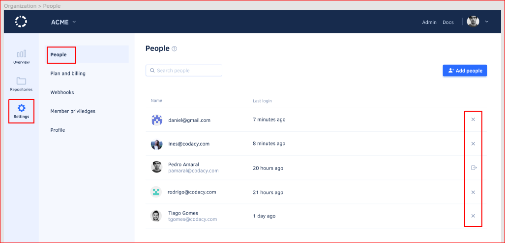

# Managing people

Members of an organization can see the details of the repositories in that organization and add new repositories to be analyzed by Codacy. Besides this, **Codacy only analyzes commits to repositories from contributors who are members of the corresponding organization on Codacy**.

!!! important
    Make sure that your team members join your organization on Codacy so that Codacy analyzes their commits in the repositories of that organization.

!!! note
    The organizations on Codacy that contain your personal repositories can only have the owner of the repositories as their single member.

    **If you're using Bitbucket Cloud** the organization that contains your personal repositories can have other members since Bitbucket Cloud doesn't have a different type of [workspace](https://support.atlassian.com/bitbucket-cloud/docs/what-is-a-workspace/){: target="_blank"} for personal use.

To list and manage the members of your organization open your organization **Settings**, page **People**:

On this page you can see the list of members of your organization and when they last logged in to Codacy.

<!-- TODO How to see if members are "regular members" or organization owners? -->

## Joining an organization

To become a member of an organization on Codacy you must [sign up to Codacy](../getting-started/getting-started-with-codacy.md) using your Git provider and follow the instructions to either join an existing organization or add a new one.

To join or add an organization after completing the sign up process, click **Organizations** on the top right-hand menu under your avatar:

<!-- Concept: Controlling how people join an organization -->

Organization owners can control who joins their organization by choosing one of the following options on the page **Plan and Billing** of the organization:

-   **Allow new people to join:** team members with access to the organization on the Git provider are able to join the organization on Codacy automatically. Your billing is updated accordingly.
-   **New people need to request access to join:** when team members with access to the organization on the Git provider join the organization on Codacy, an organization owner must manually approve their requests on the page **People**. You can override this setting for organization owners.

## Adding members to your organization

Organization owners can add other team members to their organization on Codacy. This is useful to allow Codacy to analyze commits by contributors who haven't signed up for Codacy yet.

To add members to your organization:

1.  Open your organization **Settings**, page **People**, and click the button **Add people**.

    <!-- TODO Consider adding another screenshot to show the UI path -->

    

1.  Select people from the list of recent contributors to the repositories in your organization. Alternatively, click **Add people using email addresses** to manually enter the list of email addresses of the people you wish to add.

1.  Confirm the updated billing details displayed at the bottom of the window and click the button **Add people**.

## Removing people from your organization

Members of an organization on Codacy can remove themselves from the organization, and organization owners can also remove other members.

When a member leaves an organization:

-   Codacy stops analyzing commits to repositories in the organization from contributors who are no longer members of the organization on Codacy
-   Codacy stops analyzing repositories that were added by the member
-   Organizations must have at least one owner, so when the last organization owner leaves the organization they must either add someone else as owner or [delete the organization](../organizations/what-are-synced-organizations.md#deleting-an-organization)

To remove members from your organization open your organization **Settings**, page **People**, and click the icon next to the members you wish to remove:

