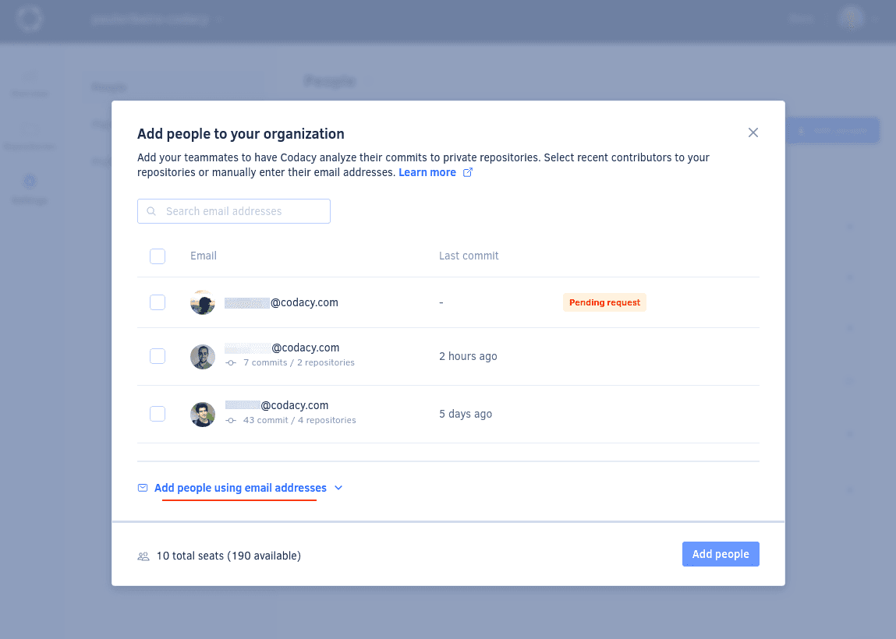

# Managing people

People signing up to the Codacy app and joining an organization become members of that organization. Members of a Codacy organization can see the dashboards and details of the organization repositories. Depending on their permissions on the Git provider, members can also manage the organization and repository settings on Codacy.

For **private repositories**, Codacy only analyzes commits from people in your Codacy organization. To make sure that Codacy analyzes all relevant commits, add to your Codacy organization the committers that aren't members of the organization yet.

!!! important
    -   Make sure that you invite or ask your teammates to join your organization on Codacy so that Codacy analyzes their commits to private repositories.

    -   Committers who aren't part of your Git provider organization can't join your organization on Codacy app, but you should still add them to your Codacy organization to analyze their commits to private repositories.

To list and manage the people in your organization, open your organization **Settings**, page **People**. This page also shows their last activity on Codacy.

!!! note "In some Enterprise plans"
    - Codacy automatically assigns a seat to any person with at least one analyzed commit to your private repositories over the past 90 days and frees up the seat after 90 days of code analysis inactivity.
    - **Members** are people that signup and joined an Organization in Codacy, and **Authors** are people that contribuite to code changes. It can happen that Authors aren't Codacy Members. 

## Joining an organization {: id="joining"}

To become a member of an organization on Codacy app you must [sign up to Codacy](../getting-started/codacy-quickstart.md) using your Git provider and follow the instructions to either join an existing organization or add a new one.

To join or add an organization after completing the sign-up process, click **Organizations** on the top right-hand menu under your avatar:

!!! note
    **On Codacy Cloud**, organization admins [control if team members need an approval](changing-your-plan-and-billing.md#allowing-new-people-to-join-your-organization) before joining their organizations.

## Adding people to your organization {: id="adding-people"}

**On Codacy Cloud**, organization admins can also add teammates to their organization on Codacy. This is useful to allow Codacy to analyze commits to private repositories by committers who haven't signed up to Codacy or joined the organization yet.

!!! tip
    You can also use the Codacy API to [add people to your Codacy organization](../codacy-api/examples/adding-people-to-codacy-programmatically.md). This is useful while adding a large amount of people or to automatically add new members of your Git provider organization to Codacy.

To add people to your organization:

1.  Open your organization **Settings**, page **People**, and click the button **Add people**.

    !!! note
        For Enterprise plans where Codacy automatically adds new committers to your organization, you can invite them to join the organization on the Codacy app by clicking the **Invite people** button.

    

1.  Select people from the list displaying pending requests to join the organization, as well as recent committers to the private repositories in your organization.

    Alternatively, click **Add people using email addresses** to manually enter the list of email addresses of the people you wish to add.

    !!! important
        - To prevent the same person from occupying more than one seat in your organization, make sure your teammates [update the email addresses associated with their Codacy account](../account/emails.md#updating).
        - **On GitHub and Bitbucket organizations**, Codacy automatically reduces seat duplication when commits are pushed by associating all the commit email addresses from the same Git provider user with a single Codacy committer. This mechanism requires that all developers committing to your private repositories [set their Git email address](../account/emails.md#git-config) and add all their email addresses to their [GitHub account](https://github.com/settings/emails) or [Bitbucket account](https://bitbucket.org/account/settings/email/).
        - Codacy doesn't allow you to have one email associated with more than one GitHub account. You can manage your [associated emails in the provider GitHub](https://docs.github.com/en/account-and-profile/setting-up-and-managing-your-personal-account-on-github/managing-email-preferences/adding-an-email-address-to-your-github-account). 

    

1.  Confirm the updated billing details displayed at the bottom of the window and click the button **Add people**. Codacy emails the newly added people inviting them to log in.

## Removing people from your organization {: id="removing-people"}

Members of an organization on Codacy can remove themselves from the organization, and organization admins can also remove other members and committers.

When a member or committer leaves an organization:

-   Codacy stops analyzing their commits to private repositories in the organization
-   **On GitLab and Bitbucket organizations** Codacy stops analyzing repositories that were added by the member
-   Organizations must have at least one admin, so when the last organization admin leaves the organization they must either add someone else as admin or [delete the organization](../organizations/what-are-organizations.md#deleting-an-organization)

To remove people from your organization open your organization **Settings**, page **People**, click the icon next to the member or committer you wish to remove, and select **Remove from organization**.

!!! note
    For Enterprise plans where Codacy automatically manages seat usage for your organization, you can't remove people who had their commits analyzed within the last 90 days because their are still active within the billing period. However, if you remove them from the organization on your Git provider, they no longer have permissions to your repositories on Codacy.

## See also

-   [Adding people to Codacy programmatically](../codacy-api/examples/adding-people-to-codacy-programmatically.md)
-   [Roles and permissions for organizations](roles-and-permissions-for-organizations.md)
