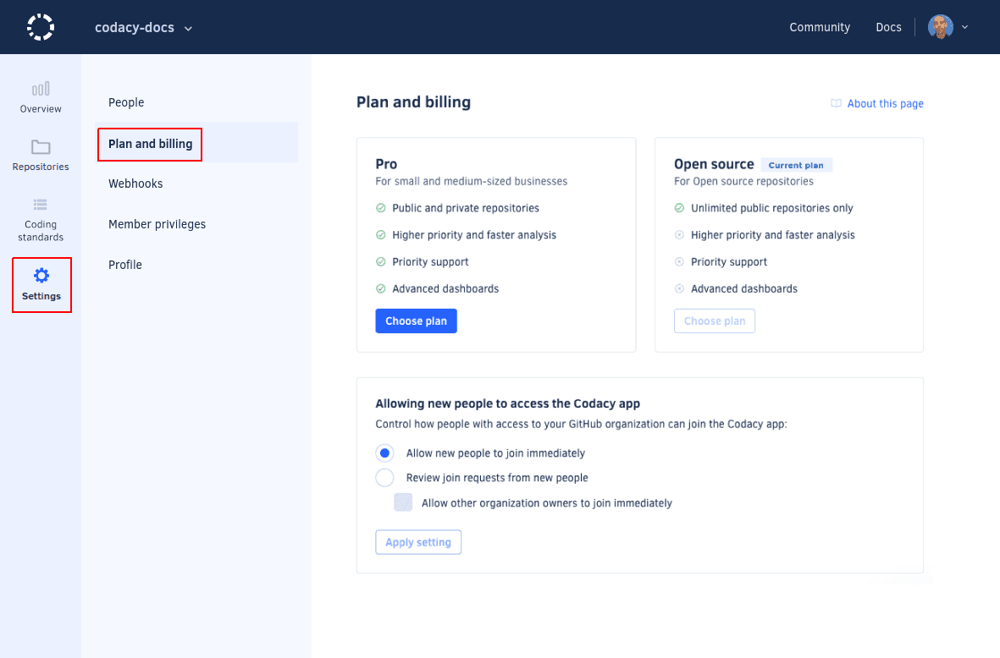

# Managing people

## WIP Notes

<!-- Managing people in an organization -->

To see and manage the members of your organization on Codacy open your organization **Settings** and open **People**.

Members can add themselves to your Codacy organization when they log into Codacy using their Git provider credentials. On the **Plan and Billing** page there are different ways to control who can join your organization:

-   **Allow new people to join:** team members with access on the Git provider will be able to join the Codacy organization automatically and your billing will be updated accordingly.
-   **New people need to request access to join:** team members must request access to be able to join the Codacy organization. You can override this setting for organization owners.

Members can remove themselves from organizations, while owners can remove themselves as well as other users, even other owners. Organizations must have at least one owner.

<!-- What organization members can do -->

As a member, you will be able to see the organization's repositories on Codacy, add new ones to be analyzed, and check each the details of each repository.

<!-- Joining an organization -->

Click **Organizations** on the top right-hand menu under your avatar and you will see a list of organizations that you can join:

<!-- Details about personal organizations -->

The organizations that contain your personal repositories can only have the owner of the repositories as their single member.

!!! important
    **If you are using Bitbucket Cloud** the organization that contains your personal repositories can have other members since Bitbucket Cloud doesn't have a different type of [workspace](https://support.atlassian.com/bitbucket-cloud/docs/what-is-a-workspace/){: target="_blank"} for personal use.