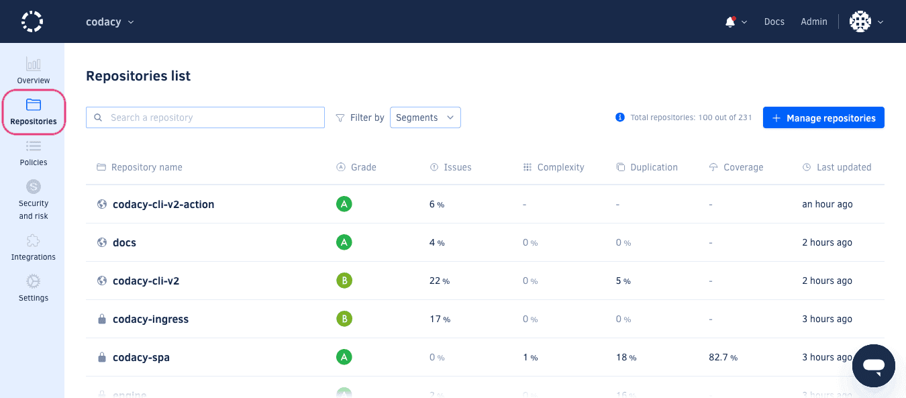

# Managing repositories in your organization

To see a list of the repositories being analyzed by Codacy, open the **Repositories** page under your organization:

This page lists the repositories that are already added to your organization on Codacy, as well as additional information that allows you to compare the repositories in the list:

-   Grade
-   Issues metric
-   Complexity metric
-   Duplication metric
-   Coverage metric
-   Last updated time

The list also displays error messages and troubleshooting guidance for repositories that are not currently being analyzed, such as when there are no committers added to the organization or when Codacy stopped having access to the repository.

If you have a large number of repositories, use the search field above the list to quickly find a specific repository.

## Adding a repository
 
To add a new repository to Codacy, click the button **Add repository** at the top right-hand corner of the page to open a modal window listing repositories in your Git provider organization that are not yet added to Codacy:

!!! important
    To see your repositories in this list, make sure that you have admin permissions over the repositories on the Git provider and that [Codacy has permissions to access the repositories](../faq/repositories/why-cant-i-see-or-add-my-organizations-repositories.md).

If you have a large number of repositories, use the search field above the list to quickly find a specific repository.

Add one or multiple repositories by clicking **Add** next to the repositories. Once you finished adding repositories to your organization, close the window to return to the list of repositories in your organization.

Your newly added repositories will immediately start being analyzed by Codacy. However, the new repositories will display empty metrics until the first analysis returns results:

