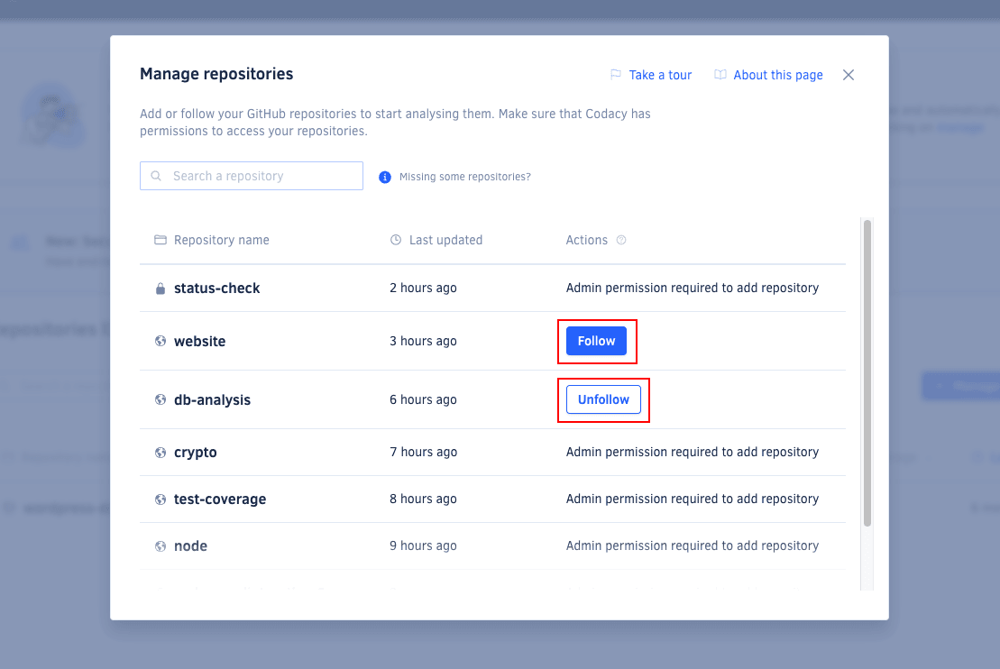

# Managing repositories

Users with the [necessary permissions on your Git provider](roles-and-permissions-for-organizations.md) can **add** repositories to Codacy to start analyzing them. The remaining organization members with access to the added repositories can then **follow** on Codacy the repositories of their interest.

!!! important
    To see your repositories on Codacy, make sure that you have the necessary permissions over the repositories on the Git provider and that Codacy has the necessary permissions to access the repositories.

To see all the repositories that you follow on Codacy, open the page **Repositories** under your organization. Organization admins also see the total number of repositories that have already been [added to the organization](#adding-a-repository).

Across the application, Codacy calculates and displays data for the repositories on this list.

This page lists the repositories that you follow on Codacy sorted by [last updated date](organization-overview.md#last-updated-repositories), and allows you to compare the repositories on the list according to the following metrics:

-   [Grade](../faq/code-analysis/which-metrics-does-codacy-calculate.md#grade)
-   [Issues](../faq/code-analysis/which-metrics-does-codacy-calculate.md#issues)
-   [Complexity](../faq/code-analysis/which-metrics-does-codacy-calculate.md#complexity)
-   [Duplication](../faq/code-analysis/which-metrics-does-codacy-calculate.md#duplication)
-   [Coverage](../faq/code-analysis/which-metrics-does-codacy-calculate.md#code-coverage)

The list also displays error and warning messages for repositories that have issues, such as when there are no committers added to the organization or when Codacy stopped having access to the repository. Hover the mouse cursor over the warning icons or open the repository to see more details.

If you follow many repositories, you can use the search field above the list to quickly find a specific repository.

## Adding a repository {: id="adding-a-repository"}



Users with the [necessary permissions](roles-and-permissions-for-organizations.md) can add a repository to Codacy to start analyzing it.

!!! note
    When a user adds a new repository to Codacy, all organization admins start following it automatically.

To add new repositories to Codacy:

1.  Click the button **Manage repositories** at the top right-hand corner of the page. This opens a window listing your organization repositories.

1.  Click **Add** next to the repositories you want to add. If you have many repositories, you can use the search field above the list to quickly find a specific repository.

    

1.  When you're done, close the window to return to your repositories list.

Although Codacy immediately starts analyzing newly added repositories, they display empty metrics until the first analysis returns results.

## Following or unfollowing a repository {: id="follow-unfollow"}

Users with [no permission to add a repository](roles-and-permissions-for-organizations.md) to Codacy, can follow that repository after it has been added to Codacy, and stop following it at any time.

To follow or unfollow repositories on Codacy:

1.  Click the button **Manage repositories** at the top right-hand corner of the page. This opens a window listing your organization repositories.

1.  Click **Follow** or **Unfollow** next to the repositories you want to follow or unfollow. If you have many repositories, you can use the search field above the list to quickly find a specific repository.

    

1.  When you're done, close the window to return to your repositories list.

!!! note
    You automatically **start following** a repository as soon as you access any page from that repository. For example, when you access the repository using a direct link on your Git provider UI.

    Conversely, you automatically **stop following** a repository as soon as you try accessing any page from that repository but you don't have permissions to see that repository anymore.

## See also

-   [Which metrics does Codacy calculate?](../faq/code-analysis/which-metrics-does-codacy-calculate.md)
