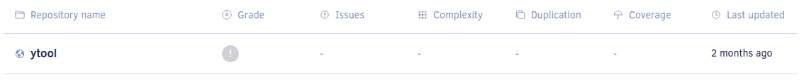

# Managing repositories

To see a list of the repositories that Codacy is monitoring, open the page **Repositories** under your organization.

This page lists the repositories that already belong to your organization on Codacy, and provides additional information that allows you to compare the repositories in the list:

-   Grade
-   Issues metric
-   Complexity metric
-   Duplication metric
-   Coverage metric
-   Last updated time

The list also displays error messages and troubleshooting guidance for repositories that have an issue, such as when there are no committers added to the organization or when Codacy stopped having access to the repository.

If you have many repositories, you can use the search field above the list to quickly find a specific repository.

## Adding a repository

To add a new repository to Codacy, click the button **Add repository** at the top right-hand corner of the page. This opens a window listing the repositories in your Git provider organization that don't belong to your organization on Codacy yet.

!!! important
    To see your repositories in this list, make sure that you have admin permissions over the repositories on the Git provider and that [Codacy has permissions to access the repositories](../faq/repositories/why-cant-i-see-or-add-my-organizations-repositories.md).

Add one or multiple repositories to your organization by clicking **Add** next to the repositories. If you have many repositories, you can use the search field above the list to quickly find a specific repository.

After adding repositories, close the window to return to the list of repositories in your organization. Although Codacy will immediately start analyzing the new repositories, they will display empty metrics until the first analysis returns results.

