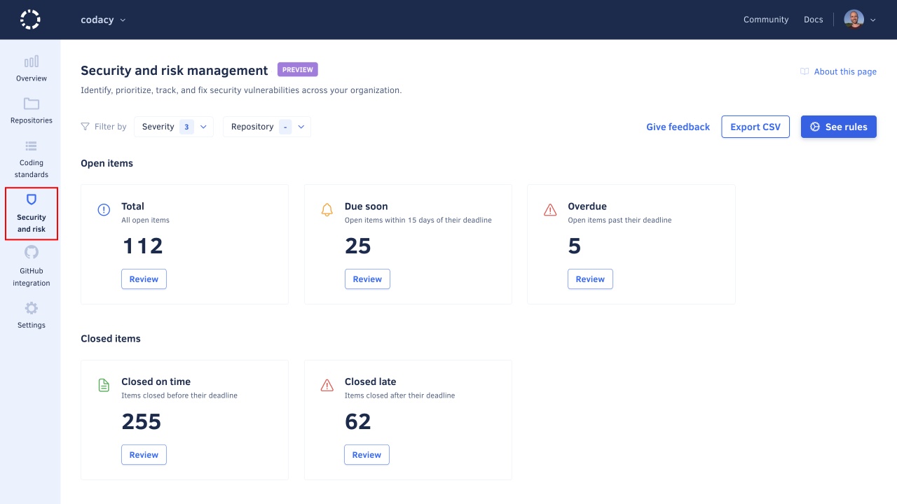
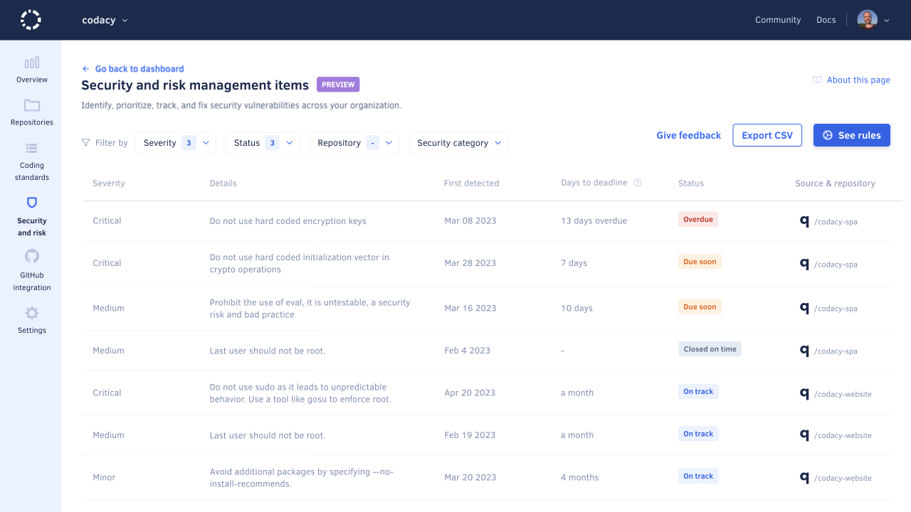
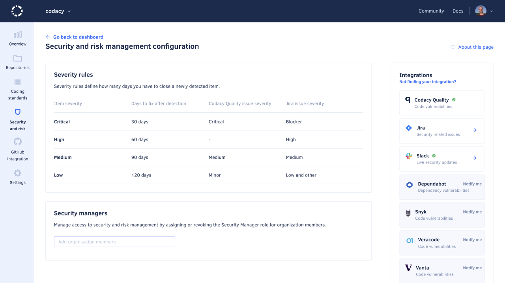
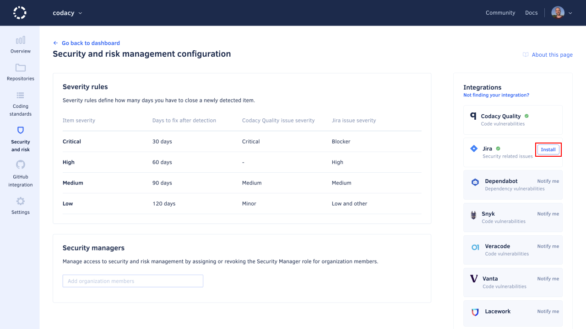
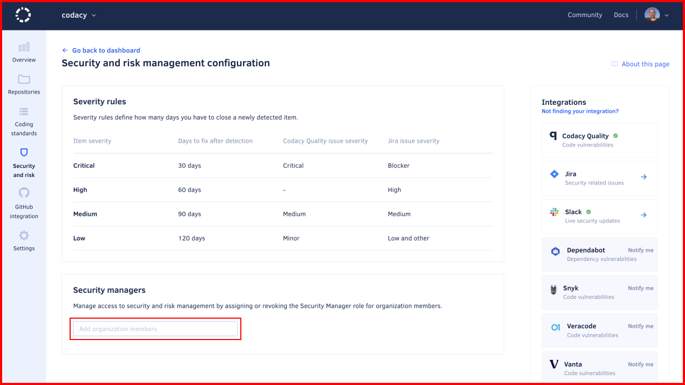

# Managing security and risk

!!! info "This is a preview feature"
    This is a new Codacy feature and we're continuing to improve it.

The security and risk management feature helps you quickly identify, track, and address security issues by automatically opening time-bound, prioritized action items whenever Codacy detects security issues in your organization repositories or in your connected Jira Cloud instance.

Under security and risk management, you can find the following pages to help you monitor your security issues:

-   [Dashboard](#dashboard)
-   [Item list](#item-list)
-   [Configuration page](#configuration-page)

## Dashboard

The **Security and risk management** dashboard provides a general overview of items, based on their status.

To access the dashboard, select an organization from the top navigation bar and select **Security and risk** on the left navigation sidebar.

The main area of the dashboard includes five panels:

-   **Total:** all open items
-   **Due soon:** open items within 15 days of their deadline
-   **Overdue:** open items with a missed deadline
-   **Closed on time:** items closed before the deadline
-   **Closed late:** items closed after the deadline

Each panel shows the total count of matching items and contains a **Review** button to view a list of matching items.

## Item list

The **Security and risk management items** page displays a filtered list of items, sorted by due date ascending.

To access the item list, access the [dashboard](#dashboard) and click the **Review** button in the area of interest, based on the desired filtering.

When viewing the item list:

-   To update the filtering criteria, click the **Status** or **Severity** drop-downs above the list.
-   To find out more about an item, click its **Details** column to navigate to the item of interest on the source platform.

## Configuration page

The **Security and risk management configuration** page lets you [manage integrations](#managing-integrations) to fetch security vulnerability information from third-party platforms, as well as [assign or revoke the Security Manager role](#managing-access-to-security-and-risk-management) for organization members.

To access the configuration page, access the [dashboard](#dashboard) or the [item list](#item-list) and click the **Configure** button in the top right-hand corner of the page.

## Exporting items

To export a list of items as a CSV file, access the [dashboard](#dashboard) or the [item list](#item-list) and click the **Export CSV** button in the top right-hand corner of the page.

!!! note
    The exported list always includes all items, ignoring any applied filters.

## Managing integrations

Integrations let you detect security issues across a number of platforms and display them all as items on the unified item list.

The following section explains how to integrate with each of the supported platforms.

=== "Codacy"

    Security and risk management always displays items opened after detecting Codacy security issues. This feature can't be deactivated.

=== "Jira Cloud"

    ### Installing the Jira Cloud integration

    To install the Jira Cloud integration:

    1.  Open your organization **Security and Risk** page and click the **Configure** button to open the configuration page.

    1.  On the right-hand side of the page, under the Integrations list, find the Jira entry and click the **Install** button to open the installation modal. Confirm by clicking **Install Jira** to proceed to Atlassian's website.

        

    1.  On Atlassian's website, authorize Codacy to access your Atlassian account. Once successful, you're redirected back to Codacy.

    Upon installation, Codacy imports all open Jira issues that were created within the 90-day period preceding the integration and tagged with the label "security" (case-insensitive) and displays them on the item list, along with items from other sources.

    Items are then synchronized daily with the matching Jira issues throughout their lifecycle.

    !!! note
        Use a Jira account with admin permissions when authorizing Codacy. This lets Codacy access all issues, since the integration inherits the permissions of the authorizing account.

    ### Uninstalling the Jira Cloud integration

    To uninstall the Jira integration:

    1.  Open your organization **Security and Risk** page and click the button **Configure** to open the configuration page.

    1.  Find the Jira entry under the Integrations list and click the **Options** button (identified by three dots), then select **Uninstall** and confirm.

## Managing access to security and risk management

To better track and address security issues, organization admins can extend access to security and risk management by assigning the Security Manager role to organization members.

The Security Manager role is independent of the Git provider role of an organization member and provides only the permissions necessary to monitor security issues, following the principle of least privilege:

| Permission                                                  | Organization Admin | Security Manager           |
|-------------------------------------------------------------|--------------------|----------------------------|
| Access security and risk management                         | Yes                | Yes                        |
| Access associated issues (Codacy repositories, Jira issues) | Platform-dependent | Keeps original permissions |
| Manage integrations                                         | Yes                | Yes                        |
| Assign and revoke the Security Manager role                 | Yes                | No                         |
| All other Organization Admin permissions                    | Yes                | No                         |

### Assigning the Security Manager role

To assign the Security Manager role:

1.  Open your organization **Security and Risk** page and click the **Configure** button to open the configuration page.

1.  In the **Security managers** area, use the search field to find the relevant user and click the user's name.

    

### Revoking the Security Manager role

To revoke the Security Manager role:

1.  Open your organization **Security and Risk** page and click the **Configure** button to open the configuration page.

1.  In the **Security managers** area, scroll the list to find the relevant user.

1.  Click the **Revoke role icon** to the right of the user's name and confirm.

## Opening and closing items

!!! important
    To open and close items, Codacy must detect when the associated issues are introduced and fixed. The detection logic is platform-dependent and is described below.

Codacy opens an item whenever one of the configured source platforms detects a security issue. The new item is assigned a severity and a status:

-   The importance of the security issue defines the [severity of the item](#item-severities-and-deadlines). In turn, the item's severity defines a deadline to fix the associated issue.
-   The time to the deadline sets the [status of the item](#item-statuses). The item then transitions through different statuses as the deadline is approached, met, or missed.

Codacy closes an existing item when the source platform stops detecting the associated security issue.

The following section details when Codacy opens and closes items for each supported platform.

=== "Codacy"

    Codacy opens a new item when it detects a new security issue on the default branch of a repository.

    Codacy closes an item in either of the following cases:
    
    -   Codacy detects that the associated issue isn't present in the most recent analyzed commit and therefore is fixed
    -   You [ignore the associated issue](../repositories/issues.md#ignoring-and-managing-issues)
    -   You [disable the tool](../repositories-configure/configuring-code-patterns.md) that found the associated issue

    !!! note
        To make sure that Codacy detects security issues correctly:

        -   [Enable code patterns](../repositories-configure/configuring-code-patterns.md) belonging to the Security category. These patterns are enabled by default, but may not be on custom configurations.
        -   Alternatively, [apply a coding standard](using-coding-standards.md) that includes patterns belonging to the Security category.
        -   Confirm that the latest [commits](../repositories/commits.md) to the default branches of your repositories are analyzed.

=== "Jira Cloud"

    Codacy opens a new item when it detects a new Jira issue with a "security" label.

    Codacy closes an item when it detects that the associated Jira issue is marked as Closed.

    !!! note
        -   Codacy retrieves updates from Jira once a day.
        -   If an issue is opened and closed on the same day, Codacy may not detect it.
        -   To make sure that Codacy detects Jira issues correctly, assign the "security" label when creating the issue or immediately after.

## Item statuses

The following table describes how item statuses map to deadlines:

<table>
    <thead>
        <tr>
            <th>Status category</th>
            <th>Item status</th>
            <th>Deadline</th>
        </tr>
    </thead>
    <tbody>
        <tr>
            <td rowspan="3">Open</td>
            <td>Overdue</td>
            <td>The deadline has been missed</td>
        </tr>
        <tr>
            <td>Due soon</td>
            <td>Fewer than 15 days to the deadline</td>
        </tr>
        <tr>
            <td>On track</td>
            <td>15 days or more to the deadline</td>
        </tr>
        <tr>
            <td rowspan="2">Closed</td>
            <td>Closed late</td>
            <td>Closed after the deadline</td>
        </tr>
        <tr>
            <td>Closed on time</td>
            <td>Closed before the deadline</td>
        </tr>
    </tbody>
</table>

## Item severities and deadlines

The following table defines item severities and days to fix the associated security issue, based on the importance of the underlying issue:

| Item severity |  Days to fix | Underlying Codacy issue severity | Underlying Jira issue priority |
|-------------------|------------------|--------------------------------------|------------------------------------|
| Critical          | 30               | Critical                             | Blocker                            |
| High              | 60               | -                                    | High                               |
| Medium            | 90               | Medium                               | Medium                             |
| Low               | 120              | Minor                                | Low and other                      |

## Data retention

Except for the situations described below, Codacy retains all items indefinitely.

=== "Codacy"

    Deleting a repository deletes all open items belonging to that repository.

=== "Jira Cloud"

    Uninstalling the Jira Cloud integration using the security and risk management configuration page deletes all associated open items.
    
    Uninstalling the Jira Cloud integration using the Jira website doesn't delete any associated items. However, it prevents Codacy from opening new Jira-related items.
