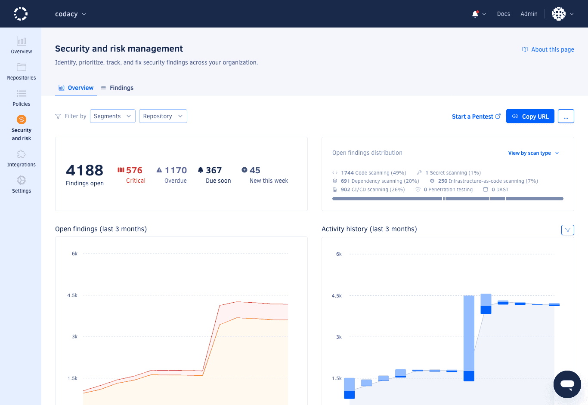
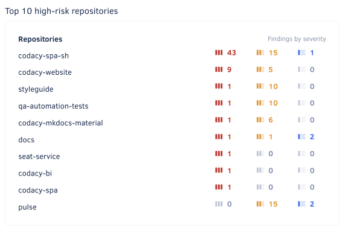

# Managing security and risk

<!-- TODO TAROT-2591 Match wording to design -->

The Security and risk management feature helps you quickly identify, track, and address security across your organization by automatically opening time-bound, prioritized findings whenever security problems are detected in your organization repositories, in your [connected Jira instance](./integrations/jira-integration.md), or during [penetration testing](#)<!-- TODO TAROT-2591: Link to pen-testing page -->.

Under Security and risk management, you can find the following pages to help you monitor security:

-   [Overview](#dashboard)
-   [Findings](#item-list)

On each of the above pages, the following actions are also available:

-   [Sharing a filtered view of findings](#sharing-filtered-view)
-   [Exporting findings](#exporting-the-security-item-list)
-   [Reviewing severity rules and integration settings](#reviewing-settings)

To review how Codacy manages findings and the associated severities and deadlines, see:

-   [How Codacy manages findings](#opening-and-closing-items)
-   [Finding statuses](#item-statuses)
-   [Finding severities and deadlines](#item-severities-and-deadlines)

For a list of languages checked for security issues by Codacy and a list of detected security categories, see:

-   [Languages checked for security issues](#languages-checked-for-security-issues)
-   [Supported security categories](#supported-security-categories)

## Overview {: id="dashboard"}

The **Security and risk management overview** page provides a high-level view of the security posture of your organization, including the number of open findings, the distribution of open findings by severity, the history of finding resolution, and a breakdown of the most high-risk repositories and most detected security categories.

Use this page to quickly identify areas that need attention and to track the progress of your security efforts.

To access the overview page, select an organization from the top navigation bar and select **Security and risk** on the left navigation sidebar.

<!-- TODO TAROT-2591: Screenshot -->

The overview page includes six panels:

-   [Open findings overview](#open-findings-overview)
-   [Open finding distribution](#open-finding-distribution)
-   [Open finding history](#open-finding-history)
-   [Activity history](#activity-history)
-   [Top 10 high-risk repositories](#top-10-high-risk-repositories)
-   [Top 10 common security categories](#top-10-common-security-categories)

To limit the information displayed in each panel to a specific set of repositories, use the filter drop-down above the main area.

### Open findings overview

The **Open findings overview** panel displays the total number of open findings, as well as the number of findings of each severity.

To access the findings page with the corresponding filter applied, click on a number.

<!-- TODO TAROT-2591: Screenshot -->

### Open finding distribution

The **Open finding distribution** panel displays the relative distribution of open findings by scan kind, severity, or status.

To select the desired distribution, use the drop-down in the top right-hand corner of the panel.

To access the findings page with the corresponding filter applied, click on a number.

<!-- TODO TAROT-2591: Screenshot -->

### Open finding history

The **Open finding history** panel displays a graph showing weekly trends of open findings from the past three months, grouped by severity.

For a detailed view of the distribution on a specific week, hover over the graph.

<!-- TODO TAROT-2591: Screenshot -->

### Activity history

The **Activity history** panel displays a graph showing weekly counts of open and closed findings over the past three months and the overall open finding trend.

For a detailed view of the counts on a specific week, hover over the graph.

<!-- TODO TAROT-2591: Screenshot -->

### Top 10 high-risk repositories

The **Top 10 high-risk repositories** panel displays the repositories with the highest number of open findings, ordered by severity.

!!! note
    This panel may list less than ten repositories if there are fewer than ten repositories with open findings in the organization or if less than ten repositories are selected in the dropdown filter.<!-- TODO TAROT-2591: Confirm this logic -->

<!-- TODO TAROT-2591: Screenshot -->

### Top 10 common security categories

The **Top 10 common security categories** panel displays the most common security categories of open findings, ordered by count.

To access the findings page with the corresponding filter applied, click on a category.

<!-- TODO TAROT-2591: Screenshot -->

<!-- TODO TAROT-2591: Review section -->
## Findings {: id="item-list"}

The **Security and risk management findings** page displays a filtered list of findings, sorted by due date ascending.<!-- TODO TAROT-2591: Confirm sorting --> Use this page to review and prioritize findings, and to track the progress of your security efforts.

To access the overview page, select an organization from the top navigation bar, select **Security and risk** on the left navigation sidebar, and click the **Findings** tab in the top navigation bar.

<!-- TODO TAROT-2591: Screenshot -->

When viewing the findings, you can update the filtering criteria by clicking the **Severity**, **Status**, **Repository**, **Security category**, or **Scan type** drop-downs above the list.

### Viewing a single finding

To view the details of a single finding, click the **Details** column of the finding in the list.<!-- TODO TAROT-2591: Confirm action to access single finding -->

<!-- TODO TAROT-2591: Draft section -->

<!-- TODO TAROT-2591: Screenshot -->

## Sharing a filtered view of findings {: id="sharing-filtered-view"}

To share the current view of the overview or findings page, click the **Copy URL** button in the top right-hand corner of the page. This action copies the URL with the current filters applied to the clipboard.

## Exporting findings {: id="exporting-the-security-item-list"}

!!! info "This feature is available only to organization admins and organization managers"

To export a list of findings as a CSV file, click the options menu in the top right-hand corner of the page and select **Export CSV**. The exported list always includes all findings, ignoring any applied filters.

## Reviewing severity rules and integration settings {: id="reviewing-settings"}

To review the [severity assignment rules](#item-severities-and-deadlines) or the [Jira integration settings](./integrations/jira-integration.md), click the options menu in the top right-hand corner of the page and select the respective entry.

## How Codacy manages findings {: id="opening-and-closing-items"}

!!! important
    To open and close findings, Codacy must detect when the associated issues are introduced and fixed. The detection logic is platform-dependent and is described below.

Codacy opens a new finding whenever a source platform detects a new security issue. The new finding is automatically assigned a severity and a status:

-   The priority of the issue on the source platform sets the [severity of the finding](#item-severities-and-deadlines). In turn, the severity of the finding defines a deadline to close the finding.
-   The time to the deadline sets the [status of the finding](#item-statuses). The finding then moves through different statuses as the deadline is approached, met, or missed.

Codacy closes a finding when the source platform stops detecting the associated security issue.

The following section details when Codacy opens and closes findings for each supported platform.

### How Codacy manages findings detected on Git repositories {: id="opening-and-closing-codacy-items"}

!!! note
    To make sure that Codacy detects security issues correctly:

    -   [Enable code patterns](../repositories-configure/configuring-code-patterns.md) belonging to the Security category. These patterns are enabled by default, but may not be on custom configurations.
    -   Alternatively, [apply a coding standard](using-coding-standards.md) that includes patterns belonging to the Security category.
    -   Confirm that the latest [commits](../repositories/commits.md) to the default branches of your repositories are analyzed.

Codacy opens a new finding when it detects a new security issue on the default branch of a repository.

Codacy closes a finding in either of the following cases:

-   Codacy detects that the associated issue isn't present in the most recent analyzed commit and therefore is fixed
-   You [ignore the associated issue](../repositories/issues.md#ignoring-and-managing-issues)
-   You [disable the tool](../repositories-configure/configuring-code-patterns.md) that found the associated issue

!!! important
    Deleting a repository deletes all open findings belonging to that repository.

### How Codacy manages findings detected on Jira {: id="opening-and-closing-jira-items"}

!!! note
    -   For Codacy to detect Jira issues, you must [integrate Jira with Security and risk management](./integrations/jira-integration.md).
    -   Codacy retrieves updates from Jira once a day. If an issue is opened and closed on the same day, Codacy may not detect it.
    -   To make sure that Codacy detects Jira issues correctly, assign the **security** label when creating the issue or immediately after.

Codacy opens a new finding when it detects a new Jira issue with a **security** label (case-insensitive).

Codacy closes a finding when it detects that the associated Jira issue is marked as Closed.

### How Codacy manages findings detected during penetration testing {: id="opening-and-closing-pen-testing-items"}

<!-- TODO TAROT-2591: Draft section -->

## Finding statuses {: id="item-statuses"}

The following table describes how finding statuses map to deadlines:

<table>
    <thead>
        <tr>
            <th>Status category</th>
            <th>Finding status</th>
            <th>Deadline</th>
        </tr>
    </thead>
    <tbody>
        <tr>
            <td rowspan="3">Open</td>
            <td>Overdue</td>
            <td>The deadline has been missed</td>
        </tr>
        <tr>
            <td>Due soon</td>
            <td>Fewer than 15 days to the deadline</td>
        </tr>
        <tr>
            <td>On track</td>
            <td>15 days or more to the deadline</td>
        </tr>
        <tr>
            <td rowspan="2">Closed</td>
            <td>Closed late</td>
            <td>Closed after the deadline</td>
        </tr>
        <tr>
            <td>Closed on time</td>
            <td>Closed before the deadline</td>
        </tr>
    </tbody>
</table>

## Finding severities and deadlines {: id="item-severities-and-deadlines"}

The following table defines finding severities and days to fix the associated security issue, based on the importance of the underlying issue:

| Finding severity |  Days to fix | Underlying Codacy issue severity | Underlying Jira issue priority 1 |
|----------------------|------------------|--------------------------------------|-------------------------------------------------|
| Critical             | 30               | Critical                             | Highest                                         |
| High                 | 60               | -                                    | High                                            |
| Medium               | 90               | Medium                               | Medium                                          |
| Low                  | 120              | Minor                                | Low and other/custom                            |

<small>1 Those listed are the default Jira priority names. If you rename a default Jira priority, it keeps the correct mapping.</small>

<!-- TODO TAROT-2591: Review section for coherence with above and consider moving it to another page altogether. -->
## Languages checked for security issues

Security and risk management supports checking the languages and infrastructure-as-code platforms below for any Codacy security issues reported by the corresponding tools:

<!--NOTE
    When adding a new supported tool, make sure that you update the following pages:

    docs/getting-started/supported-languages-and-tools.md
    docs/repositories-configure/local-analysis/client-side-tools.md (if the tool runs client-side)
    docs/organizations/managing-security-and-risk.md  (if the tool reports security issues)
    docs/repositories-configure/configuring-code-patterns.md (supported configuration files table, or list of tools that don't support configuration files)
    docs/repositories-configure/codacy-configuration-file.md (list of tool short names to use on the Codacy configuration file)
-->

<table>
  <thead>
    <tr>
      <th>Language</th>
      <th>Tools that report security issues</th>
    </tr>
  </thead>
  <tbody>
    <tr>
      <td>Apex</td>
      <td><a href="https://pmd.github.io/">PMD</a>,
          <a href="https://semgrep.dev/">Semgrep</a> <a href="#semgrep">1</a></td>
    </tr>
    <tr>
      <td>AWS CloudFormation</td>
      <td><a href="https://github.com/bridgecrewio/checkov/">Checkov</a>,
          <a href="https://trivy.dev">Trivy</a> <a href="#yaml-only">2</a></td>
    </tr>
    <tr>
      <td>C</td>
      <td><a href="https://clang.llvm.org/extra/clang-tidy/">Clang-Tidy</a><a href="#client-side"> 3</a>,
          <a href="http://cppcheck.sourceforge.net/">Cppcheck</a>,
          <a href="https://dwheeler.com/flawfinder/">Flawfinder</a>,
          <a href="https://semgrep.dev/">Semgrep</a> <a href="#semgrep">1</a>,
          <a href="https://trivy.dev">Trivy</a></td>
    </tr>
    <tr>
      <td>C#</td>
      <td><a href="https://github.com/SonarSource/sonar-dotnet">SonarC#</a>,
          <a href="https://semgrep.dev/">Semgrep</a> <a href="#semgrep">1</a>,
          <a href="https://trivy.dev">Trivy</a></td>
    </tr>
    <tr>
      <td>C++</td>
      <td><a href="https://clang.llvm.org/extra/clang-tidy/">Clang-Tidy</a><a href="#client-side"> 3</a>,
          <a href="http://cppcheck.sourceforge.net/">Cppcheck</a>,
          <a href="https://dwheeler.com/flawfinder/">Flawfinder</a>,
          <a href="https://semgrep.dev/">Semgrep</a> <a href="#semgrep">1</a>,
          <a href="https://trivy.dev">Trivy</a></td>
    </tr>
    <tr>
      <td>Dart</td>
      <td><a href="https://trivy.dev">Trivy</a></td>
    </tr>
    <tr>
      <td>Dockerfile</td>
      <td><a href="https://github.com/hadolint/hadolint">Hadolint</a>,
          <a href="https://semgrep.dev/">Semgrep</a> <a href="#semgrep">1</a>,
          <a href="https://trivy.dev">Trivy</a></td>
    </tr>
    <tr>
      <td>Elixir</td>
      <td><a href="https://github.com/rrrene/credo">Credo</a>,
          <a href="https://trivy.dev">Trivy</a></td>
    </tr>
    <tr>
      <td>GitHub Actions</td>
      <td><a href="https://semgrep.dev/">Semgrep</a> <a href="#semgrep">1</a></td>
    </tr>
    <tr>
      <td>Go</td>
      <td><a href="https://github.com/securego/gosec">Gosec</a><a href="#client-side"> 3</a>,
          <a href="https://semgrep.dev/">Semgrep</a> <a href="#semgrep">1</a>,
          <a href="https://trivy.dev">Trivy</a></td>
    </tr>
    <tr>
      <td>Groovy</td>
      <td><a href="https://codenarc.github.io/CodeNarc/">CodeNarc</a></td>
    </tr>
    <tr>
      <td>Helm</td>
      <td><a href="https://trivy.dev">Trivy</a> <a href="#yaml-only">2</a></td>
    </tr>
    <tr>
      <td>Java</td>
      <td><a href="https://semgrep.dev/">Semgrep</a> <a href="#semgrep">1</a>,
          <a href="https://spotbugs.github.io/">SpotBugs</a><a href="#client-side"> 3</a><a href="#spotbugs-plugin"> 4</a>,
          <a href="https://trivy.dev">Trivy</a></td>
    </tr>
    <tr>
      <td>JavaScript</td>
      <td><a href="https://eslint.org/">ESLint</a> <a href="#eslint-plugin">5</a>,
          <a href="https://semgrep.dev/">Semgrep</a> <a href="#semgrep">1</a>,
          <a href="https://trivy.dev">Trivy</a></td>
    </tr>
    <tr>
      <td>JSON</td>
      <td><a href="https://trivy.dev">Trivy</a></td>
    </tr>
    <tr>
      <td>Kotlin</td>
      <td><a href="https://semgrep.dev/">Semgrep</a> <a href="#semgrep">1</a></td>
    </tr>
    <tr>
      <td>Kubernetes</td>
      <td><a href="https://trivy.dev">Trivy</a> <a href="#yaml-only">2</a></td>
    </tr>
    <tr>
      <td>Objective-C</td>
      <td><a href="https://clang.llvm.org/extra/clang-tidy/">Clang-Tidy</a><a href="#client-side"> 3</a></td>
    </tr>
    <tr>
      <td>PHP</td>
      <td><a href="https://github.com/squizlabs/PHP_CodeSniffer">PHP_CodeSniffer</a>,
          <a href="https://phpmd.org/">PHP Mess Detector</a>,
          <a href="https://semgrep.dev/">Semgrep</a> <a href="#semgrep">1</a>,
          <a href="https://trivy.dev">Trivy</a></td>
    </tr>
    <tr>
      <td>PowerShell</td>
      <td><a href="https://github.com/PowerShell/PSScriptAnalyzer">PSScriptAnalyser</a></td>
    </tr>
    <tr>
      <td>Python</td>
      <td><a href="https://github.com/PyCQA/bandit">Bandit</a>,
          <a href="https://github.com/landscapeio/prospector">Prospector</a>,
          <a href="https://github.com/pylint-dev/pylint">Pylint</a>,
          <a href="https://semgrep.dev/">Semgrep</a> <a href="#semgrep">1</a>,
          <a href="https://trivy.dev">Trivy</a></td>
    </tr>
    <tr>
      <td>Ruby<a href="#ruby-31"> 6</a></td>
      <td><a href="https://brakemanscanner.org/">Brakeman</a>,
          <a href="https://github.com/rubocop/rubocop">RuboCop</a>,
          <a href="https://semgrep.dev/">Semgrep</a> <a href="#semgrep">1</a>,
          <a href="https://trivy.dev">Trivy</a></td>
    </tr>
    <tr>
      <td>Rust</td>
      <td><a href="https://semgrep.dev/">Semgrep</a> <a href="#semgrep">1</a>,
          <a href="https://trivy.dev">Trivy</a></td>
    </tr>
    <tr>
      <td>Scala</td>
      <td><a href="https://github.com/codacy/codacy-scalameta">Codacy Scalameta Pro</a>,
          <a href="https://semgrep.dev/">Semgrep</a> <a href="#semgrep">1</a>,
          <a href="https://spotbugs.github.io/">SpotBugs</a><a href="#client-side"> 3</a><a href="#spotbugs-plugin"> 4</a></td>
    </tr>
    <tr>
      <td>Swift</td>
      <td><a href="https://semgrep.dev/">Semgrep</a> <a href="#semgrep">1</a></td>
    </tr>
    <tr>
      <td>Shell</td>
      <td><a href="https://www.shellcheck.net/">ShellCheck</a>
          <a href="https://semgrep.dev/">Semgrep</a> <a href="#semgrep">1</a></td>
    </tr>
    <tr>
      <td>Terraform</td>
      <td><a href="https://semgrep.dev/">Semgrep</a> <a href="#semgrep">1</a>,
          <a href="https://trivy.dev">Trivy</a></td>
    </tr>
    <tr>
      <td>Transact-SQL</td>
      <td><a href="https://github.com/tsqllint/tsqllint/">TSQLLint</a></td>
    </tr>
    <tr>
      <td>TypeScript</td>
      <td><a href="https://eslint.org/">ESLint</a> <a href="#eslint-plugin">5</a>,
          <a href="https://semgrep.dev/">Semgrep</a> <a href="#semgrep">1</a>,
          <a href="https://trivy.dev">Trivy</a></td>
    </tr>
    <tr>
      <td>Visual Basic</td>
      <td><a href="https://github.com/SonarSource/sonar-dotnet">SonarVB</a></td>
    </tr>
  </tbody>
</table>

1: Semgrep supports additional security rules when signing up for [Semgrep Pro](https://semgrep.dev/pricing/).  
2: Currently, Trivy only supports scanning YAML files on this platform.  
3: Supported as a [client-side tool](../repositories-configure/local-analysis/client-side-tools.md).  
4: Includes the plugin [Find Security Bugs](https://find-sec-bugs.github.io/).  
5: Includes the plugins [no-unsanitized](https://www.npmjs.com/package/eslint-plugin-no-unsanitized), [security](https://www.npmjs.com/package/eslint-plugin-security), [security-node](https://www.npmjs.com/package/eslint-plugin-security-node), and [xss](https://www.npmjs.com/package/eslint-plugin-xss).  
6: Currently, Codacy doesn't support any static code analysis tool for [Ruby 3.1](https://www.ruby-lang.org/en/news/2021/12/25/ruby-3-1-0-released/).  

## Supported security categories

Each Codacy issue reported by Security and risk management belongs to one of the following security categories:

<!--NOTE
    Currently, this category doesn't include any security issues
    https://github.com/codacy/codacy-tools/pull/496#discussion_r892437164

|**Firefox OS**|Security issues related to sensitive APIs of Firefox OS.|
-->

| Security category                  | Description                                                                                                                                                                                                      |
|------------------------------------|------------------------------------------------------------------------------------------------------------------------------------------------------------------------------------------------------------------|
| **Android**                        | Android-specific security issues.                                                                                                                                                                                |
| **Authentication**                 | Broken authentication and authorization attacks consist in gaining access to accounts that allow disclosing sensitive information or performing operations that could compromise the system.                     |
| **Command Injection**              | Command injection attacks aim to execute arbitrary commands on the host operating system.                                                                                                                        |
| **Cookies**                        | Security issues related to insecure cookies.                                                                                                                                                                     |
| **Cryptography**                   | Cryptography attacks exploit failures related to cryptography (or lack thereof), potentially leading to exposure of sensitive data.                                               |
| **CSRF**                           | Cross-Site Request Forgery (CSRF) attacks force an end user to execute unwanted actions on a web application in which they're currently authenticated.                                                           |
| **Denial of Service**              | Denial of Service (DoS) attacks make a resource (site, application, server) unavailable for legitimate users, typically by flooding the resource with requests or exploiting a vulnerability to trigger a crash. |
| **File Access**                    | File access security issues may allow an attacker to access arbitrary files and directories stored on the file system such as application source code, configuration, and critical system files.                 |
| **HTTP Headers**                   | Insecure HTTP headers are a common attack vector for malicious users.                                                                                                                                            |
| **Input Validation**               | Client input should always be validated to prevent malformed or malicious data from entering the workflow of an information system.                                                                              |
| **Insecure Modules and Libraries** | Security issues related to modules or libraries that can potentially include vulnerabilities.                                                                                     |
| **Insecure Storage**               | Security issues related to insecure storage of sensitive data.                                                                                                                                                   |
| **Malicious Code**                 | Security issues related to code patterns that are potentially unsafe.                                                                                                             |
| **Mass Assignment**                | Unprotected mass assignments are a Rails feature that could allow an attacker to update sensitive model attributes.                                                                                              |
| **Regex**                          | Regular expressions can be used in Denial of Service attacks, exploiting the fact that in most regular expression implementations the computational load grows exponentially with input size.                    |
| **Routes**                         | Badly configured routes can give unintended access to an attacker.                                                                                                                                               |
| **SQL Injection**                  | SQL injection attacks insert or "inject" malicious SQL queries into the application via the client input data.                                                                                                   |
| **SSL**                            | Security issues related with old SSL versions or configurations that have known cryptographic weaknesses and should no longer be used.                                                                           |
| **Unexpected Behaviour**           | Security issues related to potentially insecure system API calls.                                                                                                                 |
| **Visibility**                     | Logging should always be included for security events to better allow attack detection and help defend against vulnerabilities.                                                                                  |
| **XSS**                            | Cross-Site Scripting (XSS) attacks inject malicious client-side scripts into trusted websites that are visited by the end users.                                                                                 |
| **Other**                          | Other language-specific security issues.                                                                                                                                                                         |

!!! note
    Due to a recent update, some issues may be temporarily assigned the **Not yet categorized** category. To categorize these issues, you can [reanalyze the default branch of the relevant repository](../faq/repositories/how-do-i-reanalyze-my-repository.md#reanalyzing-a-branch).
