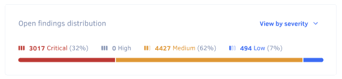
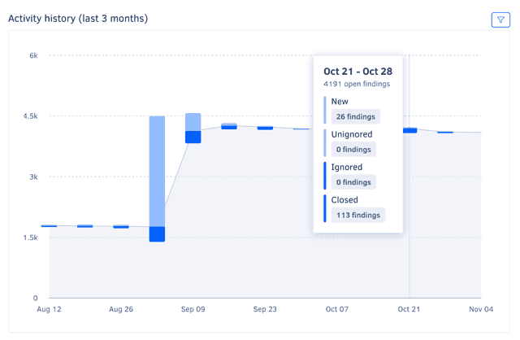
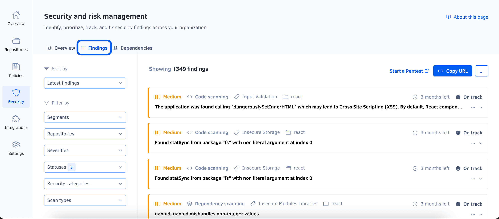

# Managing security and risk

The Security and risk management feature helps you quickly identify, track, and address security across your organization by automatically opening time-bound, prioritized findings whenever security problems are detected in your organization repositories, in your [connected Jira instance](./integrations/jira-integration.md), or as a result of [penetration testing](https://go.codacy.com/pen-testing-product).

Under Security and risk management, you can find the following pages to help you monitor the security of your repositories:

-   [Overview](#dashboard)
-   [Findings](#item-list)

In addition, on these pages, you can [share filtered views of findings](#sharing-filtered-view), [export findings as a CSV file](#exporting-the-security-item-list), and [review severity rules and integration settings](#reviewing-settings)

## Overview {: id="dashboard"}

The **Security and risk management overview** page provides a high-level view of the security posture of your organization, including the number of open findings, the distribution of open findings by severity, the history of finding resolution, and a breakdown of the most high-risk repositories and most detected security categories.

Use this page to assess your organization's security posture and its progress over time, identify areas for improvement, and share findings with stakeholders.

To access the overview page, select an organization from the top navigation bar and select **Security and risk** on the left navigation sidebar.

The overview page includes six panels:

-   [Open findings overview](#open-findings-overview)
-   [Open findings distribution](#open-findings-distribution)
-   [Open findings history](#open-findings-history)
-   [Activity history](#activity-history)
-   [Top 10 high-risk repositories](#top-10-high-risk-repositories)
-   [Top 10 common security categories](#top-10-common-security-categories)

To limit the information displayed in each panel to a specific set of repositories, use the filter drop-down above the main area.

### Open findings overview

The **Open findings overview** panel displays the total number of open security findings and the number of findings of each severity, helping you quickly assess the overall security posture of your organization and quickly review findings that are critical or overdue.

To access the findings page with the corresponding filter applied, click on a number.

### Open findings distribution

The **Open findings distribution** panel shows the relative distribution of open findings by scan type, severity, or status, helping you evaluate the distribution of risk across different criteria and identify areas that may need immediate attention.

To select the desired distribution, use the drop-down in the top right-hand corner of the panel.

To access the findings page with the corresponding filter applied, click on a number.

### Open findings history

The **Open findings history** graph shows the open findings trends over the past three months, grouped by week and severity. It details the progression of your organization's risk and security posture over time and can, for example, help you understand if the right issues are being addressed.

For a detailed view of the distribution on a specific week, hover over the graph.

### Activity history

The **Activity history** graph shows weekly counts of open and closed findings over the past three months, overlaid on the overall open findings trend. It complements the **Open findings history** graph with more information, such as the volume of findings addressed each week and a visual representation of the new/closed ratio.

To filter the graph by finding severity, use the drop-down in the top right-hand corner of the panel.

For a detailed view of the counts on a specific week, hover over the graph.

### Top 10 high-risk repositories

The **Top 10 high-risk repositories** list shows the repositories with the highest number of open findings, ordered by severity.

!!! note
    This panel may list fewer than ten repositories if there are fewer than ten repositories with open findings in the organization or if fewer than ten repositories are selected in the dropdown **Repository** filter.

### Top 10 common security categories

The **Top 10 common security categories** list shows the most common security categories of open findings, ordered by count.

To access the findings page with the corresponding filter applied, click on a category.

## Findings {: id="item-list"}

The **Security and risk management findings** page displays a filtered list of findings. By default, this list is sorted by status, and you can click the **First detected** column name to sort the findings by the detection date. Use this page to review and prioritize findings and track the progress of your security efforts.

To access the findings page, access the [overview page](#dashboard) and click the **Findings** tab.

When viewing the findings, you can update the filtering criteria by clicking the **Severity**, **Status**, **Repository**, **Security category**, or **Scan type** drop-downs above the list.

The **Details** column offers a quick overview of each finding in the list, including its title, [source platform](#opening-and-closing-items), [scan type](#scan-types), [security category](#supported-security-categories), and related information such as the repository name, Jira issue key, or penetration testing report URL. To find out more, click this overview to navigate to the finding details on the source platform.

## Sharing a filtered view of findings {: id="sharing-filtered-view"}

To share the current view of the overview or findings page, click the **Copy URL** button in the top right-hand corner of the page. This action copies the URL with the current filters applied to the clipboard.

## Exporting findings {: id="exporting-the-security-item-list"}

!!! info "This feature is available only to organization admins and organization managers"

To export a list of findings as a CSV file, click the options menu in the top right-hand corner of the page and select **Export findings (.csv)**. The exported list always includes all findings, ignoring any applied filters.

## Reviewing severity rules and integration settings {: id="reviewing-settings"}

To [review the severity assignment rules](#item-severities-and-deadlines) or manage the integration with [Jira](./integrations/jira-integration.md) or [Slack](./integrations/slack-integration.md), click the options menu in the top right-hand corner of the page and select respectively **See severity rules** or **View integrations**.

## How Codacy manages findings {: id="opening-and-closing-items"}

!!! important
    To open and close findings, Codacy must detect when the associated issues are introduced and fixed. The detection logic is platform-dependent and is described below.

Codacy opens a new finding whenever a source platform detects a new security issue. The new finding is automatically assigned a severity and a status:

-   The priority of the issue on the source platform sets the [severity of the finding](#item-severities-and-deadlines). In turn, the severity of the finding defines a deadline to close the finding.
-   The time to the deadline sets the [status of the finding](#item-statuses). The finding then moves through different statuses as the deadline is approached, met, or missed.

Codacy closes a finding when the source platform stops detecting the associated security issue.

The following section details when Codacy opens and closes findings for each supported platform.

### How Codacy manages findings detected on Git repositories {: id="opening-and-closing-codacy-items"}

!!! note
    To make sure that Codacy detects security issues correctly:

    -   [Enable code patterns](../repositories-configure/configuring-code-patterns.md) belonging to the Security category. These patterns are enabled by default, but may not be on custom configurations.
    -   Alternatively, [apply a coding standard](using-coding-standards.md) that includes patterns belonging to the Security category.
    -   Confirm that the latest [commits](../repositories/commits.md) to the default branches of your repositories are analyzed.

Codacy opens a new finding when it detects a new security issue on the default branch of a repository.

Codacy closes a finding in either of the following cases:

-   Codacy detects that the associated issue isn't present in the most recent analyzed commit and therefore is fixed
-   You [ignore the associated issue](../repositories/issues.md#ignoring-and-managing-issues)
-   You [disable the tool](../repositories-configure/configuring-code-patterns.md) that found the associated issue

!!! important
    Deleting a repository deletes all open findings belonging to that repository.

### How Codacy manages findings detected on Jira {: id="opening-and-closing-jira-items"}

!!! note
    -   For Codacy to detect Jira issues, you must [integrate Jira with Security and risk management](./integrations/jira-integration.md).
    -   Codacy retrieves updates from Jira once a day. If an issue is opened and closed on the same day, Codacy may not detect it.
    -   To make sure that Codacy detects Jira issues correctly, assign the **security** label when creating the issue or immediately after.

Codacy opens a new finding when it detects a new Jira issue with a **security** label (case-insensitive).

Codacy closes a finding when it detects that the associated Jira issue is marked as Closed.

### How Codacy manages findings detected during penetration testing {: id="opening-and-closing-pen-testing-items"}

!!! note
    Penetration testing is available upon request and is provided by a third-party partner. See [how to request penetration testing for your organization](https://go.codacy.com/pen-testing-product).

Codacy opens a finding for each security issue detected during a penetration test.

Codacy closes a finding when a subsequent penetration test does not detect the underlying security issue.

### How Codacy manages findings detected during application scanning (DAST) {: id="opening-and-closing-app-scanning-items"}

!!! note
    To view application scanning findings, also known as DAST (Dynamic Application Security Testing) findings, you must first generate a report using Zed Attack Proxy and upload it to Codacy. See [how to upload a DAST report](../codacy-api/examples/uploading-application-scanning-results.md).

Codacy opens a finding for each security issue detected in the DAST report.

Codacy closes a finding when a subsequent DAST report does not detect the underlying security issue.

## Finding severities and deadlines {: id="item-severities-and-deadlines"}

!!! note
    Currently, Codacy doesn't support customizing the severity rules for security findings.

The following table defines finding severities and the number of days to the deadline to fix the associated security issue, based on the importance of the underlying issue:

| Finding severity |  Days to deadline | Underlying Codacy issue severity | Underlying Jira issue priority 1 |
|----------------------|-----------------------|--------------------------------------|-------------------------------------------------|
| Critical             | 30                    | Critical                             | Highest                                         |
| High                 | 60                    | -                                    | High                                            |
| Medium               | 90                    | Medium                               | Medium                                          |
| Low                  | 120                   | Minor                                | Low and other/custom                            |

<small>1 Those listed are the default Jira priority names. If you rename a default Jira priority, it keeps the correct mapping.</small>

## Finding statuses {: id="item-statuses"}

The following table describes how finding statuses map to deadlines:

<table>
    <thead>
        <tr>
            <th>Status category</th>
            <th>Finding status</th>
            <th>Deadline</th>
        </tr>
    </thead>
    <tbody>
        <tr>
            <td rowspan="3">Open</td>
            <td>Overdue</td>
            <td>The deadline has been missed</td>
        </tr>
        <tr>
            <td>Due soon</td>
            <td>Fewer than 15 days to the deadline</td>
        </tr>
        <tr>
            <td>On track</td>
            <td>15 days or more to the deadline</td>
        </tr>
        <tr>
            <td rowspan="2">Closed</td>
            <td>Closed late</td>
            <td>Closed after the deadline</td>
        </tr>
        <tr>
            <td>Closed on time</td>
            <td>Closed before the deadline</td>
        </tr>
    </tbody>
</table>

## Supported security categories

!!! note
    Due to a recent update, some issues may be temporarily assigned the **Not yet categorized** category. To categorize these issues, you can [reanalyze the default branch of the relevant repository](../faq/repositories/how-do-i-reanalyze-my-repository.md#reanalyzing-a-branch). For a list of repositories that have issues with this category, use the **Security category** filter on the [Findings](#item-list) page.

Each Codacy issue reported by Security and risk management belongs to one of the following security categories:

<!--NOTE
    Currently, this category doesn't include any security issues
    https://github.com/codacy/codacy-tools/pull/496#discussion_r892437164

|**Firefox OS**|Security issues related to sensitive APIs of Firefox OS.|
-->

| Security category                  | Description                                                                                                                                                                                                      |
|------------------------------------|------------------------------------------------------------------------------------------------------------------------------------------------------------------------------------------------------------------|
| **Android**                        | Android-specific security issues.                                                                                                                                                                                |
| **Authentication**                 | Broken authentication and authorization attacks consist in gaining access to accounts that allow disclosing sensitive information or performing operations that could compromise the system.                     |
| **Command Injection**              | Command injection attacks aim to execute arbitrary commands on the host operating system.                                                                                                                        |
| **Cookies**                        | Security issues related to insecure cookies.                                                                                                                                                                     |
| **Cryptography**                   | Cryptography attacks exploit failures related to cryptography (or lack thereof), potentially leading to exposure of sensitive data.                                               |
| **CSRF**                           | Cross-Site Request Forgery (CSRF) attacks force an end user to execute unwanted actions on a web application in which they're currently authenticated.                                                           |
| **Denial of Service**              | Denial of Service (DoS) attacks make a resource (site, application, server) unavailable for legitimate users, typically by flooding the resource with requests or exploiting a vulnerability to trigger a crash. |
| **File Access**                    | File access security issues may allow an attacker to access arbitrary files and directories stored on the file system such as application source code, configuration, and critical system files.                 |
| **HTTP Headers**                   | Insecure HTTP headers are a common attack vector for malicious users.                                                                                                                                            |
| **Input Validation**               | Client input should always be validated to prevent malformed or malicious data from entering the workflow of an information system.                                                                              |
| **Insecure Modules and Libraries** | Security issues related to modules or libraries that can potentially include vulnerabilities.                                                                                     |
| **Insecure Storage**               | Security issues related to insecure storage of sensitive data.                                                                                                                                                   |
| **Malicious Code**                 | Security issues related to code patterns that are potentially unsafe.                                                                                                             |
| **Mass Assignment**                | Unprotected mass assignments are a Rails feature that could allow an attacker to update sensitive model attributes.                                                                                              |
| **Regex**                          | Regular expressions can be used in Denial of Service attacks, exploiting the fact that in most regular expression implementations the computational load grows exponentially with input size.                    |
| **Routes**                         | Badly configured routes can give unintended access to an attacker.                                                                                                                                               |
| **SQL Injection**                  | SQL injection attacks insert or "inject" malicious SQL queries into the application via the client input data.                                                                                                   |
| **SSL**                            | Security issues related with old SSL versions or configurations that have known cryptographic weaknesses and should no longer be used.                                                                           |
| **Unexpected Behaviour**           | Security issues related to potentially insecure system API calls.                                                                                                                 |
| **Visibility**                     | Logging should always be included for security events to better allow attack detection and help defend against vulnerabilities.                                                                                  |
| **XSS**                            | Cross-Site Scripting (XSS) attacks inject malicious client-side scripts into trusted websites that are visited by the end users.                                                                                 |
| **Other**                          | Other language-specific security issues.                                                                                                                                                                         |

## Scan types

Security and risk management classifies each finding with a **Scan type**, indicating the specific source or method used to detect the finding. This information helps you understand the origin of the finding and the context in which the underlying issue was detected.

The following table lists the available scan types and their descriptions:

| Scan type                         | Description                                                                                                                  |
|-----------------------------------|------------------------------------------------------------------------------------------------------------------------------|
| **Code Scanning**                 | Analysis of source code for vulnerabilities without execution. Also known as Static Application Security Testing (**SAST**). |
| **Software Composition Analysis** | Analysis of external libraries and packages for vulnerabilities or outdated versions.                                        |
| **Exposed Secrets**               | Detection of sensitive information, such as passwords or API keys, inadvertently included in the code.                       |
| **Infrastructure as Code**        | Detection of configuration issues within infrastructure-as-code (IaC) files that could pose risks.                           |
| **Penetration Testing**           | Results from [penetration testing](#opening-and-closing-pen-testing-items) to find security vulnerabilities in running code. |
| **App Scanning**                  | Simulated attacks on live applications to find vulnerabilities. Known as Dynamic Application Security Testing (**DAST**).    |

## Languages checked for security issues

Security and risk management supports checking the languages and infrastructure-as-code platforms below for any Codacy security issues reported by the corresponding tools:

<!--NOTE
    When adding a new supported tool, make sure that you update the following pages:

    docs/getting-started/supported-languages-and-tools.md
    docs/repositories-configure/local-analysis/client-side-tools.md (if the tool runs client-side)
    docs/organizations/managing-security-and-risk.md  (if the tool reports security issues)
    docs/repositories-configure/configuring-code-patterns.md (supported configuration files table, or list of tools that don't support configuration files)
    docs/repositories-configure/codacy-configuration-file.md (list of tool short names to use on the Codacy configuration file)
-->

<table>
  <thead>
    <tr>
      <th>Language</th>
      <th>Tools that report security issues</th>
    </tr>
  </thead>
  <tbody>
    <tr>
      <td>Apex</td>
      <td><a href="https://pmd.github.io/">PMD</a>,
          <a href="https://semgrep.dev/">Semgrep</a> <a href="#semgrep">1</a></td>
    </tr>
    <tr>
      <td>AWS CloudFormation</td>
      <td><a href="https://github.com/bridgecrewio/checkov/">Checkov</a>,
          <a href="https://trivy.dev">Trivy</a> <a href="#yaml-only">2</a></td>
    </tr>
    <tr>
      <td>C</td>
      <td><a href="https://clang.llvm.org/extra/clang-tidy/">Clang-Tidy</a><a href="#client-side"> 3</a>,
          <a href="http://cppcheck.sourceforge.net/">Cppcheck</a>,
          <a href="https://dwheeler.com/flawfinder/">Flawfinder</a>,
          <a href="https://semgrep.dev/">Semgrep</a> <a href="#semgrep">1</a>,
          <a href="https://trivy.dev">Trivy</a></td>
    </tr>
    <tr>
      <td>C#</td>
      <td><a href="https://github.com/SonarSource/sonar-dotnet">SonarC#</a>,
          <a href="https://semgrep.dev/">Semgrep</a> <a href="#semgrep">1</a>,
          <a href="https://trivy.dev">Trivy</a></td>
    </tr>
    <tr>
      <td>C++</td>
      <td><a href="https://clang.llvm.org/extra/clang-tidy/">Clang-Tidy</a><a href="#client-side"> 3</a>,
          <a href="http://cppcheck.sourceforge.net/">Cppcheck</a>,
          <a href="https://dwheeler.com/flawfinder/">Flawfinder</a>,
          <a href="https://semgrep.dev/">Semgrep</a> <a href="#semgrep">1</a>,
          <a href="https://trivy.dev">Trivy</a></td>
    </tr>
    <tr>
      <td>Dart</td>
      <td><a href="https://trivy.dev">Trivy</a></td>
    </tr>
    <tr>
      <td>Dockerfile</td>
      <td><a href="https://github.com/hadolint/hadolint">Hadolint</a>,
          <a href="https://semgrep.dev/">Semgrep</a> <a href="#semgrep">1</a>,
          <a href="https://trivy.dev">Trivy</a></td>
    </tr>
    <tr>
      <td>Elixir</td>
      <td><a href="https://github.com/rrrene/credo">Credo</a>,
          <a href="https://trivy.dev">Trivy</a></td>
    </tr>
    <tr>
      <td>GitHub Actions</td>
      <td><a href="https://semgrep.dev/">Semgrep</a> <a href="#semgrep">1</a></td>
    </tr>
    <tr>
      <td>Go</td>
      <td><a href="https://github.com/securego/gosec">Gosec</a><a href="#client-side"> 3</a>,
          <a href="https://semgrep.dev/">Semgrep</a> <a href="#semgrep">1</a>,
          <a href="https://trivy.dev">Trivy</a></td>
    </tr>
    <tr>
      <td>Groovy</td>
      <td><a href="https://codenarc.github.io/CodeNarc/">CodeNarc</a></td>
    </tr>
    <tr>
      <td>Helm</td>
      <td><a href="https://trivy.dev">Trivy</a> <a href="#yaml-only">2</a></td>
    </tr>
    <tr>
      <td>Java</td>
      <td><a href="https://semgrep.dev/">Semgrep</a> <a href="#semgrep">1</a>,
          <a href="https://spotbugs.github.io/">SpotBugs</a><a href="#client-side"> 3</a><a href="#spotbugs-plugin"> 4</a>,
          <a href="https://trivy.dev">Trivy</a></td>
    </tr>
    <tr>
      <td>JavaScript</td>
      <td><a href="https://eslint.org/">ESLint</a> <a href="#eslint-plugin">5</a>,
          <a href="https://semgrep.dev/">Semgrep</a> <a href="#semgrep">1</a>,
          <a href="https://trivy.dev">Trivy</a></td>
    </tr>
    <tr>
      <td>JSON</td>
      <td><a href="https://trivy.dev">Trivy</a></td>
    </tr>
    <tr>
      <td>Kotlin</td>
      <td><a href="https://semgrep.dev/">Semgrep</a> <a href="#semgrep">1</a></td>
    </tr>
    <tr>
      <td>Kubernetes</td>
      <td><a href="https://trivy.dev">Trivy</a> <a href="#yaml-only">2</a></td>
    </tr>
    <tr>
      <td>Objective-C</td>
      <td><a href="https://clang.llvm.org/extra/clang-tidy/">Clang-Tidy</a><a href="#client-side"> 3</a></td>
    </tr>
    <tr>
      <td>PHP</td>
      <td><a href="https://github.com/squizlabs/PHP_CodeSniffer">PHP_CodeSniffer</a>,
          <a href="https://phpmd.org/">PHP Mess Detector</a>,
          <a href="https://semgrep.dev/">Semgrep</a> <a href="#semgrep">1</a>,
          <a href="https://trivy.dev">Trivy</a></td>
    </tr>
    <tr>
      <td>PowerShell</td>
      <td><a href="https://github.com/PowerShell/PSScriptAnalyzer">PSScriptAnalyser</a></td>
    </tr>
    <tr>
      <td>Python</td>
      <td><a href="https://github.com/PyCQA/bandit">Bandit</a>,
          <a href="https://github.com/landscapeio/prospector">Prospector</a>,
          <a href="https://github.com/pylint-dev/pylint">Pylint</a>,
          <a href="https://semgrep.dev/">Semgrep</a> <a href="#semgrep">1</a>,
          <a href="https://trivy.dev">Trivy</a></td>
    </tr>
    <tr>
      <td>Ruby<a href="#ruby-31"> 6</a></td>
      <td><a href="https://brakemanscanner.org/">Brakeman</a>,
          <a href="https://github.com/rubocop/rubocop">RuboCop</a>,
          <a href="https://semgrep.dev/">Semgrep</a> <a href="#semgrep">1</a>,
          <a href="https://trivy.dev">Trivy</a></td>
    </tr>
    <tr>
      <td>Rust</td>
      <td><a href="https://semgrep.dev/">Semgrep</a> <a href="#semgrep">1</a>,
          <a href="https://trivy.dev">Trivy</a></td>
    </tr>
    <tr>
      <td>Scala</td>
      <td><a href="https://github.com/codacy/codacy-scalameta">Codacy Scalameta Pro</a>,
          <a href="https://semgrep.dev/">Semgrep</a> <a href="#semgrep">1</a>,
          <a href="https://spotbugs.github.io/">SpotBugs</a><a href="#client-side"> 3</a><a href="#spotbugs-plugin"> 4</a></td>
    </tr>
    <tr>
      <td>Swift</td>
      <td><a href="https://semgrep.dev/">Semgrep</a> <a href="#semgrep">1</a></td>
    </tr>
    <tr>
      <td>Shell</td>
      <td><a href="https://www.shellcheck.net/">ShellCheck</a>
          <a href="https://semgrep.dev/">Semgrep</a> <a href="#semgrep">1</a></td>
    </tr>
    <tr>
      <td>Terraform</td>
      <td><a href="https://semgrep.dev/">Semgrep</a> <a href="#semgrep">1</a>,
          <a href="https://trivy.dev">Trivy</a></td>
    </tr>
    <tr>
      <td>Transact-SQL</td>
      <td><a href="https://github.com/tsqllint/tsqllint/">TSQLLint</a></td>
    </tr>
    <tr>
      <td>TypeScript</td>
      <td><a href="https://eslint.org/">ESLint</a> <a href="#eslint-plugin">5</a>,
          <a href="https://semgrep.dev/">Semgrep</a> <a href="#semgrep">1</a>,
          <a href="https://trivy.dev">Trivy</a></td>
    </tr>
    <tr>
      <td>Visual Basic</td>
      <td><a href="https://github.com/SonarSource/sonar-dotnet">SonarVB</a></td>
    </tr>
  </tbody>
</table>

1: Semgrep supports additional security rules when signing up for [Semgrep Pro](https://semgrep.dev/pricing/).  
2: Currently, Trivy only supports scanning YAML files on this platform.  
3: Supported as a [client-side tool](../repositories-configure/local-analysis/client-side-tools.md).  
4: Includes the plugin [Find Security Bugs](https://find-sec-bugs.github.io/).  
5: Includes the plugins [no-unsanitized](https://www.npmjs.com/package/eslint-plugin-no-unsanitized), [security](https://www.npmjs.com/package/eslint-plugin-security), [security-node](https://www.npmjs.com/package/eslint-plugin-security-node), and [xss](https://www.npmjs.com/package/eslint-plugin-xss).  
6: Currently, Codacy doesn't support any static code analysis tool for [Ruby 3.1](https://www.ruby-lang.org/en/news/2021/12/25/ruby-3-1-0-released/).  
