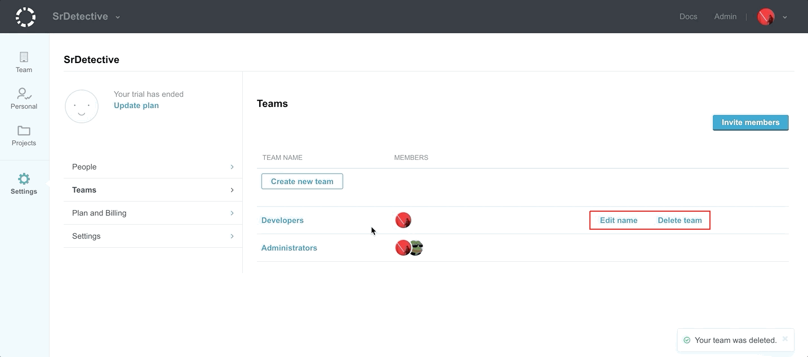

# Creating and managing teams



You can create and manage teams on the **Teams** page for your organization:

1.  Click your avatar and select **Organizations**
1.  Select the organization whose teams you want to manage
1.  Open the organization **Settings**, page **Teams**

## Creating a team

On the **Teams** page:

1.  Click **Create new team**
1.  Enter the name of the team and click **Create new team** or press enter to create the team

## Managing teams

On the **Teams** page, click:

-   **Edit name** to rename a team
-   **Delete team** and confirm the operation to delete a team

## Adding team members

On the **Teams** page:

1.  Click **Invite members**
1.  Enter the email address of the user to invite and select the team for the new user

    !!! tip
        You can add multiple email addresses at once by separating them with commas.

1.  Click **Invite new member**

## Removing team members

On the **Teams** page:

1.  Click the name of the team from where you want to remove the team member
1.  Click the **X** to the left of the team member name

