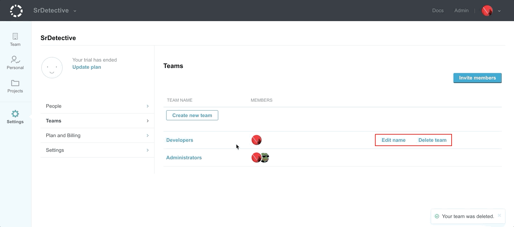
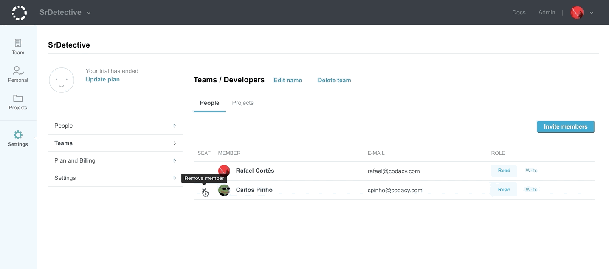

# Creating and managing teams

## Creating a team

To create a team, click on your avatar and select **Organizations**. Once on the Organizations page, select the organization you'd like to create the team in. Click on **Create new team**, fill in the **Team name** field, and click on the **Create new team button** or hit enter.

## Managing teams

In this section, you can also rename and delete teams. To rename a team, click on **Edit name**. To remove a team click on **Delete team** and confirm.

## Adding team members

To add team members, click on your avatar and select **Organizations**, then select the organization you would like to add members to. Fill in the Email and Team fields, then click on the **Invite members** button. You can add multiple addresses by separating them with a comma.

## Managing team members

You can also remove team members from an organization by clicking the **X** found on the left-hand side of their member row.

