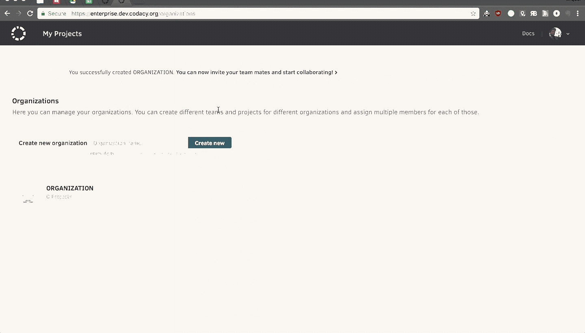
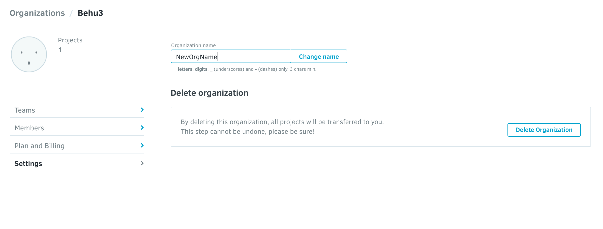

# Creating and renaming an organization

!!! note
    From April 3rd, 2020 onwards it's no longer possible to create new Manual Organizations on Codacy cloud, although you can continue using your existing Manual Organizations.

    Please use the improved [Synced Organizations](https://support.codacy.com/hc/en-us/articles/360010263720-What-are-synced-organizations) instead, since you will no longer be able to add new repositories under Manual Organizations to avoid duplication of repositories.

    This change does not impact Codacy self-hosted.

To create an organization, click on your avatar and select **Organizations**. Type the name in the **Create new organization** field and click on **Create New**.

## Renaming your organization

You can always rename an organization but:

-   You won't be able to change it back if someone else registers your original organization name.
-   This may break all your repository URLs.

To ease the migration process, your original URLs will be valid for at least 15 days.

