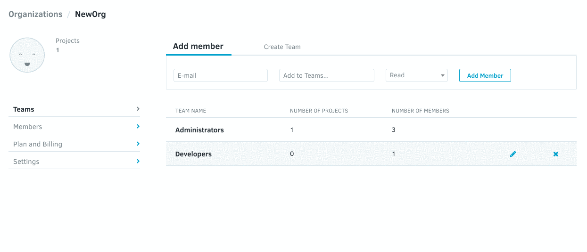

# Managing team repositories

You will be able to add and remove repositories from a team after it has been added to your organization.

## Adding a repository to your team

First, import a repository from your Git provider into your own account.

Go to your organization menu, select the team, then select the repository from the drop-down menu, and click on **Add repository**. This will make your organization the owner of this repository.

## Removing a repository from your team

Click on your avatar and select Organizations. Select the Organization and then the Team that your repository belongs to. Click on the "X" and confirm the prompt to delete the repository.

