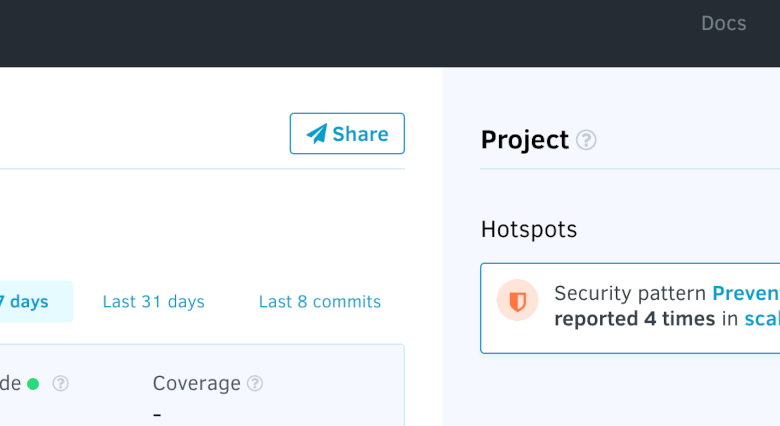
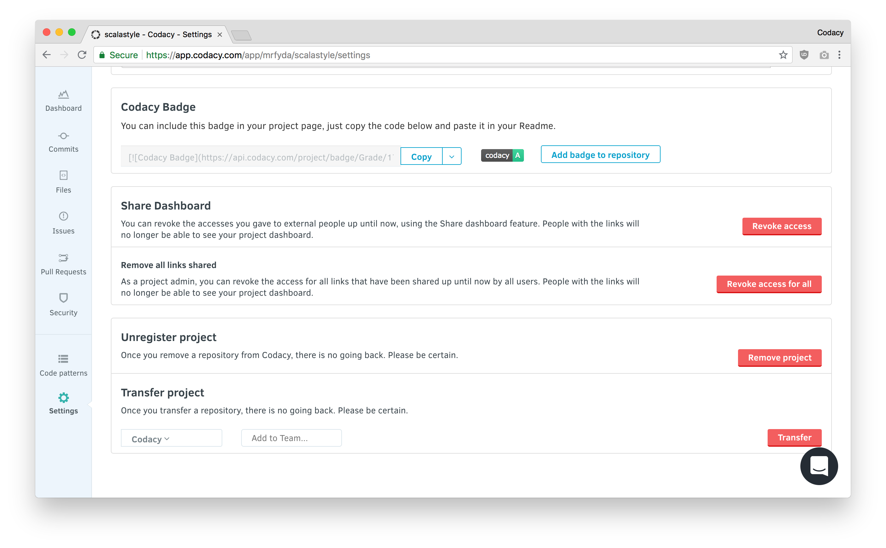

# Share your repository with a non-Codacy user

If you're a Codacy Cloud user, you can share your Repository Dashboard with a non-Codacy user by using a link that doesn't require a login.

To do this, click **Share** at the top of your Repository Dashboard.

Codacy generates a link that you can copy and share anywhere. Alternatively, you can share the link to Twitter.

You can revoke access to shared links in the Repository Settings. Revoking a link removes access to the repository dashboard for everyone you shared the link with.

-   **Revoke Access:** will revoke the link you generated for that repository.
-   **Revoke Access for all:** an admin will revoke all links generated by anyone for that repository.

Recipients of the share through email will get the following email:

