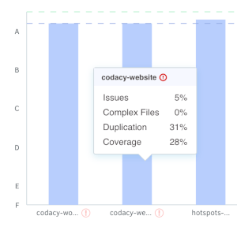
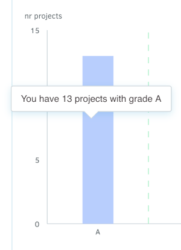
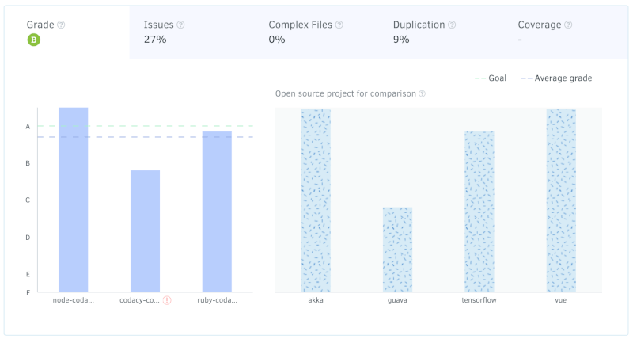

# Organization Dashboard overview

The **Organization Dashboard** offers an overview of repositories that belong to the same Git provider organization. Here you can compare their statuses and check for items that require your attention.

To access your Organization Dashboard, select an organization from the top navigation bar and click **Overview** on the left navigation sidebar.

On the Organization Dashboard, you have three areas to help you monitor your repositories:

1.  [Overall quality chart](#overall-quality-chart)
1.  [Open pull requests](#open-pull-requests)
1.  [Last updated repositories](#last-updated-repositories)

The following sections provide a detailed description of each dashboard area.

## Overall quality chart {: id="overall-quality-chart"}

The Overall Quality Chart displays your repositories and compares them against the average grade, your defined goal, and across each specific criteria: Issues, Complex Files, Duplication, and Coverage.

-   In the upper left is the average grade (A, in this example).
-   The graph displays how different repositories match up to your goals and the average grade.
-   You can see how each repository is performing by hovering over the bar. If something is not up to standards, you will see it flagged.
-   You can also go directly to each repository by clicking on the name of the repository at the bottom of each column.

If you have over 8 repositories, you will see your repositories grouped by Grade or by the interval of Issues (number of repositories you have with Issues between 0%-20%, 20%-40%, 40%-60%, 60%-80%, 80%-100%).

Hover over each group of repositories to see a summary.

For each specific criteria (Issues, Complex Files, Duplication, and Coverage), you can click on its tab to compare repositories. This comparison will display the current statuses of your repositories against the average and against your goal for this criteria.

!!! note
    The graph will notify you when you click on the Coverage tab if you don't have [Coverage set up](../repositories-configure/coverage.md) for any of your repositories.

If you don't have enough repositories for comparison, don't worry - we have included some Open Source repositories for comparison so you can see how you match up.

## Open pull requests {: id="open-pull-requests"}

The **Most problematic** tab displays a short list of the open pull requests that are not up to your defined standards and have the most potential to negatively affect your code quality. You can click directly on each pull request to see more details.

The **Last updated** tab displays open pull requests sorted by the date of update with a status. Pull requests can be:

-   Not up to standards
-   Up to standards
-   Analysis failed (in case something went wrong during the analysis)
-   Analyzing (an intermediate status while the pull request is under analysis)

## Last updated repositories {: id="last-updated-repositories"}

This area displays a maximum of 6 repositories by date of last update. Each repository card will display the date of the last update, the current grade, and the status for each criteria.

You can also see all repositories or add a repository here.

