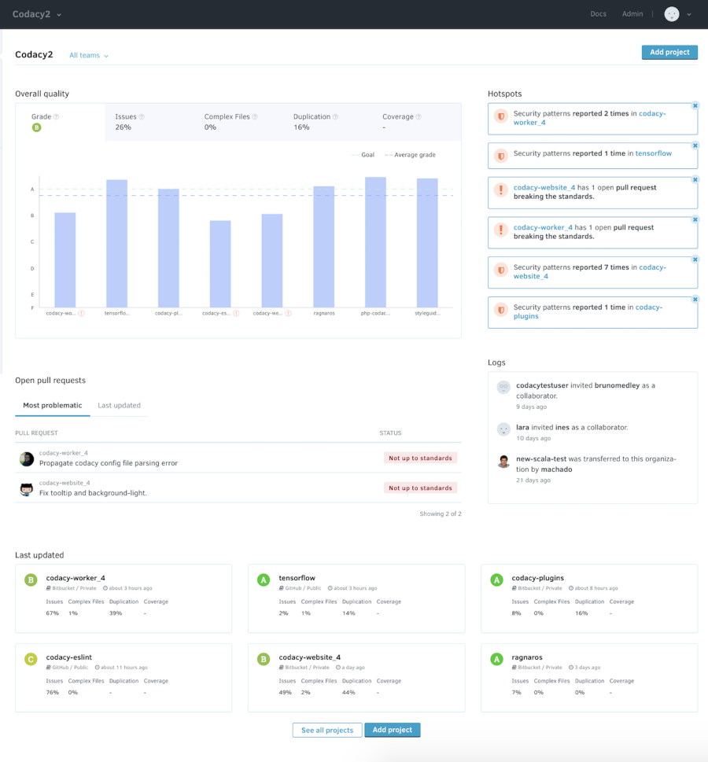
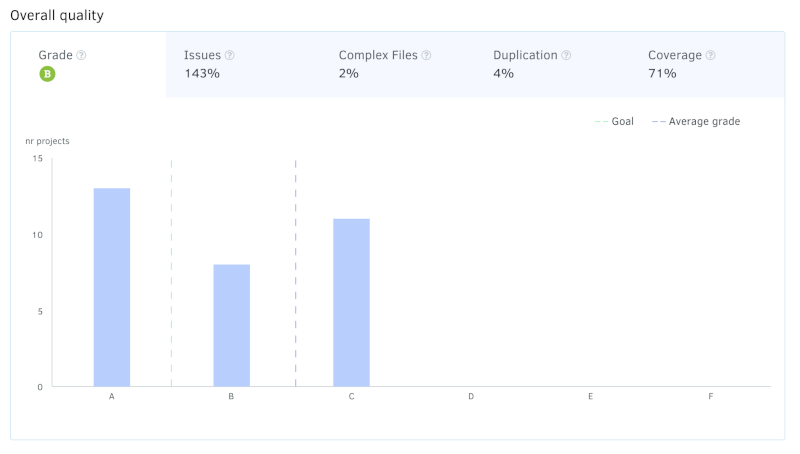
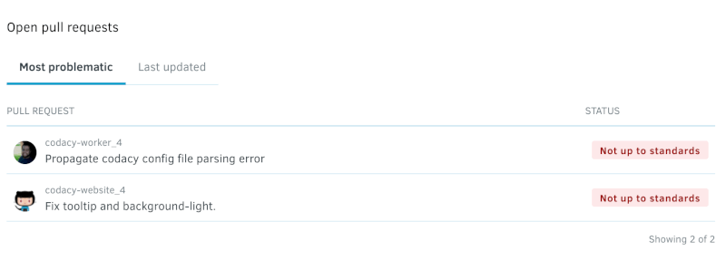
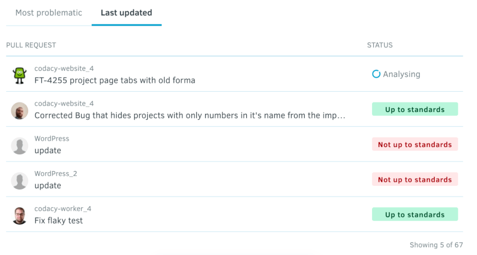
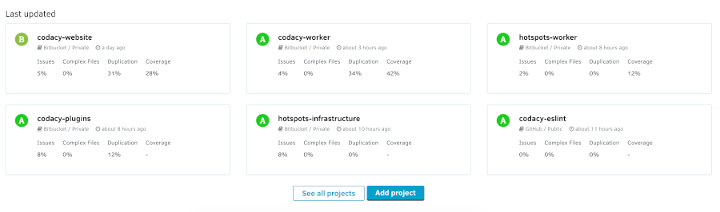

# Organization Dashboard overview

The **Organization Dashboard** offers an overview of repositories that belong to the same Git provider organization. Here you can compare their statuses and check for items that require your attention.

!!! note
    The Organization Dashboard calculates metrics and displays data only for the repositories that you have access to. This means that depending on their permissions, two users could see different results on their Organization Dashboards.

To access your Organization Dashboard, select an organization from the top navigation bar and click **Overview** on the left navigation sidebar.

On the Organization Dashboard, you have three areas to help you monitor your repositories:

1.  [Overall quality chart](#overall-quality-chart)
1.  [Open pull requests](#open-pull-requests)
1.  [Last updated repositories](#last-updated-repositories)

The following sections provide a detailed description of each dashboard area.

## Overall quality chart {: id="overall-quality-chart"}

The overall quality chart compares your repositories across grade, issues, complex files, duplication, and coverage. Each tab displays the average value for the corresponding metric.

-   Hover over the bars to see the metrics for the corresponding repositories. If a metric is not up to standards, you will see it flagged.
-   Click the bars to navigate directly to the corresponding repository.

If you have over eight repositories, the chart displays your repositories grouped by grade or percentage intervals:

!!! tip
    If you don't have coverage set up for any of your repositories yet, the coverage tab provides you with instructions on [how to add coverage for your repositories](../coverage-reporter/adding-coverage-to-your-repository.md).

## Open pull requests {: id="open-pull-requests"}

The **Most problematic** tab displays a short list of the open pull requests that are not up to your defined standards and have the most potential to negatively affect your code quality. Click directly on each pull request to see more details.

The **Last updated** tab displays open pull requests sorted by the date of update with one of the following status:

-   Not up to standards
-   Up to standards
-   Analysis failed (something went wrong during the analysis)
-   Analyzing (intermediate status while Codacy is analyzing the pull request)

## Last updated repositories {: id="last-updated-repositories"}

This list displays the last updated repositories, sorted by reverse date of the last update. Each repository card displays the date of the last update and the current grade of the repository.

Click **See all** to see all repositories in your organization.

