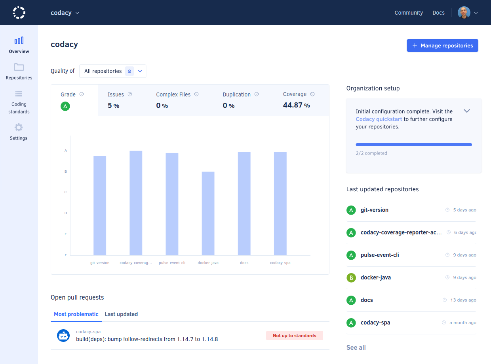

# Organization Overview



The **Organization Overview** provides an overview of repositories that belong to the same Git provider organization. Here you can compare their statuses and check for items that require your attention.

!!! important
    -   The Organization Overview calculates metrics and displays data only for the repositories that you have access to. This means that depending on their permissions, two users could see different results on their Organization Overview.

    -   The Organization Overview displays information for **at most the last 100 updated repositories**.

To access your Organization Overview, select an organization from the top navigation bar and select **Overview** on the left navigation sidebar.

On the Organization Overview you have three areas to help you monitor your repositories:

-   [Overall quality chart](#overall-quality-chart)
-   [Open pull requests](#open-pull-requests)
-   [Last updated repositories](#last-updated-repositories)

Use the drop-down list at the top of the page to filter the information displayed on all dashboard areas based on the repositories that you select. For example, you can use the filter to monitor the quality of the repositories maintained by specific teams, or to ignore legacy repositories that are no longer maintained.

The following sections provide a detailed description of each dashboard area.

## Overall quality chart

The **Overall quality** chart compares the repositories in your organization regarding grade, issues, complex files, duplication, and coverage. Each tab displays the average value for the corresponding metric across your repositories.

-   Hover the mouse pointer over the bars to see the metrics for the corresponding repositories.
-   Click the bars to navigate directly to the corresponding repository.

If you have over 8 repositories, the chart displays your repositories grouped by grade or percentage intervals. Click the bars to see and navigate directly to the corresponding repositories.

!!! info "This is a beta feature"
    This is a new Codacy feature and we're continuing to improve it.

    Read more about this feature and share your feedback on our [public roadmap](https://roadmap.codacy.com/c/86-know-which-repositories-require-more-attention){: target="_blank"}.

!!! tip
    If you don't have coverage set up for any of your repositories yet, the coverage tab provides you with instructions on [how to add coverage for your repositories](../coverage-reporter/index.md).

## Open pull requests

The **Most problematic** tab displays a short list of the open pull requests that aren't up to standards and have the most potential to negatively affect your code quality. Click directly on each pull request to see more details.

The **Last updated** tab displays open pull requests sorted by the date of update with one of the following status:

-   Not up to standards
-   Up to standards
-   Analysis failed (something went wrong during the analysis)
-   Analyzing (intermediate status while Codacy is analyzing the pull request)

## Last updated repositories

The **Last updated repositories** list displays the last updated repositories, sorted by reverse date of the last update. Each item displays the date of the last update and the current grade of the repository.

Click **See all** to see all repositories in your organization.

!!! important
    **If you're using Bitbucket Server** the list displays the repositories in alphabetical order because Codacy can't obtain the information on when the repositories were last updated from this Git provider.
