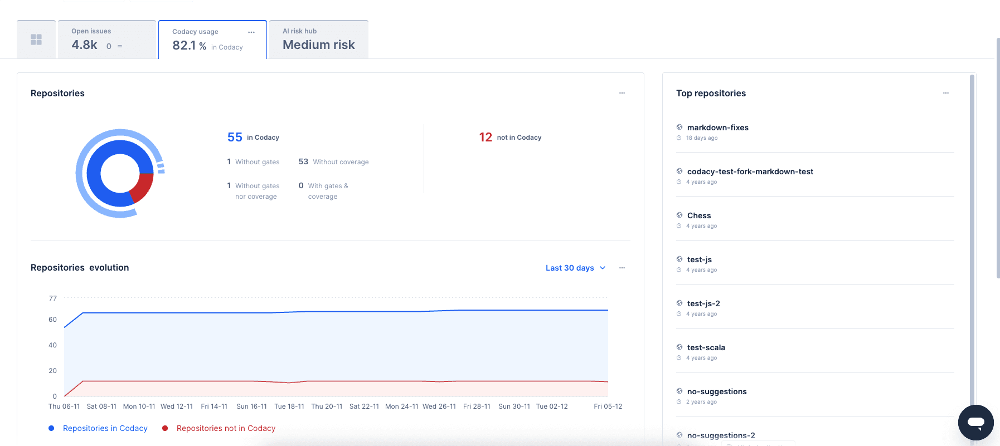
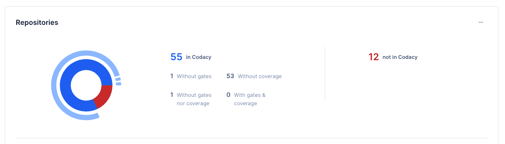
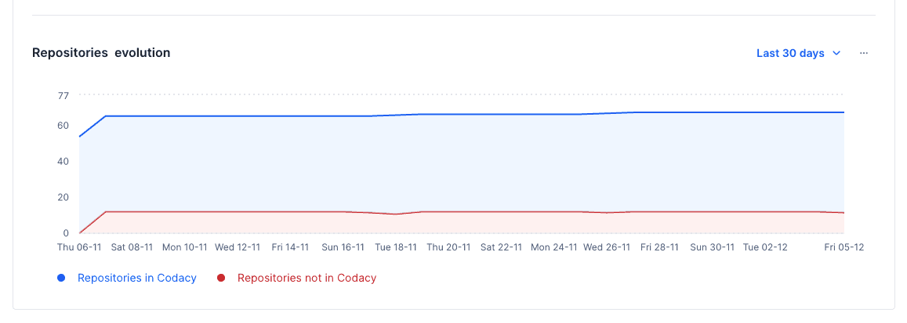
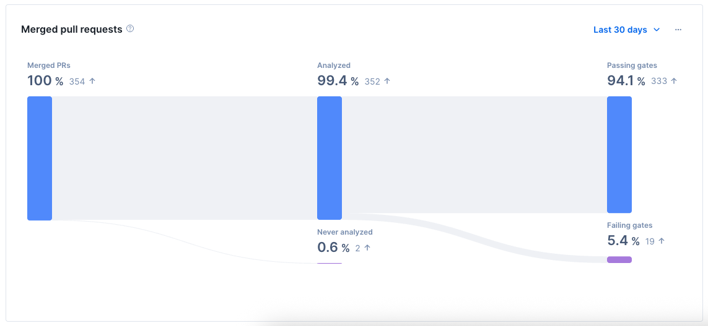
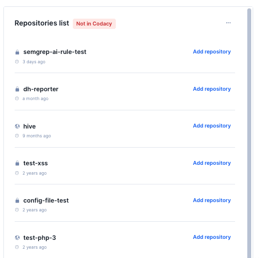

# Codacy usage

The **Codacy usage** dashboard provides an overview of your organization's configurations and their impact. You can filter repositories by quality gates and coverage, select specific repositories, or use [the segments that you have set up](../segments.md).

!!! important
    The repositories **not in Codacy** metric is only available to GitHub accounts.

To view the **Codacy usage** dashboard:

- Select an organization from the top navigation bar.
- On the organization overview page, click the Codacy usage tab.

The **Codacy usage dashboard** includes the following sections/charts to help you monitor Codacy adoption:

- [Repositories](#repositories)
- [Repositories evolution](#repositories-evolution)
- [Merged pull requests](#merged-pull-requests)
- [Repositories list](#repositories-list)

!!! tip
    In each section, you can click on the ellipsis icon in the top right corner to export that section's data to CSV or JSON.

## Repositories

This chart displays the distribution of repositories that are and are not in Codacy. The doughnut chart also details the breakdown of Codacy repositories based on their configurations: those without quality gates, without coverage, without either gates or coverage, and those with both gates and coverage. Users can interact with the doughnut chart or the numerical data to filter the results. Applying a filter will also affect the repositories displayed in the evolution chart and the results will appear in the **Repositories list**.

!!! note
    Repository coverage data is based on the last merged pull request, meaning that if a repository has coverage setup but coverage was not sent in the last merged PR, it will not count as a repository with Coverage.

## Repositories evolution

This chart shows the trend of repositories in your organization over time, considering the filters applied, affecting the **Repositories list**. You can hover over the chart to see the number of repositories on a specific date. You can also click on the chart to filter results.

## Merged pull requests

This chart tracks the total volume of pull requests merged across your Codacy-managed repositories. It serves as a high-level health check to ensure that your team's development velocity is aligned with your quality standards. 
Interacting with the chart allows you to filter the data, with the resulting repositories displayed in the **Repositories list**.

### Understanding the categories

- Passing Gates: These PRs met all your quality standards (e.g., coverage, complexity, security) before being merged.
- Failing Gates: PRs merged despite failing one or more quality checks.
- Without Gates: PRs merged into repositories where no quality gates are configured. 
- Never Analyzed: PRs that reached a "Merged" status without Codacy completing an analysis.

#### Why are some PRs "Never analyzed"?

If you see high numbers here, it usually boils down to two scenarios:

1. A developer merged the PR immediately after opening it, before the Codacy analysis could finish. To improve this, ensure your team adjusts their workflow to wait for the "Codacy/Analysis" check to turn green before merging or by making the Codacy status check mandatory.

2. In organizations with manual user management (check your billing settings), if a PR is authored by an email/user not yet added to your Codacy seat count, the analysis may be skipped. You should check your [seat management](../managing-people.md) to confirm that all active contributors are correctly mapped to a Codacy seat.”

#### Why are some PRs merged with "Failing gates"?

Pull requests are merged with failing Quality Gates usually due to two reasons:

1. Quality Gates are advisory, not blocking. [Protect your pull requests](../../getting-started/integrating-codacy-with-your-git-workflow.md#blocking-pull-requests).

2. Intentional exceptions or risk acceptance:
    - Developers/maintainers may override failing checks to address urgent fixes, unblock critical work, or accept a known risk temporarily.

    - Sometimes pull requests are small and diff coverage / coverage variation may fail. Make sure your team follows the practices that were agreed upon within the organization.

Interacting with the chart allows you to filter the data, with the resulting repositories displayed in the **Repositories list**.

!!! note
    Merged pull requests data is only from repositories that are in Codacy.

## Repositories list

The list shows a maximum of 10 repositories from your Git provider. You can use filters to display repositories that aren't yet in Codacy, or repositories that are already in Codacy. For repositories in Codacy, the list can also group them by specific metrics such as gates, coverage, and merged pull request information. Despite the 10 repository limit, the Repositories list section allows you to download a list up to 100 repositories.

