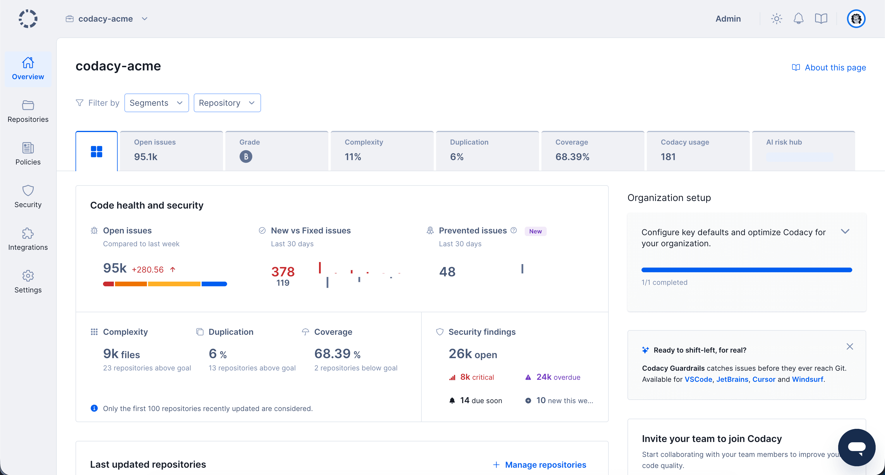
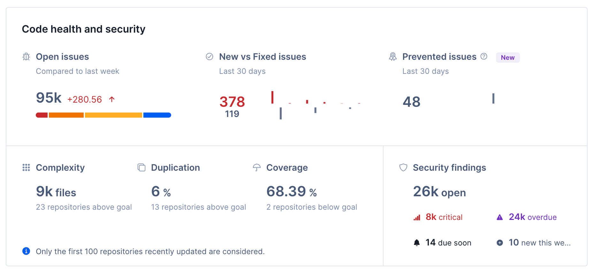
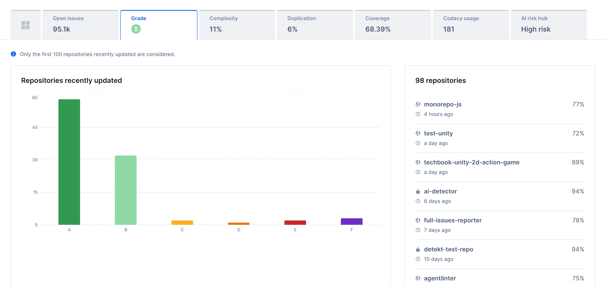
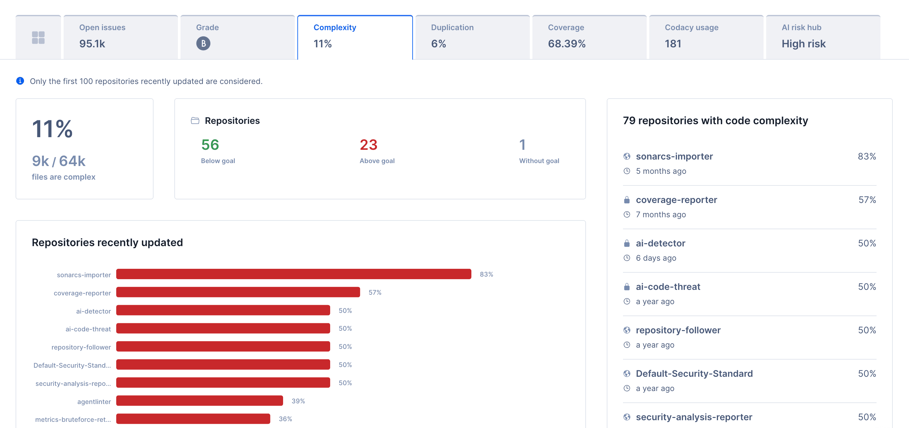
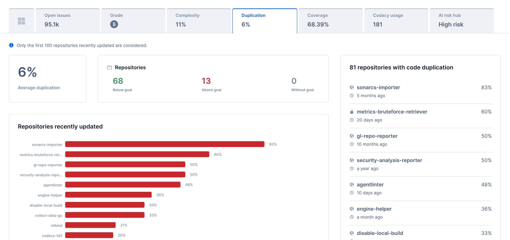
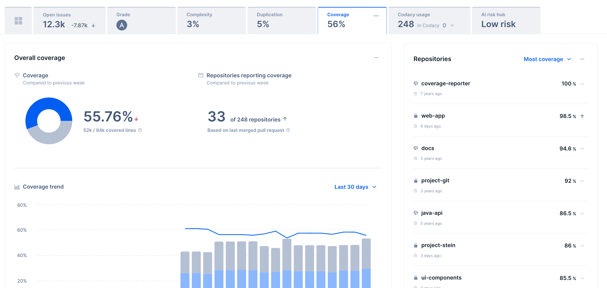

# Organization overview

Codacy gives you high-level visibility into your organization's code quality, security posture, AI risks, and usage and configuration metrics. In the **Organization overview**, you can see these metrics at a glance.

The **Organization overview** summarizes the repositories belonging to your Git provider organization that you [follow on Codacy](../managing-repositories.md). Here you can compare their statuses and check for items that require your attention.

To access your Organization overview, select an organization from the top navigation bar and select **Overview** on the left navigation sidebar.

The Organization overview contains the following tabs:

- [Overview](#overview)
- [Open issues](./issues-metrics.md)
- [Grade](#grade)
- [Complexity](#complexity)
- [Duplication](#duplication)
- [Coverage](#coverage)
- [Codacy usage](./codacy-usage.md)
- [AI Risk Hub](./ai-risk-hub.md)

Use the filters at the top of the page to filter all dashboard information by repositories or segments. For example, use filters to monitor repositories maintained by specific teams or repositories using specific programming languages, or to ignore legacy repositories that are no longer maintained. Your filter selection is stored in your browser, so your view is preserved between visits.

This page covers the Overview, Grade, Complexity, Duplication, and Coverage sections.



## Overview

On the Organization overview page, you have the following areas to help you monitor your repositories:

-   [Code health and security](#code-health-and-security)
-   [Last updated repositories](#last-updated-repositories)

On this page, you can also see the **Organization setup** area, which provides you with a checklist of items that you should complete to ensure that your organization is set up correctly and that you're getting the most out of Codacy.

### Code health and security

The **Code health and security** area provides a snapshot of your organization and key hotspots. Here, you can see at a glance open issues, new vs. fixed issues, prevented issues, and complexity, duplication, coverage, and security metrics. You can click any metric to see more details.

Some of these metrics depend on your billing plan and are calculated differently. For details, see the following table:

| Metric | Availability | How it is calculated |
| ------ | ------------ | -------------------- |
| Open issues, New and Fixed issues, and Prevented issues | Paid plans | [More details](../../faq/code-analysis/which-metrics-does-codacy-calculate.md#issues) |
| Grade | Open source and trial plans | [More details](../../faq/code-analysis/which-metrics-does-codacy-calculate.md#grade) |
| Complexity | All plans | [More details](../../faq/code-analysis/which-metrics-does-codacy-calculate.md#complexity) |
| Duplication | All plans | [More details](../../faq/code-analysis/which-metrics-does-codacy-calculate.md#duplication) |
| Coverage | All plans <a href="#coverage-note">1</a> | [More details](../../faq/code-analysis/which-metrics-does-codacy-calculate.md#code-coverage) |
| Security | All plans | [More details](../managing-security-and-risk.md) |

!!! important
    -   The overall quality chart calculates metrics and displays data only for the **repositories that you follow** on Codacy. This means that depending on their list of followed repositories, two users can see different results on this chart.

    -   Metrics like grade, complexity, duplication, and coverage (on free plans) represent **at most the last 100 updated repositories**.

1: Coverage metrics are calculated differently for paid plans and for open source and trial plans. [Learn more](#coverage).

### Last updated repositories

The **Last updated repositories** list displays the last updated repositories, sorted by reverse date of the last update.

!!! note
    The exact value of the last updated date of the repositories depends on your Git provider:

    -   **GitHub:** date of the last commit to any branch of the repository (value of `pushed_at` from the [GitHub Repositories API](https://docs.github.com/en/rest/repos/repos#list-organization-repositories){: target=_"blank"}).
    -   **GitLab:** date when the project was last updated (value of `last_activity_at` from the [GitLab Groups API](https://docs.gitlab.com/ee/api/groups.html)). Note that this value is only updated [at most once per hour](https://gitlab.com/gitlab-org/gitlab/-/issues/20952)).
    -   **Bitbucket:** date when the repository was last updated (value of `updated_on` from the [Bitbucket Repositories API](https://developer.atlassian.com/cloud/bitbucket/rest/api-group-repositories/#api-group-repositories)). **On Bitbucket Server** Codacy can't obtain this information and the list displays the repositories in alphabetical order.

## Grade

The **Grade** tab gives you visibility into grade distribution across your repositories. From this tab, you can identify the repositories with the highest risk by selecting a grade in the distribution chart.

To learn more about how grades are calculated [see how metrics are calculated](../../faq/code-analysis/which-metrics-does-codacy-calculate.md#grade).

!!! important
    Grade metrics are based **at most on the last 100 updated repositories**.

## Complexity

Complexity allows you to understand which repositories are at risk of having code that is more difficult to test and more likely to have defects.

In this tab, you can understand your organization's complexity status (based on the number of complex files) and how repositories compare against their [goals](../../repositories-configure/adjusting-quality-goals.md). A file is considered complex if its cyclomatic complexity value is higher than the goal defined at repository level. To learn more, see [how metrics are calculated](../../faq/code-analysis/which-metrics-does-codacy-calculate.md#complexity).

This panel shows, from the top 100 most recently updated repositories, which repositories are above goal, below goal, or have no goal. Because complexity is better when lower, repositories above goal are highlighted so you can review and act on them.

At the bottom of the tab, the complex files distribution helps you understand which files are complex because they are above goal, below goal, or in repositories without a goal. Files are not filterable, while repository goal distributions are.

!!! important
    Complexity metrics are based **at most on the last 100 updated repositories**.

## Duplication

Duplication allows you to check if sequences of duplicate code exist in at least two different places of the source code of your repository.

In this tab, you can see your average duplication and check which repositories are above goal, below goal, or without configured [goals](../../repositories-configure/adjusting-quality-goals.md).

To learn more about duplication metrics, see [how duplication is calculated](../../faq/code-analysis/which-metrics-does-codacy-calculate.md#duplication).

!!! important
    Duplication metrics are based **at most on the last 100 updated repositories**.

## Coverage

The **Coverage** tab provides organization-level visibility into your coverage status. Strong coverage helps protect your code and reduce the risk of regressions when code changes.

!!! important
    The Coverage tab has two modes:

    - On trial and open source plans, you can see the average repository coverage across the 100 most recently updated repositories. This includes visibility into which repositories are above goal, below goal, or without a goal, similar to the Duplication and Complexity tabs.
    - On paid plans, the dashboard removes the 100-repository limitation and provides additional metrics to help you prioritize improvements. This is the mode covered in this page.

    To understand better how these metrics are calculated, [learn more](../../faq/code-analysis/which-metrics-does-codacy-calculate.md#code-coverage).

The Coverage tab is based on two key metrics:

- **Covered lines**: number of covered lines reported into Codacy;
- **Coverable lines**: number of lines that can be covered based on your coverage reports.

These metrics are the basis of all components in this dashboard:

| Metric | Description |
| ------ | ----------- |
| **Coverage** | `coveredLines / coverableLines`  Aggregation of all covered lines divided by all coverable lines across all repositories (or your filter selection, see [filters](#overview-filters)). This metric only includes repositories reporting coverage. |
| **Repositories reporting coverage** | Repositories that have coverage based on the latest merged pull request. For example, if the latest merged pull request reported coverage metrics to Codacy, that repository is counted as reporting coverage. |
| **Coverage trend** | Trend over time for covered lines, uncovered lines, and organization coverage (or your filter selection, see [filters](#overview-filters)). You can select different time ranges and granularities, and select a date to see which repositories changed most in that period. |

You can download data from each chart using the ellipsis icon in the top-right corner and export values in JSON or CSV format.

## See also
-   [Which metrics does Codacy calculate?](../../faq/code-analysis/which-metrics-does-codacy-calculate.md)
-   [Using the Codacy API to obtain current issues in repositories](../../codacy-api/examples/obtaining-current-issues-in-repositories.md)
-   [Using the Codacy API to obtain code quality metrics for files](../../codacy-api/examples/obtaining-code-quality-metrics-for-files.md)
