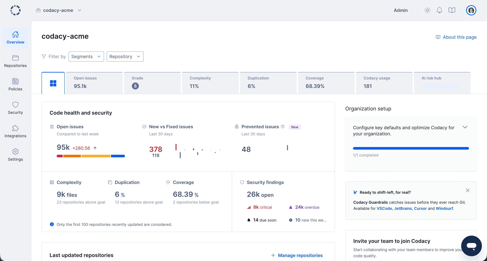
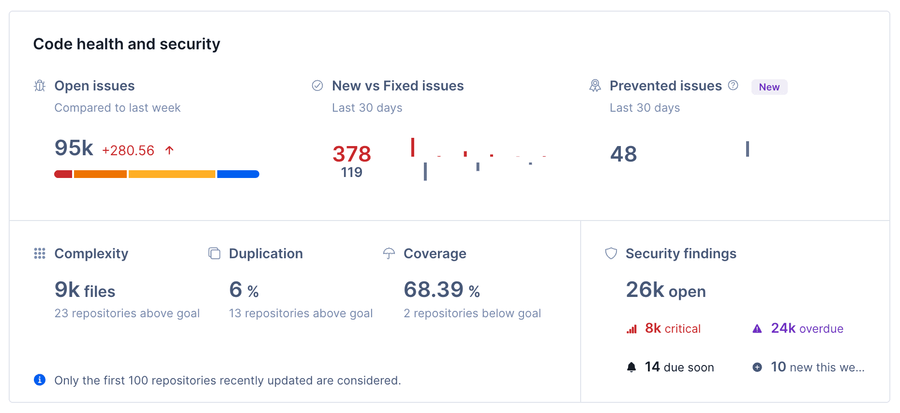
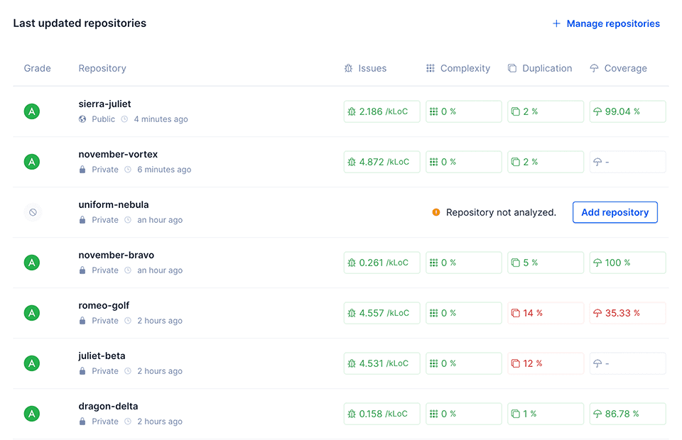
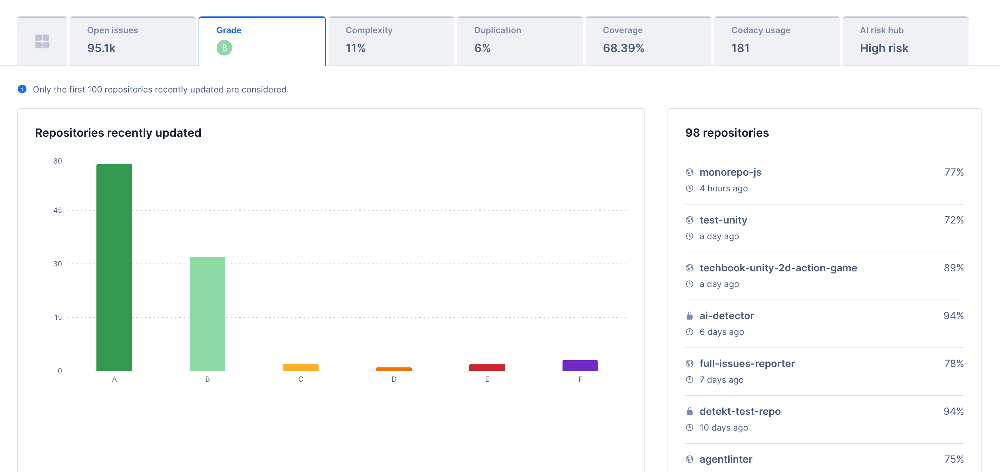
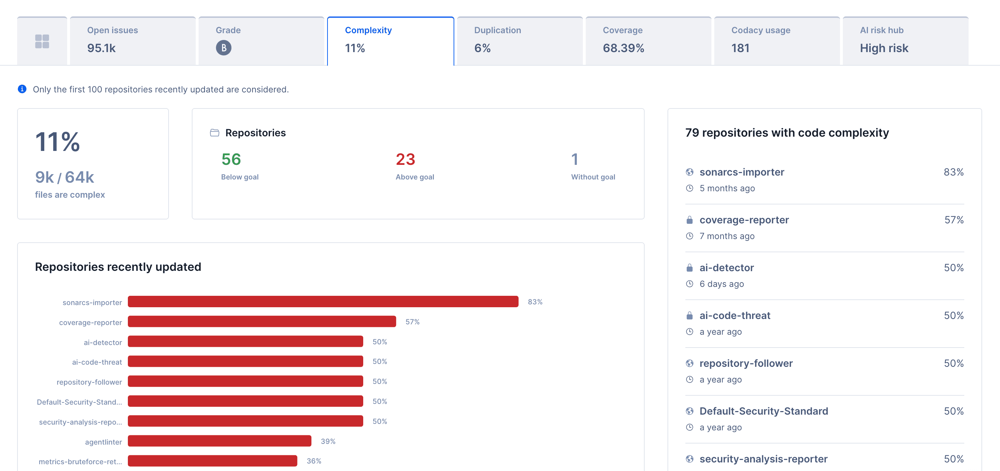
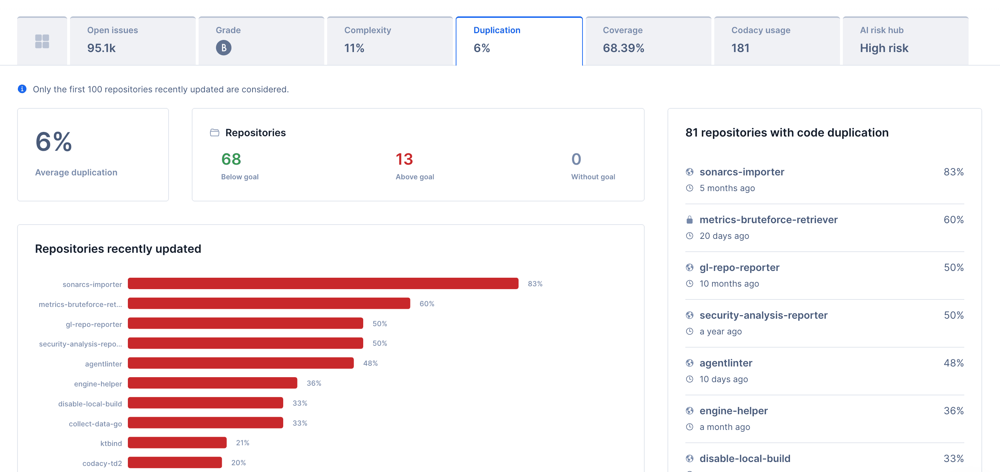
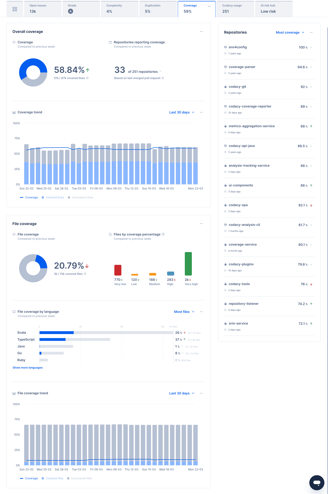

# Organization overview

Codacy provides high-level visibility into your organization's code quality, security posture, usage, and configuration metrics. The **Organization overview** consolidates these signals in a single view.

The **Organization overview** summarizes repositories in your Git provider organization that you [follow on Codacy](../managing-repositories.md). Use it to compare repository status and identify areas that require action.

To open the Organization overview, select an organization in the top navigation bar, then select **Overview** in the left sidebar.

The Organization overview includes the following tabs:

- [Overview](#overview)
- [Open issues](./issues-metrics.md)
- [Grade](#grade)
- [Complexity](#complexity)
- [Duplication](#duplication)
- [Coverage](#coverage)
- [Codacy usage](./codacy-usage.md)

Use the filters at the top of the page to scope all dashboard data by repositories or segments. For example, filter by repositories owned by specific teams, repositories using specific languages, or exclude legacy repositories that are no longer maintained. Filter selections are stored in your browser and persist across visits.

This page documents the Overview, Grade, Complexity, Duplication, and Coverage sections.



## Overview

The Organization overview page includes the following areas to help you monitor repository health:

-   [Code health and security](#code-health-and-security)
-   [Last updated repositories](#last-updated-repositories)

This page also includes the **Organization setup** area, which provides a checklist of recommended actions to ensure your organization is configured correctly and fully using Codacy capabilities.

### Code health and security

The **Code health and security** area provides an organizational snapshot and highlights key hotspots. It shows open issues, new vs. fixed issues, prevented issues, and complexity, duplication, coverage, and security metrics. Select any metric to open detailed results.

Some metrics depend on your billing plan and use plan-specific calculations. For details, see the following table:

| Metric | Availability | How it is calculated |
| ------ | ------------ | -------------------- |
| Open issues, New and Fixed issues, and Prevented issues | Paid plans | [More details](../../faq/code-analysis/which-metrics-does-codacy-calculate.md#issues) |
| Grade | Open source and trial plans | [More details](../../faq/code-analysis/which-metrics-does-codacy-calculate.md#grade) |
| Complexity | All plans | [More details](../../faq/code-analysis/which-metrics-does-codacy-calculate.md#complexity) |
| Duplication | All plans | [More details](../../faq/code-analysis/which-metrics-does-codacy-calculate.md#duplication) |
| Coverage | All plans <a href="#coverage-note">1</a> | [More details](../../faq/code-analysis/which-metrics-does-codacy-calculate.md#code-coverage) |
| Security | All plans | [More details](../managing-security-and-risk.md) |

!!! important
    -   The **Code health and security** area calculates and displays metrics only for **repositories you follow** on Codacy. As a result, users with different followed repositories can see different values.

    -   Some organization-level metrics are limited to the 100 most recently updated repositories, depending on the metric and plan.

1: Coverage metrics are calculated differently for paid plans versus open source and trial plans. [Learn more](#coverage).

### Last updated repositories

The **Last updated repositories** list shows repositories sorted by most recent update first.

!!! note
    The source of the "last updated" value depends on your Git provider:

    -   **GitHub:** Date of the most recent commit to any branch (`pushed_at` in the [GitHub Repositories API](https://docs.github.com/en/rest/repos/repos#list-organization-repositories)).
    -   **GitLab:** Date when the project was last updated (`last_activity_at` in the [GitLab Groups API](https://docs.gitlab.com/ee/api/groups.html)). This value updates [at most once per hour](https://gitlab.com/gitlab-org/gitlab/-/issues/20952).
    -   **Bitbucket:** Date when the repository was last updated (`updated_on` in the [Bitbucket Repositories API](https://developer.atlassian.com/cloud/bitbucket/rest/api-group-repositories/#api-group-repositories)). On **Bitbucket Server**, Codacy cannot retrieve this value, so repositories are listed alphabetically.

## Grade

The **Grade** tab shows grade distribution across repositories. Use this view to identify higher-risk repositories by selecting a grade in the distribution chart.

At organization level, **Grade** is the average grade across the 100 most recently updated repositories.

For calculation details, see [how metrics are calculated](../../faq/code-analysis/which-metrics-does-codacy-calculate.md#grade).

## Complexity

The **Complexity** tab helps identify repositories where code may be harder to test and more defect-prone.

At organization level, **Complexity** is the percentage of complex files across the 100 most recently updated repositories.

This tab shows your organization's complexity status (based on complex file counts) and how repositories compare against configured [goals](../../repositories-configure/adjusting-quality-goals.md). A file is considered complex when its cyclomatic complexity exceeds the repository-level goal. For details, see [how metrics are calculated](../../faq/code-analysis/which-metrics-does-codacy-calculate.md#complexity).

The panel classifies the top 100 most recently updated repositories as above goal, below goal, or without a goal. Because lower complexity is better, repositories above goal are highlighted for review.

At the bottom of the tab, complex-file distribution shows whether files above goal, below goal, or without goals are driving complexity. Repository goal distributions are filterable; file-level data is not.

## Duplication

The **Duplication** tab identifies repeated code sequences that appear in at least two locations in a repository.

At organization level, **Duplication** is the average duplication across the 100 most recently updated repositories.

This tab shows average duplication and indicates which repositories are above goal, below goal, or without configured [goals](../../repositories-configure/adjusting-quality-goals.md).

For metric details, see [how duplication is calculated](../../faq/code-analysis/which-metrics-does-codacy-calculate.md#duplication).

## Coverage

The **Coverage** tab provides organization-level visibility into coverage status. Higher coverage helps reduce regression risk when code changes.

At organization level, **Coverage** depends on your plan:

- On trial and open source plans, it is the average coverage across the 100 most recently updated repositories.
- On paid plans, it is a line-based percentage calculated as `coveredLines / coverableLines` across repositories that report coverage.

For calculation details, see [how code coverage is calculated](../../faq/code-analysis/which-metrics-does-codacy-calculate.md#code-coverage).

### Coverage dashboard on Paid plans

The Coverage tab on paid plans is divided into two main sections:

- **Line coverage**

    Uses three main metrics:

    - **Covered lines**: Number of covered lines reported to Codacy.
    - **Coverable lines**: Number of lines that can be covered, based on coverage reports.
    - **Coverage percentage**: The percentage of covered lines.

- **File coverage**

    Uses two main metrics:

    - **Files with coverage**: Number of files that have coverage.
    - **Total files**: Total number of files.

These metrics drive all dashboard components:

| Metric | Description |
| ------ | ----------- |
| **Coverage** | `coveredLines / coverableLines`  Aggregation of all covered lines divided by all coverable lines across all repositories (or the current filter selection, see [filters](#overview-filters)). Includes only repositories reporting coverage. |
| **Repositories reporting coverage** | Repositories with coverage data from the latest merged pull request. For example, if the latest merged pull request reported coverage metrics to Codacy, that repository is counted as reporting coverage. |
| **Coverage trend** | Time-based trend for covered lines, uncovered lines, and organization coverage (or the current filter selection, see [filters](#overview-filters)). You can choose time ranges and granularity, and select a date to see which repositories changed the most during that period. |
| **File coverage** | `filesWithCoverage / totalFiles`  Aggregation of all the files that have coverage divided by all the files across all repositories (or the current filter selection, see [filters](#overview-filters)). Includes only languages that support coverage. |
| **Files by coverage percentage** | Distribution chart grouping the files with coverage into coverage ranges: very low, low, medium, high, and very high. You can select one or more ranges to see the distribution of selected ranges for each language in the languages chart, each day in the trend chart, and the number of files within that range for each repository. |
| **File coverage by language** | Language breakdown showing file coverage percentages and covered/total file counts per language. You can choose one or more languages to view coverage performance across your repositories for those selected languages. |
| **File coverage trend** | Time-based trend for covered files, uncovered files, and overall file coverage percentage. You can choose time ranges and granularity, and select a date to see which repositories changed the most during that period. |

You can export data from each chart using the ellipsis icon in the top-right corner in JSON or CSV format.

## See also
-   [Which metrics does Codacy calculate?](../../faq/code-analysis/which-metrics-does-codacy-calculate.md)
-   [Using the Codacy API to obtain current issues in repositories](../../codacy-api/examples/obtaining-current-issues-in-repositories.md)
-   [Using the Codacy API to obtain code quality metrics for files](../../codacy-api/examples/obtaining-code-quality-metrics-for-files.md)
