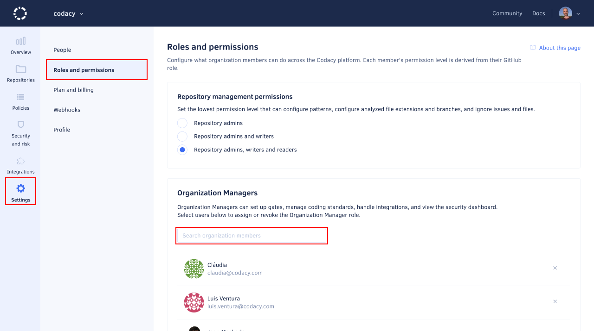

# Roles and permissions for organizations

<!-- TODO TAROT-2414 overall page review -->

Your team members have different permission levels on Codacy depending on their role on your Git provider. To change the permission level of a user on Codacy, you must adjust their role directly on your Git provider so that Codacy will use the corresponding permission level on the next time that the user logs in to Codacy.

See the Codacy permission levels that correspond to each role on your Git provider:

-   [GitHub](#permissions-for-github)
-   [GitLab](#permissions-for-gitlab)
-   [Bitbucket](#permissions-for-bitbucket)

See [managing people](managing-people.md) to list and manage the members of your Codacy organization.

## Permissions for GitHub

The table below maps the GitHub Cloud and GitHub Enterprise roles to the corresponding Codacy permission levels and the operations that they're allowed to perform:

<table>
  <thead>
    <tr>
      <th>GitHub role</th>
      <th>Outside Collaborator1</th>
      <th>Repository Read</th>
      <th>Repository Triage</th>
      <th>Repository Write</th>
      <th>Repository Maintain</th>
      <th>Repository Admin</th>
      <th>Organization Owner</th>
    </tr>
  </thead>
  <tbody>
    <tr>
      <td>Codacy permission level</td>
      <td>-</td>
      <td colspan="2">Repository Read</td>
      <td colspan="2">Repository Write</td>
      <td>Repository Admin</td>
      <td>Organization Admin</td>
    </tr>
    <tr>
      <td>Join organization</td>
      <td>No</td>
      <td colspan="2" class="yes">Yes2</td>
      <td colspan="2" class="yes">Yes2</td>
      <td class="yes">Yes2</td>
      <td class="yes">Yes2</td>
    </tr>
    <tr>
      <td>View and follow private repository</td>
      <td>No</td>
      <td colspan="2" class="yes">Yes</td>
      <td colspan="2" class="yes">Yes</td>
      <td class="yes">Yes</td>
      <td class="yes">Yes</td>
    </tr>
    <tr>
      <td>Ignore issues and files, configure code patterns and file extensions, manage branches</td>
      <td>No</td>
      <td colspan="2" class="yes"><a href="#change-analysis-configuration">Configurable</a></td>
      <td colspan="2" class="yes"><a href="#change-analysis-configuration">Configurable</a></td>
      <td class="yes">Yes</td>
      <td class="yes">Yes</td>
    </tr>
    <tr>
      <td>Upload coverage using an account API token, see the coverage report logs</td>
      <td>No</td>
      <td colspan="2">No</td>
      <td colspan="2" class="yes">Yes</td>
      <td class="yes">Yes</td>
      <td class="yes">Yes</td>
    </tr>
    <tr>
      <td>Configure repository</td>
      <td>No</td>
      <td colspan="2">No</td>
      <td colspan="2">No</td>
      <td class="yes">Yes</td>
      <td class="yes">Yes</td>
    </tr>
    <tr>
      <td>Add and remove repository</td>
      <td>No</td>
      <td colspan="2">No</td>
      <td colspan="2">No</td>
      <td class="yes">Yes3</td>
      <td class="yes">Yes</td>
    </tr>
    <tr>
      <td>Manage gate policies and coding standards, bulk copy patterns</td>
      <td>No</td>
      <td colspan="2">No</td>
      <td colspan="2">No</td>
      <td>No</td>
      <td class="yes">Yes</td>
    </tr>
    <tr>
      <td>Configure default Git provider integration settings</td>
      <td>No</td>
      <td colspan="2">No</td>
      <td colspan="2">No</td>
      <td>No</td>
      <td class="yes">Yes</td>
    </tr>
    <tr>
      <td>
        Access security and risk management, 
        assign and revoke <a href="/organizations/managing-security-and-risk/#managing-access-to-security-and-risk-management">Security Manager role</a><!-- TODO TAROT-2414 review-->
      </td>
      <td>No</td>
      <td colspan="2">No</td>
      <td colspan="2">No</td>
      <td>No</td>
      <td class="yes">Yes</td>
    </tr>
    <tr>
      <td>Invite and accept members, modify billing</td>
      <td>No</td>
      <td colspan="2">No</td>
      <td colspan="2">No</td>
      <td>No</td>
      <td class="yes">Yes</td>
    </tr>
  </tbody>
</table>

1: Outside Collaborators aren't supported as members of organizations on Codacy. You can still [add Outside Collaborators to Codacy](managing-people.md#adding-people) so that Codacy analyzes their commits to private repositories, but they won't be able to join your Codacy organization.  
2: Joining an organization may need an approval depending on your setting for [accepting new people](changing-your-plan-and-billing.md#allowing-new-people-to-join-your-organization).  
3: Requires that an Organization owner has given the Codacy GitHub App access to the repositories to add or remove.

## Permissions for GitLab

The table below maps the GitLab Cloud and GitLab Enterprise roles to the corresponding Codacy permission levels and the operations that they're allowed to perform:

<table>
  <thead>
    <tr>
      <th>GitLab role</th>
      <th>External User1</th>
      <th>Project Guest</th>
      <th>Project Reporter</th>
      <th>Project Developer</th>
      <th>Project Maintainer</th>
      <th>Project Owner</th>
      <th>Group Owner</th>
      <th>Administrator</th>
    </tr>
  </thead>
  <tbody>
    <tr>
      <td>Codacy permission level</td>
      <td>-</td>
      <td colspan="2">Repository Read</td>
      <td>Repository Write</td>
      <td colspan="2">Repository Admin</td>
      <td colspan="2">Organization Admin</td>
    </tr>
    <tr>
      <td>Join organization</td>
      <td>No</td>
      <td colspan="2" class="yes">Yes2</td>
      <td class="yes">Yes2</td>
      <td colspan="2" class="yes">Yes2</td>
      <td colspan="2" class="yes">Yes2</td>
    </tr>
    <tr>
      <td>View and follow private repository</td>
      <td>No</td>
      <td colspan="2" class="yes">Yes</td>
      <td class="yes">Yes</td>
      <td colspan="2" class="yes">Yes</td>
      <td colspan="2" class="yes">Yes</td>
    </tr>
    <tr>
      <td>Ignore issues and files, configure code patterns and file extensions, manage branches</td>
      <td>No</td>
      <td colspan="2" class="yes"><a href="#change-analysis-configuration">Configurable</a></td>
      <td class="yes"><a href="#change-analysis-configuration">Configurable</a></td>
      <td colspan="2" class="yes">Yes</td>
      <td colspan="2" class="yes">Yes</td>
    </tr>
    <tr>
      <td>Upload coverage using an account API token, see the coverage report logs</td>
      <td>No</td>
      <td colspan="2">No</td>
      <td class="yes">Yes</td>
      <td colspan="2" class="yes">Yes</td>
      <td colspan="2" class="yes">Yes</td>
    </tr>
    <tr>
      <td>Configure repository</td>
      <td>No</td>
      <td colspan="2">No</td>
      <td>No</td>
      <td colspan="2" class="yes">Yes</td>
      <td colspan="2" class="yes">Yes</td>
    </tr>
    <tr>
      <td>Add and remove repository</td>
      <td>No</td>
      <td colspan="2">No</td>
      <td>No</td>
      <td colspan="2" class="yes">Yes</td>
      <td colspan="2" class="yes">Yes</td>
    </tr>
    <tr>
      <td>Manage gate policies and coding standards, bulk copy patterns</td>
      <td>No</td>
      <td colspan="2">No</td>
      <td>No</td>
      <td colspan="2">No</td>
      <td colspan="2" class="yes">Yes</td>
    </tr>
    <tr>
      <td>Configure default settings for Git provider integration</td>
      <td>No</td>
      <td colspan="2">No</td>
      <td>No</td>
      <td colspan="2">No</td>
      <td colspan="2" class="yes">Yes</td>
    </tr>
    <tr>
      <td>
        Access security and risk management, 
        assign and revoke <a href="/organizations/managing-security-and-risk/#managing-access-to-security-and-risk-management">Security Manager role</a><!-- TODO TAROT-2414 review-->
      </td>
      <td>No</td>
      <td colspan="2">No</td>
      <td>No</td>
      <td colspan="2">No</td>
      <td colspan="2" class="yes">Yes</td>
    </tr>
    <tr>
      <td>Invite and accept members, modify billing</td>
      <td>No</td>
      <td colspan="2">No</td>
      <td>No</td>
      <td colspan="2">No</td>
      <td colspan="2" class="yes">Yes</td>
    </tr>
  </tbody>
</table>

1: External Users aren't supported as members of organizations on Codacy. You can still [add External Users to Codacy](managing-people.md#adding-people) so that Codacy analyzes their commits to private repositories, but they won't be able to join your Codacy organization.  
2: Joining an organization may need an approval depending on your setting for [accepting new people](changing-your-plan-and-billing.md#allowing-new-people-to-join-your-organization).

## Permissions for Bitbucket

The table below maps the Bitbucket Cloud and Bitbucket Server roles to the corresponding Codacy permission levels and the operations that they're allowed to perform:

<table>
  <thead>
    <tr>
      <th>Bitbucket role</th>
      <th>Read</th>
      <th>Write1</th>
      <th>Admin</th>
    </tr>
  </thead>
  <tbody>
    <tr>
      <td>Codacy permission level</td>
      <td colspan="2">Repository Read</td>
      <td>Organization Admin</td>
    </tr>
    <tr>
      <td>Join organization</td>
      <td colspan="2" class="yes">Yes2</td>
      <td class="yes">Yes2</td>
    </tr>
    <tr>
      <td>View and follow private repository</td>
      <td colspan="2" class="yes">Yes</td>
      <td class="yes">Yes</td>
    </tr>
    <tr>
      <td>Ignore issues and files, configure code patterns and file extensions, manage branches</td>
      <td colspan="2" class="yes"><a href="#change-analysis-configuration">Configurable</a></td>
      <td class="yes">Yes</td>
    </tr>
    <tr>
      <td>Upload coverage using an account API token, see the coverage report logs</td>
      <td colspan="2">No</td>
      <td class="yes">Yes</td>
    </tr>
    <tr>
      <td>Configure repository</td>
      <td colspan="2">No</td>
      <td class="yes">Yes</td>
    </tr>
    <tr>
      <td>Add and remove repository</td>
      <td colspan="2">No</td>
      <td class="yes">Yes</td>
    </tr>
    <tr>
      <td>Manage gate policies and coding standards, bulk copy patterns</td>
      <td colspan="2">No</td>
      <td class="yes">Yes</td>
    </tr>
    <tr>
      <td>Configure default settings for Git provider integration</td>
      <td colspan="2">No</td>
      <td class="yes">Yes</td>
    </tr>
    <tr>
      <td>
        Access security and risk management, 
        assign and revoke <a href="/organizations/managing-security-and-risk/#managing-access-to-security-and-risk-management">Security Manager role</a><!-- TODO TAROT-2414 review-->
      </td>
      <td colspan="2">No</td>
      <td class="yes">Yes</td>
    </tr>
    <tr>
      <td>Invite and accept members, modify billing</td>
      <td colspan="2">No</td>
      <td class="yes">Yes</td>
    </tr>
  </tbody>
</table>

1: Codacy can't distinguish the Bitbucket roles Read and Write because of a limitation on the Bitbucket API.  
2: Joining an organization may need an approval depending on your setting for [accepting new people](changing-your-plan-and-billing.md#allowing-new-people-to-join-your-organization).

## Configuring who can change the analysis configuration {: id="change-analysis-configuration"}

By default, only users with the Codacy permission level **Repository Write** can change analysis configurations.

To change this, open your organization **Settings**, page **Roles and permissions**, and define the lowest Codacy permission level required to perform the following operations on the repositories of your organization:

<!-- TODO TAROT-2414 confirm permissions-->
-   [Ignore issues](../repositories/issues.md#ignoring-and-managing-issues)
-   [Ignore files](../repositories-configure/ignoring-files.md)
-   [Configure code patterns](../repositories-configure/configuring-code-patterns.md)
-   [Configure file extensions](../repositories-configure/file-extensions.md)
-   [Manage branches](../repositories-configure/managing-branches.md)

<!-- TODO TAROT-2414 finalize screenshot -->

!!! note
    Codacy determines the permission level of each user from the role that each user has on your Git provider:

    -   [GitHub](#permissions-for-github)
    -   [GitLab](#permissions-for-gitlab)
    -   [Bitbucket](#permissions-for-bitbucket)

## Managing the Organization Manager role

<!-- TODO TAROT-2414 review intro and permissions-->
To better track and address security issues, organization admins can extend access to Security and risk management by assigning the Organization Manager role to organization members.

The Organization Manager role is independent of the Git provider role of an organization member and provides the following permissions:

| Permission                                                  | Organization Admin | Organization Manager       |
|-------------------------------------------------------------|--------------------|----------------------------|
| Access Security and risk management                         | Yes                | Yes                        |
| Access associated issues (Codacy repositories, Jira issues) | Platform-dependent | Keeps original permissions |
| Manage the Jira integration                                 | Yes                | Yes                        |
| Assign and revoke the Organization Manager role             | Yes                | No                         |
| All other Organization Admin permissions                    | Yes                | No                         |

### Assigning the Organization Manager role

To assign the Organization Manager role:

1.  Open your organization **Settings**, page **Roles and permissions**.

1.  In the **Organization Managers** area, use the search field to find the relevant user and click the user's name.

    <!-- TODO TAROT-2414 finalize screenshot -->

### Revoking the Organization Manager role

To revoke the Organization Manager role:

1.  Open your organization **Settings**, page **Roles and permissions**.

1.  In the **Organization Managers** area, scroll the list to find the relevant user.

1.  Click the **Revoke role icon** to the right of the user's name and confirm.

## See also

-   [Managing people](managing-people.md)
-   [Accepting new people to your organization](changing-your-plan-and-billing.md#allowing-new-people-to-join-your-organization)

<!-- vale off -->

