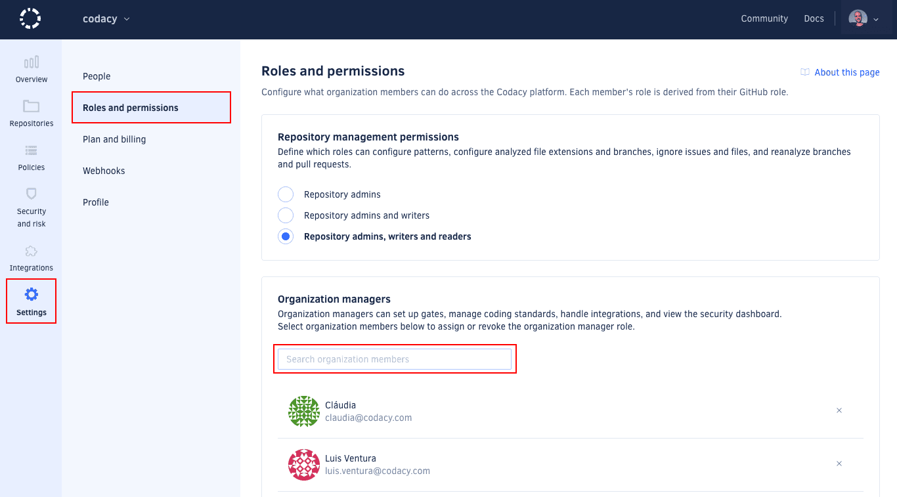

# Roles and permissions for organizations

By default, Codacy assigns each organization member a role corresponding to that member's role on your Git provider.

To update a member's role on Codacy, update that member's role directly on your Git provider. When next logging in to Codacy, the member is assigned the new role.

To review the permissions granted by each role, see the tables for each Git provider:

-   [GitHub](#permissions-for-github)
-   [GitLab](#permissions-for-gitlab)
-   [Bitbucket](#permissions-for-bitbucket)

Additionally, you can grant some administrative permissions to any organization member independently of the member's role on the Git provider, using the [organization manager](#the-organization-manager-role) role.

To list and manage the members of your Codacy organization, see the [Managing people](managing-people.md) page.

## Permissions for GitHub

The table below maps the GitHub Cloud and GitHub Enterprise roles to the corresponding Codacy roles and the operations that they're allowed to perform:

<table>
  <thead>
    <tr>
      <th>GitHub role</th>
      <th>Outside collaborator1</th>
      <th>Repository read</th>
      <th>Repository triage</th>
      <th>Repository write</th>
      <th>Repository maintain</th>
      <th>Repository admin</th>
      <th>-</th>
      <th>Organization Owner</th>
    </tr>
  </thead>
  <tbody>
    <tr>
      <td>Codacy role</td>
      <td>-</td>
      <td colspan="2">Repository read</td>
      <td colspan="2">Repository write</td>
      <td>Repository admin</td>
      <td><a href="#the-organization-manager-role">Organization manager</a></td>
      <td>Organization admin</td>
    </tr>
    <tr>
      <td>Join organization</td>
      <td class="no">No</td>
      <td colspan="2" class="yes">Yes2</td>
      <td colspan="2" class="yes">Yes2</td>
      <td class="yes">Yes2</td>
      <td class="yes">Yes</td>
      <td class="yes">Yes2</td>
    </tr>
    <tr>
      <td>View and follow private repository</td>
      <td class="no">No</td>
      <td colspan="2" class="yes">Yes</td>
      <td colspan="2" class="yes">Yes</td>
      <td class="yes">Yes</td>
      <td class="yes">Yes</td>
      <td class="yes">Yes</td>
    </tr>
    <tr>
      <td>Access Security and risk management</td>
      <td class="no">No</td>
      <td colspan="2" class="yes">Yes3</td>
      <td colspan="2" class="yes">Yes3</td>
      <td class="yes">Yes3</td>
      <td class="yes">Yes</td>
      <td class="yes">Yes</td>
    </tr>
    <tr>
      <td>Ignore issues and files, configure code patterns and file extensions, manage branches, reanalyze branches and pull requests</td>
      <td class="no">No</td>
      <td colspan="2" class="maybe"><a href="#change-analysis-configuration">Configurable</a></td>
      <td colspan="2" class="maybe"><a href="#change-analysis-configuration">Configurable</a></td>
      <td class="yes">Yes</td>
      <td class="maybe">Inherits original permission</td>
      <td class="yes">Yes</td>
    </tr>
    <tr>
      <td>Upload coverage using an account API token, see the coverage report logs</td>
      <td class="no">No</td>
      <td colspan="2" class="no">No</td>
      <td colspan="2" class="yes">Yes</td>
      <td class="yes">Yes</td>
      <td class="maybe">Inherits original permission</td>
      <td class="yes">Yes</td>
    </tr>
    <tr>
      <td>Configure repository settings</td>
      <td class="no">No</td>
      <td colspan="2" class="no">No</td>
      <td colspan="2" class="no">No</td>
      <td class="yes">Yes</td>
      <td class="maybe">Inherits original permission</td>
      <td class="yes">Yes</td>
    </tr>
    <tr>
      <td>Add and remove repository</td>
      <td class="no">No</td>
      <td colspan="2" class="no">No</td>
      <td colspan="2" class="no">No</td>
      <td class="yes">Yes4</td>
      <td class="maybe">Inherits original permission</td>
      <td class="yes">Yes</td>
    </tr>
    <tr>
      <td>Manage gate policies and coding standards, bulk copy patterns</td>
      <td class="no">No</td>
      <td colspan="2" class="no">No</td>
      <td colspan="2" class="no">No</td>
      <td class="no">No</td>
      <td class="yes">Yes</td>
      <td class="yes">Yes</td>
    </tr>
    <tr>
      <td>Configure default Git provider integration settings</td>
      <td class="no">No</td>
      <td colspan="2" class="no">No</td>
      <td colspan="2" class="no">No</td>
      <td class="no">No</td>
      <td class="yes">Yes</td>
      <td class="yes">Yes</td>
    </tr>
    <tr>
      <td>Invite and accept members, modify billing</td>
      <td class="no">No</td>
      <td colspan="2" class="no">No</td>
      <td colspan="2" class="no">No</td>
      <td class="no">No</td>
      <td class="no">No</td>
      <td class="yes">Yes</td>
    </tr>
    <tr>
      <td>Assign and revoke the organization manager role</td>
      <td class="no">No</td>
      <td colspan="2" class="no">No</td>
      <td colspan="2" class="no">No</td>
      <td class="no">No</td>
      <td class="no">No</td>
      <td class="yes">Yes</td>
    </tr>
  </tbody>
</table>

1: Outside collaborators aren't supported as members of organizations on Codacy. You can still [add outside collaborators to Codacy](managing-people.md#adding-people) so that Codacy analyzes their commits to private repositories, but they won't be able to join your Codacy organization.  
2: Joining an organization may need an approval depending on your setting for [accepting new people](changing-your-plan-and-billing.md#allowing-new-people-to-join-your-organization).  
3: These users can only see security items originating from Codacy repositories that they follow.  
4: Requires that an organization owner has given the Codacy GitHub App access to the repositories to add or remove.

## Permissions for GitLab

The table below maps the GitLab Cloud and GitLab Enterprise roles to the corresponding Codacy roles and the operations that they're allowed to perform:

<table>
  <thead>
    <tr>
      <th>GitLab role</th>
      <th>External user1</th>
      <th>Project guest</th>
      <th>Project reporter</th>
      <th>Project developer</th>
      <th>Project maintainer</th>
      <th>Project owner</th>
      <th>-</th>
      <th>Group owner</th>
      <th>Administrator</th>
    </tr>
  </thead>
  <tbody>
    <tr>
      <td>Codacy role</td>
      <td>-</td>
      <td colspan="2">Repository read</td>
      <td>Repository write</td>
      <td colspan="2">Repository admin</td>
      <td><a href="#the-organization-manager-role">Organization manager</a></td>
      <td colspan="2">Organization admin</td>
    </tr>
    <tr>
      <td>Join organization</td>
      <td class="no">No</td>
      <td colspan="2" class="yes">Yes2</td>
      <td class="yes">Yes2</td>
      <td colspan="2" class="yes">Yes2</td>
      <td class="yes">Yes</td>
      <td colspan="2" class="yes">Yes2</td>
    </tr>
    <tr>
      <td>View and follow private repository</td>
      <td class="no">No</td>
      <td colspan="2" class="yes">Yes</td>
      <td class="yes">Yes</td>
      <td colspan="2" class="yes">Yes</td>
      <td class="yes">Yes</td>
      <td colspan="2" class="yes">Yes</td>
    </tr>
    <tr>
      <td>Access Security and risk management</td>
      <td class="no">No</td>
      <td colspan="2" class="yes">Yes3</td>
      <td class="yes">Yes3</td>
      <td colspan="2" class="yes">Yes3</td>
      <td class="yes">Yes</td>
      <td colspan="2" class="yes">Yes</td>
    </tr>
    <tr>
      <td>Ignore issues and files, configure code patterns and file extensions, manage branches, reanalyze branches and pull requests</td>
      <td class="no">No</td>
      <td colspan="2" class="maybe"><a href="#change-analysis-configuration">Configurable</a></td>
      <td class="maybe"><a href="#change-analysis-configuration">Configurable</a></td>
      <td colspan="2" class="yes">Yes</td>
      <td class="maybe">Inherits original permission</td>
      <td colspan="2" class="yes">Yes</td>
    </tr>
    <tr>
      <td>Upload coverage using an account API token, see the coverage report logs</td>
      <td class="no">No</td>
      <td colspan="2" class="no">No</td>
      <td class="yes">Yes</td>
      <td colspan="2" class="yes">Yes</td>
      <td class="maybe">Inherits original permission</td>
      <td colspan="2" class="yes">Yes</td>
    </tr>
    <tr>
      <td>Configure repository settings</td>
      <td class="no">No</td>
      <td colspan="2" class="no">No</td>
      <td class="no">No</td>
      <td colspan="2" class="yes">Yes</td>
      <td class="maybe">Inherits original permission</td>
      <td colspan="2" class="yes">Yes</td>
    </tr>
    <tr>
      <td>Add and remove repository</td>
      <td class="no">No</td>
      <td colspan="2" class="no">No</td>
      <td class="no">No</td>
      <td colspan="2" class="yes">Yes</td>
      <td class="maybe">Inherits original permission</td>
      <td colspan="2" class="yes">Yes</td>
    </tr>
    <tr>
      <td>Manage gate policies and coding standards, bulk copy patterns</td>
      <td class="no">No</td>
      <td colspan="2" class="no">No</td>
      <td class="no">No</td>
      <td colspan="2" class="no">No</td>
      <td class="yes">Yes</td>
      <td colspan="2" class="yes">Yes</td>
    </tr>
    <tr>
      <td>Configure default settings for Git provider integration</td>
      <td class="no">No</td>
      <td colspan="2" class="no">No</td>
      <td class="no">No</td>
      <td colspan="2" class="no">No</td>
      <td class="yes">Yes</td>
      <td colspan="2" class="yes">Yes</td>
    </tr>
    <tr>
      <td>Invite and accept members, modify billing</td>
      <td class="no">No</td>
      <td colspan="2" class="no">No</td>
      <td class="no">No</td>
      <td colspan="2" class="no">No</td>
      <td class="no">No</td>
      <td colspan="2" class="yes">Yes</td>
    </tr>
    <tr>
      <td>Assign and revoke the organization manager role</td>
      <td class="no">No</td>
      <td colspan="2" class="no">No</td>
      <td class="no">No</td>
      <td colspan="2" class="no">No</td>
      <td class="no">No</td>
      <td colspan="2" class="yes">Yes</td>
    </tr>
  </tbody>
</table>

1: External users aren't supported as members of organizations on Codacy. You can still [add external users to Codacy](managing-people.md#adding-people) so that Codacy analyzes their commits to private repositories, but they won't be able to join your Codacy organization.  
2: Joining an organization may need an approval depending on your setting for [accepting new people](changing-your-plan-and-billing.md#allowing-new-people-to-join-your-organization).  
3: These users can only see security items originating from Codacy repositories that they follow.  

## Permissions for Bitbucket

The table below maps the Bitbucket Cloud and Bitbucket Server roles to the corresponding Codacy roles and the operations that they're allowed to perform:

<table>
  <thead>
    <tr>
      <th>Bitbucket role</th>
      <th>Read</th>
      <th>Write1</th>
      <th>-</th>
      <th>Admin</th>
    </tr>
  </thead>
  <tbody>
    <tr>
      <td>Codacy role</td>
      <td colspan="2">Repository read</td>
      <td><a href="#the-organization-manager-role">Organization manager</a></td>
      <td>Organization admin</td>
    </tr>
    <tr>
      <td>Join organization</td>
      <td colspan="2" class="yes">Yes2</td>
      <td class="yes">Yes</td>
      <td class="yes">Yes2</td>
    </tr>
    <tr>
      <td>View and follow private repository</td>
      <td colspan="2" class="yes">Yes</td>
      <td class="yes">Yes</td>
      <td class="yes">Yes</td>
    </tr>
    <tr>
      <td>Access Security and risk management</td>
      <td colspan="2" class="yes">Yes3</td>
      <td class="yes">Yes</td>
      <td class="yes">Yes</td>
    </tr>
    <tr>
      <td>Ignore issues and files, configure code patterns and file extensions, manage branches, reanalyze branches and pull requests</td>
      <td colspan="2" class="maybe"><a href="#change-analysis-configuration">Configurable</a></td>
      <td class="maybe">Inherits original permission</td>
      <td class="yes">Yes</td>
    </tr>
    <tr>
      <td>Upload coverage using an account API token, see the coverage report logs</td>
      <td colspan="2" class="no">No</td>
      <td class="maybe">Inherits original permission</td>
      <td class="yes">Yes</td>
    </tr>
    <tr>
      <td>Configure repository settings</td>
      <td colspan="2" class="no">No</td>
      <td class="maybe">Inherits original permission</td>
      <td class="yes">Yes</td>
    </tr>
    <tr>
      <td>Add and remove repository</td>
      <td colspan="2" class="no">No</td>
      <td class="maybe">Inherits original permission</td>
      <td class="yes">Yes</td>
    </tr>
    <tr>
      <td>Manage gate policies and coding standards, bulk copy patterns</td>
      <td colspan="2" class="no">No</td>
      <td class="yes">Yes</td>
      <td class="yes">Yes</td>
    </tr>
    <tr>
      <td>Configure default settings for Git provider integration</td>
      <td colspan="2" class="no">No</td>
      <td class="yes">Yes</td>
      <td class="yes">Yes</td>
    </tr>
    <tr>
      <td>Invite and accept members, modify billing</td>
      <td colspan="2" class="no">No</td>
      <td class="no">No</td>
      <td class="yes">Yes</td>
    </tr>
    <tr>
      <td>Assign and revoke the organization manager role</td>
      <td colspan="2" class="no">No</td>
      <td class="no">No</td>
      <td class="yes">Yes</td>
    </tr>
  </tbody>
</table>

1: Codacy can't distinguish the Bitbucket roles Read and Write because of a limitation on the Bitbucket API.  
2: Joining an organization may need an approval depending on your setting for [accepting new people](changing-your-plan-and-billing.md#allowing-new-people-to-join-your-organization).  
3: These users can only see security items originating from Codacy repositories that they follow.

## The organization manager role

To enable other members to manage organization settings, organization admins can share some of their permissions with any organization member using the organization manager role. This role is independent of the Git provider roles of organization members.

To review the additional permissions granted by the organization manager role, see the tables for each Git provider:

-   [GitHub](#permissions-for-github)
-   [GitLab](#permissions-for-gitlab)
-   [Bitbucket](#permissions-for-bitbucket)

!!! important
    Organization managers can access the **Policies** and **Integrations** settings sections of your organization and can therefore impact some repository settings for all repositories of your organization, even repositories that they can't access on the Git provider. However, they can't access the repositories themselves and can only see the repository names.

### Assigning the organization manager role

To assign the organization manager role:

1.  Open your organization **Settings**, page **Roles and permissions**.

1.  In the **Organization managers** area, use the search field to find the relevant organization member and click the member's name.

    !!! note
        You can only assign the organization manager role to [members of your organization](./managing-people.md#joining).

    

### Revoking the organization manager role

To revoke the organization manager role:

1.  Open your organization **Settings**, page **Roles and permissions**.

1.  In the **Organization managers** area, scroll the list to find the relevant user.

1.  Click the **Revoke role icon** to the right of the user's name and confirm.

## Configuring who can change the analysis configuration {: id="change-analysis-configuration"}

By default, only users with the Codacy role **repository write** can change analysis configurations.

To change this, open your organization **Settings**, page **Roles and permissions**, and define the lowest Codacy role required to perform the following operations on the repositories of your organization:

-   [Ignore issues](../repositories/issues.md#ignoring-and-managing-issues)
-   [Ignore files](../repositories-configure/ignoring-files.md)
-   [Configure code patterns](../repositories-configure/configuring-code-patterns.md)
-   [Configure file extensions](../repositories-configure/file-extensions.md)
-   [Manage branches](../repositories-configure/managing-branches.md)
-   [Reanalyze branches and pull requests](../faq/repositories/how-do-i-reanalyze-my-repository.md)

!!! note
    Codacy determines the role of each organization member from the role of that member on your Git provider:

    -   [GitHub](#permissions-for-github)
    -   [GitLab](#permissions-for-gitlab)
    -   [Bitbucket](#permissions-for-bitbucket)

## See also

-   [Managing people](managing-people.md)
-   [Accepting new people to your organization](changing-your-plan-and-billing.md#allowing-new-people-to-join-your-organization)

<!-- vale off -->

