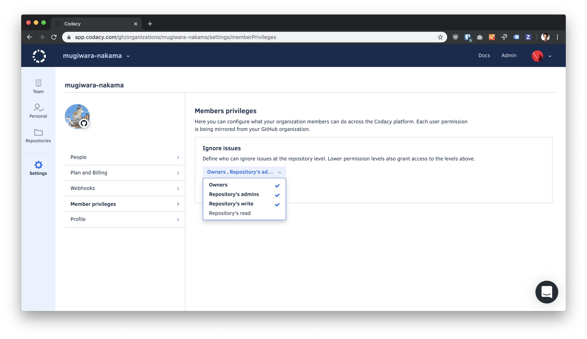

# Roles and permissions for synced organizations

Depending on your role on the Git provider you will have different permissions on Codacy:

<table>
  <thead>
    <tr>
      <th>Provider</th>
      <th>Role</th>
      <th>Join organization</th>
      <th>Ignore issues</th>
      <th>Add repository</th>
      <th>Configure repository</th>
      <th>View repository</th>
      <th>Invite and accept members</th>
      <th>Modify billing</th>
    </tr>
  </thead>
  <tbody>
    <tr>
      <td rowspan="7">GitHub Cloud and GitHub Enterprise</td>
      <td>Outside Collaborator<a href="#note-1">1</a></td>
      <td>No</td>
      <td>No</td>
      <td>No</td>
      <td>No</td>
      <td>No</td>
      <td>No</td>
      <td>No</td>
    </tr>
    <tr>
      <td>Repository Read</td>
      <td>Yes<a href="#note-2">2</a></td>
      <td><a href="#configure-ignore-issues">Configurable</a></td>
      <td>No</td>
      <td>No</td>
      <td>Yes</td>
      <td>No</td>
      <td>No</td>
    </tr>
    <tr>
      <td>Repository Triage</td>
      <td>Yes<a href="#note-2">2</a></td>
      <td><a href="#configure-ignore-issues">Configurable</a></td>
      <td>No</td>
      <td>No</td>
      <td>Yes</td>
      <td>No</td>
      <td>No</td>
    </tr>
    <tr>
      <td>Repository Write</td>
      <td>Yes<a href="#note-2">2</a></td>
      <td><a href="#configure-ignore-issues">Configurable</a></td>
      <td>No</td>
      <td>Yes</td>
      <td>Yes</td>
      <td>No</td>
      <td>No</td>
    </tr>
    <tr>
      <td>Repository Maintain</td>
      <td>Yes<a href="#note-2">2</a></td>
      <td><a href="#configure-ignore-issues">Configurable</a></td>
      <td>No</td>
      <td>Yes</td>
      <td>Yes</td>
      <td>No</td>
      <td>No</td>
    </tr>
    <tr>
      <td>Repository Admin</td>
      <td>Yes<a href="#note-2">2</a></td>
      <td><a href="#configure-ignore-issues">Configurable</a></td>
      <td>Yes</td>
      <td>Yes</td>
      <td>Yes</td>
      <td>No</td>
      <td>No</td>
    </tr>
    <tr>
      <td>Organization Owner</td>
      <td>Yes<a href="#note-2">2</a></td>
      <td>Yes</td>
      <td>Yes</td>
      <td>Yes</td>
      <td>Yes</td>
      <td>Yes</td>
      <td>Yes</td>
    </tr>
    <tr>
      <td rowspan="7">GitLab Cloud and GitLab Enterprise</td>
      <td>External User<a href="#note-1">1</a></td>
      <td>No</td>
      <td>No</td>
      <td>No</td>
      <td>No</td>
      <td>No</td>
      <td>No</td>
      <td>No</td>
    </tr>
    <tr>
      <td>Guest</td>
      <td>Yes<a href="#note-2">2</a></td>
      <td>No</td>
      <td>No</td>
      <td>No</td>
      <td>Yes</td>
      <td>No</td>
      <td>No</td>
    </tr>
    <tr>
      <td>Reporter</td>
      <td>Yes<a href="#note-2">2</a></td>
      <td>No</td>
      <td>No</td>
      <td>No</td>
      <td>Yes</td>
      <td>No</td>
      <td>No</td>
    </tr>
    <tr>
      <td>Developer</td>
      <td>Yes<a href="#note-2">2</a></td>
      <td>Yes</td>
      <td>No</td>
      <td>No</td>
      <td>Yes</td>
      <td>No</td>
      <td>No</td>
    </tr>
    <tr>
      <td>Maintainer</td>
      <td>Yes<a href="#note-2">2</a></td>
      <td>Yes</td>
      <td>No</td>
      <td>No</td>
      <td>Yes</td>
      <td>No</td>
      <td>No</td>
    </tr>
    <tr>
      <td>Owner</td>
      <td>Yes<a href="#note-2">2</a></td>
      <td>Yes</td>
      <td>Yes</td>
      <td>Yes</td>
      <td>Yes</td>
      <td>Yes</td>
      <td>Yes</td>
    </tr>
    <tr>
      <td>Administrator</td>
      <td>Yes<a href="#note-2">2</a></td>
      <td>Yes</td>
      <td>Yes</td>
      <td>Yes</td>
      <td>Yes</td>
      <td>Yes</td>
      <td>Yes</td>
    </tr>
    <tr>
      <td rowspan="2">Bitbucket Cloud and Bitbucket Server</td>
      <td>Read, Write<a href="#note-3">3</a></td>
      <td>Yes<a href="#note-2">2</a></td>
      <td>No</td>
      <td>No</td>
      <td>No</td>
      <td>Yes</td>
      <td>No</td>
      <td>No</td>
    </tr>
    <tr>
      <td>Admin</td>
      <td>Yes<a href="#note-2">2</a></td>
      <td>Yes</td>
      <td>Yes</td>
      <td>Yes</td>
      <td>Yes</td>
      <td>Yes</td>
      <td>Yes</td>
    </tr>
  </tbody>
</table>

1: Outside Collaborators and External Users aren't supported as Members of organizations on Codacy. However, you can [add them](managing-people.md#adding-people) so that Codacy analyzes their commits to private repositories. 
2: Joining an organization may need an approval depending on your setting for [accepting new people](managing-people.md#joining). 
3: Codacy can't distinguish the Bitbucket roles Read and Write because of a limitation on the Bitbucket API.

See [managing people](managing-people.md) to list and manage the members of your organization.

## Configuring who can ignore issues {: id="configure-ignore-issues"}

!!! info "Applies only to GitHub Cloud and GitHub Enterprise"

By default, only users with Admin permission on a repository can [ignore issues](../repositories/issues.md#ignoring-an-issue), but you can change this. In your Organization's settings, you can find **Members privileges** where you can define the lowest permission required to ignore issues for your organization.

Codacy doesn't allow changing the role of a user, as the roles on Codacy are mirrored from your Git provider and applied to each repository.
