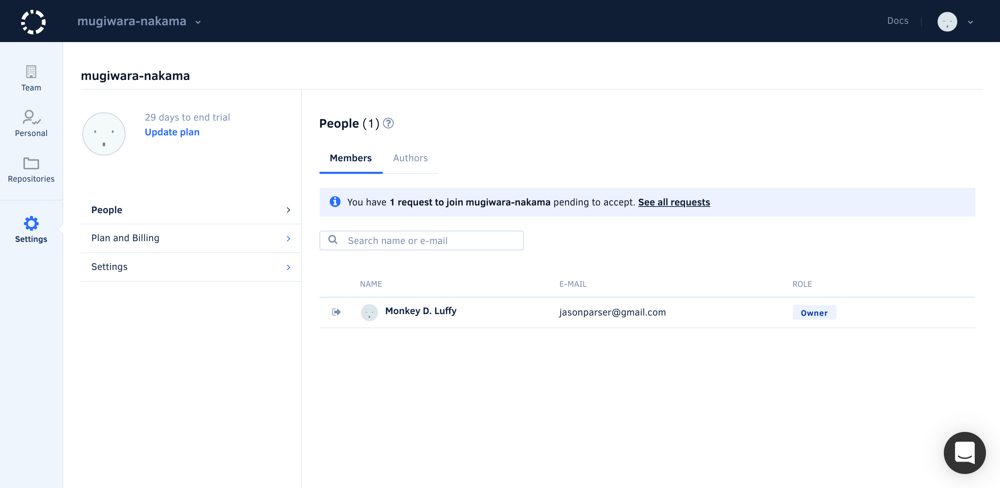

# Roles and permissions for synced organizations

Depending on your role on the Git provider you will have different permissions on Codacy:

<table>
<tbody>
<tr>
<td><strong>Provider</strong></td>
<td><strong>Role</strong></td>
<td><strong>Join organization</strong></td>
<td><strong>Ignore issues</strong></td>
<td><strong>Add repo</strong></td>
<td><strong>Configure repo</strong></td>
<td><strong>View repo</strong></td>
<td><strong>Invite and accept members</strong></td>
<td><strong>Modify billing</strong></td>
</tr>
<tr>
<td rowspan="4">

GitHub Cloud

</td>
<td>Outside Collaborator1</td>
<td>No</td>
<td>No</td>
<td>No</td>
<td>No</td>
<td>No</td>
<td>No</td>
<td>No</td>
</tr>
<tr>
<td>Member</td>
<td>Configurable2</td>
<td>No</td>
<td>No</td>
<td>No</td>
<td>Yes</td>
<td>No</td>
<td>No</td>
</tr>
<tr>
<td>Repository Admin</td>
<td>Configurable2</td>
<td>Yes</td>
<td>Yes</td>
<td>Yes</td>
<td>Yes</td>
<td>No</td>
<td>No</td>
</tr>
<tr>
<td>Owner</td>
<td>Configurable2</td>
<td>Yes</td>
<td>Yes</td>
<td>Yes</td>
<td>Yes</td>
<td>Yes</td>
<td>Yes</td>
</tr>
<tr>
<td rowspan="7">GitLab Cloud</td>
<td>External User1</td>
<td>No</td>
<td>No</td>
<td>No</td>
<td>No</td>
<td>No</td>
<td>No</td>
<td>No</td>
</tr>
<tr>
<td>Guest</td>
<td>Configurable2</td>
<td>No</td>
<td>No</td>
<td>No</td>
<td>Yes</td>
<td>No</td>
<td>No</td>
</tr>
<tr>
<td>Reporter</td>
<td>Configurable2</td>
<td>No</td>
<td>No</td>
<td>No</td>
<td>Yes</td>
<td>No</td>
<td>No</td>
</tr>
<tr>
<td>Developer</td>
<td>Configurable2</td>
<td>Yes</td>
<td>No</td>
<td>No</td>
<td>Yes</td>
<td>No</td>
<td>No</td>
</tr>
<tr>
<td>Maintainer</td>
<td>Configurable2</td>
<td>Yes</td>
<td>No</td>
<td>No</td>
<td>Yes</td>
<td>No</td>
<td>No</td>
</tr>
<tr>
<td>Owner</td>
<td>Configurable2</td>
<td>Yes</td>
<td>Yes</td>
<td>Yes</td>
<td>Yes</td>
<td>Yes</td>
<td>Yes</td>
</tr>
<tr>
<td>Administrator</td>
<td>Configurable2</td>
<td>Yes</td>
<td>Yes</td>
<td>Yes</td>
<td>Yes</td>
<td>Yes</td>
<td>Yes</td>
</tr>
<tr>
<td rowspan="4">Bitbucket Server</td>
<td>Read</td>
<td>Configurable2</td>
<td>No</td>
<td>No</td>
<td>No</td>
<td>Yes</td>
<td>No</td>
<td>No</td>
</tr>
<tr>
<td>Write</td>
<td>Configurable2</td>
<td>No</td>
<td>No</td>
<td>No</td>
<td>Yes</td>
<td>No</td>
<td>No</td>
</tr>
<tr>
<td>Admin</td>
<td>Configurable2</td>
<td>Yes</td>
<td>Yes</td>
<td>Yes</td>
<td>Yes</td>
<td>Yes</td>
<td>Yes</td>
</tr>
</tbody>
</table>

1: Outside Collaborators and External Users are not supported as Members of organizations on Codacy. However, you can [add them as Authors](adding-and-managing-authors.md) so that their commits are analyzed by Codacy.  
2: Depending on your [setting for accepting new people](/hc/en-us/articles/360010263720).

You can check who joined your organization and their role in the People page on Codacy.

💡 If you would like to analyze commits from authors that do not belong to your organization, [read more about Authors here](/hc/en-us/articles/360010922420).

Please reach out to us if you have any questions.
