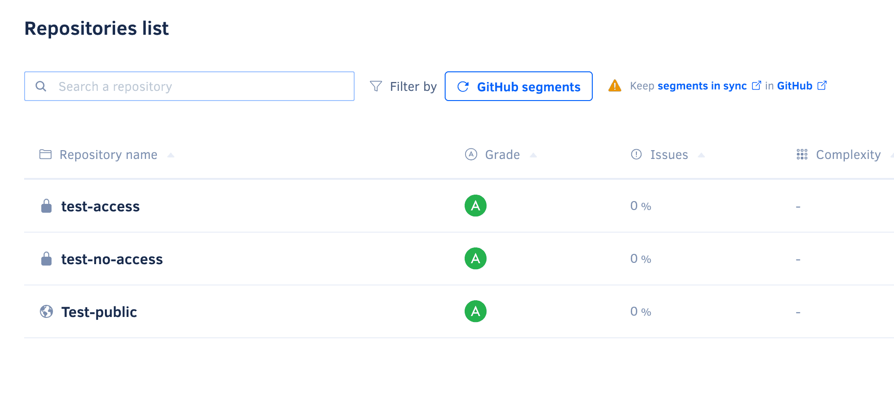
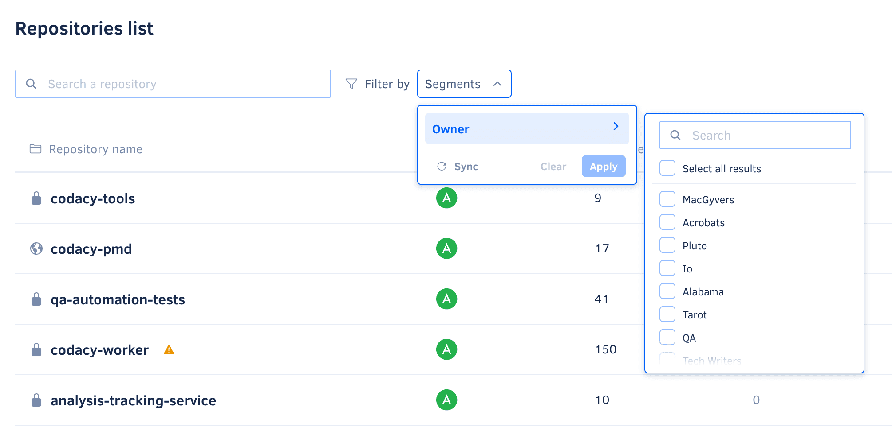

# Segments
Segments are dimensions that Codacy reads from your provider that organizes repositories into relevant groups for you. Today, Segments is available for: 
- [GitHub Custom Properties](#github-custom-properties)
- [Bitbucket Projects](#bitbucket-projects)
  

## Where can Segments be utilised?
- [Repository list](../managing-repositories/#provider-segments) 
- [Security & Management Risk](../managing-security-and-risk/)

## Enabling Segments {: id="enabling-segments"}
To enable Segments, an initial sync between your provider and Codacy needs to happen. Once completed, you can use Segments to better locate and organize repositories within Codacy.

  

### GitHub Custom Properties {: id="github-custom-properties"}
Custom properties allow you to assign tags or metadata to repositories, making it easier to categorize and filter them. Create, use, and manage custom properties for your repositories directly in GitHub. 

> Refer to [GitHub's official documentation](https://docs.github.com/en/organizations/managing-organization-settings/managing-custom-properties-for-repositories-in-your-organization#adding-custom-properties) for detailed steps on how to add, edit, and manage repository **Custom Properties**. 

#### Keep Segments in sync
For changes to repository **Custom Properties** in GitHub to be **automatically** reflected in Codacy, users need to [accept the new permission request made by the Codacy GitHub app](https://docs.github.com/en/apps/using-github-apps/approving-updated-permissions-for-a-github-app). 
!!! note
    If the permission is **not accepted**, users will still be able to use Repository Custom Properties as filters in Codacy, but will need to manually trigger a sync. This can be done using the **manual sync** button available in the filter dropdown, which allows users to synchronize changes from GitHub, though the process may take longer.

### Bitbucket Projects {: id="bitbucket-projects"}
Bitbucket Projects allow you to organize your repositories into relevant contexts for you, making it easier to categorize and filter them. Create, use, and manage Projects for your repositories directly in Bitbucket. 

> Refer to [Bitbucket's official documentation](https://support.atlassian.com/bitbucket-cloud/docs/create-a-project/) for detailed steps on how to add, edit, and manage **Projects**. 

#### Keep Segments in sync
After the first sync is done, Bitbucket Prjects will continually be in sync with Codacy automatically.

  
***
#### Check out what's new, and to come, in Codacy

  <iframe id="inlineRoadmap"
      title="Codacy Roadmap"
      width="100%"
      height="472"
    src="https://portal.productboard.com/2ng56ct2oir3adgbkvzfgqks" frameborder="0" >
  </iframe>

