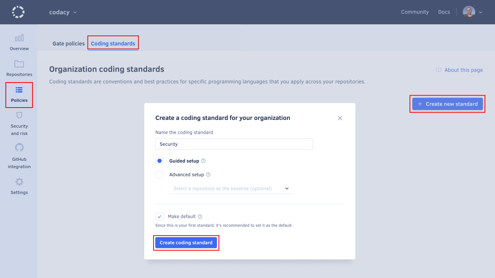
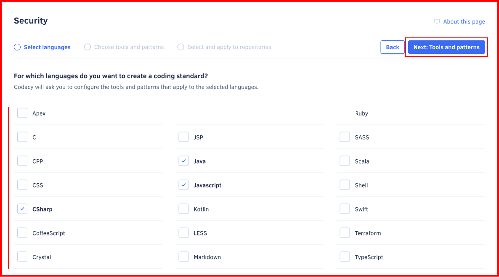
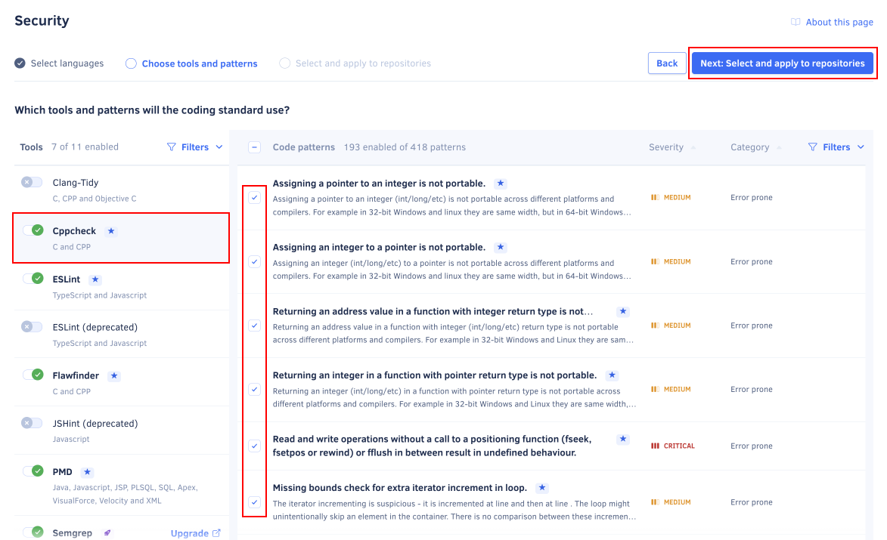
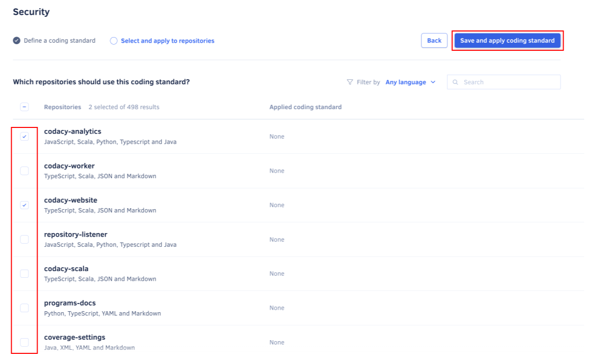
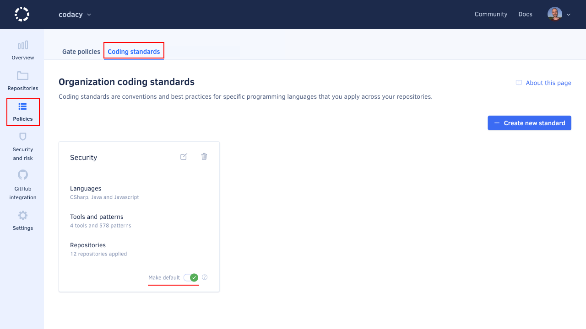
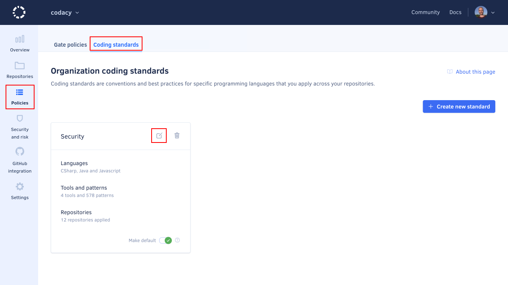
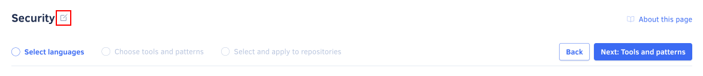

# Using a coding standard

!!! info "This is a beta feature"
    This is a new Codacy feature and we're continuing to improve it.

    For more information [read the release announcement](https://blog.codacy.com/organization-coding-standards/){: target="_blank"} or [watch a demo (3 min)](https://www.loom.com/share/19642d09662e40f2820bf2be6bdf3660){: target="_blank"} to learn how to create a coding standard for your organization.

Create a coding standard on your organization to define and apply shared tool and code pattern configurations consistently across your repositories.

You can also apply the coding standard to new repositories automatically by defining the coding standard as default.

The organization coding standard helps you ensure that Codacy analyzes multiple repositories with the same tool and code pattern settings. For example, you can use the organization coding standard to ensure that all your repositories and teams are following the same security rules or coding conventions.

When you customize the tools or code patterns of a repository that follows the coding standard, Codacy warns you that the repository will stop following the coding standard and asks for your confirmation.

## Creating a coding standard {: id="creating"}

To create a coding standard for your organization:

1.  Open your organization **Coding standards** page, tab **Coding standards**.

1.  Name your coding standard and click **Create standard**.

    Optionally, select a repository that Codacy will use as a baseline to bootstrap the tool and pattern configurations for the new coding standard. This is useful if you already have a repository with code patterns configured that you wish to use as a template for creating the coding standard.

    

1.  Select all the programming languages that the new coding standard will cover and click **Next: Tools and patterns**.

    The coding standard will only include configurations for the tools that support at least one of the selected languages.

    

1.  Configure the tools and patterns of the coding standard and click **Next: Select and apply to repositories**.

    -   Toggle the tools that Codacy will run when analyzing your code
    -   For each enabled tool, configure the code patterns that the tool will use

    You can use the filters to help you find the relevant tools and code patterns. The recommended configurations are manually curated by Codacy or based on the default code patterns of the tools and are marked with the icon .

    

1.  Select existing repositories that should follow the new coding standard and click **Save and apply standard**.

    

    Codacy will start using the new coding standard on the next analysis of each selected repository.

    

## Setting a coding standard as default {: id="set-default"}

New repositories in your organization will automatically follow the default coding standard.

To set a coding standard as default:

1.  Open your organization **Coding standards** page, tab **Coding standards**.

1.  Toggle **Make default** on the coding standard card.

    

## Editing a coding standard {: id="editing"}

To edit an existing coding standard or change the repositories that follow that coding standard:

1.  Open your organization **Coding standards** page, tab **Coding standards**.

1.  Click the edit icon on the coding standard card or, if you only want to apply an existing coding standard to a different set of repositories, click the link **Apply coding standard to your repositories** to navigate directly to the repository selection step.

    

1.  Make your changes to the current coding standard configurations and click the button **Next** to advance between the following pages:

    -   The programming languages that the coding standard applies to
    -   The tool and code pattern configurations of the coding standard
    -   The repositories that follow the coding standard

    You can also rename the coding standard using the input at the bottom of the first page of the wizard:

    

1.  Click the button **Save and apply standard** on the repository selection page to save your changes to the coding standard.

    

    Codacy will start using the updated coding standard on the next analysis of each selected repository.

!!! tip
    To ensure that all new repositories automatically follow the coding standard, [set the coding standard as default](#set-default).

## See also

-   [Copying code patterns between repositories](copying-code-patterns-between-repositories.md)
-   [Configuring code patterns on each repository](../repositories-configure/configuring-code-patterns.md)
-   [Importing pattern configurations from another repository](../repositories-configure/configuring-code-patterns.md#import-patterns)
