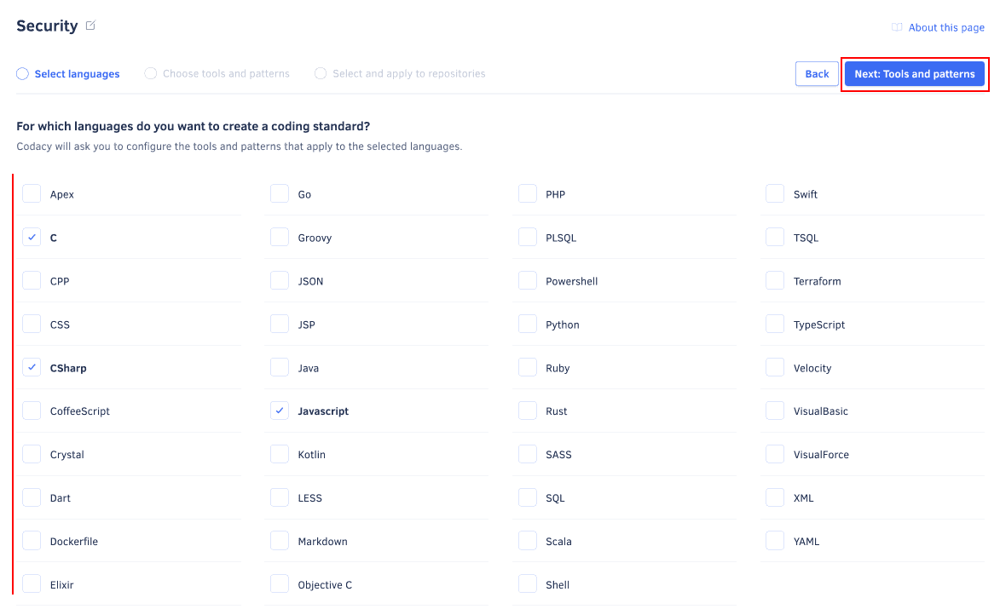
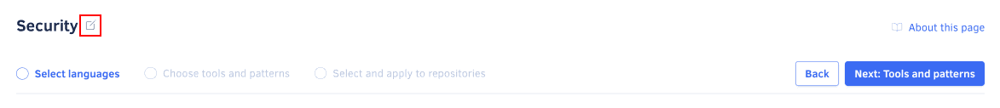

# Using coding standards

Create coding standards on your organization to define and apply shared tool and code pattern configurations consistently across your repositories. You can also apply a coding standard to new repositories automatically by [defining it as default](#set-default).

<!--TODO Refactor-->
Coding standards help you ensure that Codacy analyzes multiple repositories with the same tool and code pattern configurations. For example, you can use a coding standard to ensure that a group of repositories follow the same security rules or coding conventions.

<!--TODO Refactor-->
Applying a coding standard to a repository only affects the configurations of the tools included in the coding standard, while the remaining tool and code pattern configurations remain unchanged.

<!--TODO Refactor-->
Each repository can only follow one coding standard at a time. Applying a new coding standard to a repository unassigns any previously applied coding standard.

<!--TODO Refactor-->
When you customize the tools or code patterns of a repository that follows a coding standard, Codacy warns you that the repository will stop following the coding standard and asks for your confirmation.

<!--TODO Refactor-->
!!! important
    Coding standards turn tools with configuration files on and off. Those tool configuration files, however, take precedence over the code patterns defined on the coding standard.

## Creating a coding standard {: id="creating"}

To create a coding standard for your organization:

1.  Open your organization **Coding standards** page, tab **Coding standards**.

1.  Click the button **Create new standard** at the top right-hand corner of the page. This opens a window with the coding standard creation form.

    !!! note
        Codacy currently supports up to 10 coding standards per organization.

1.  Enter a unique name and click **Create standard**.

    Optionally, select a repository for Codacy to use as a baseline when bootstrapping the tool and pattern configurations for the new coding standard. This is useful if you already have a configured repository that you wish to use as a template.

    

1.  Select the programming languages that the new coding standard should cover and click **Next: Tools and patterns**.

    The coding standard will only include configurations for the tools that support at least one of the selected languages.

    

1.  Configure the tools and patterns of the coding standard and click **Next: Select and apply to repositories**.

    -   Toggle the tools to run when Codacy analyzes your code
    -   For each enabled tool, configure the code patterns to use

    !!! tip
        -   Use the filters to find the relevant tools and code patterns. The recommended configurations are manually curated by Codacy or based on tool defaults and are marked with the icon .
        -   To toggle multiple code patterns at once, click the checkbox of the first pattern and **Shift+click** the checkbox of the last pattern in a range.
        -   To toggle all the code patterns visible on the list, click the checkbox on the header of the code patterns list. If there are more code patterns to load on the list, you can click the link **Enable/Disable all &lt;N&gt; patterns** to toggle all patterns matching the current filters.

    

1.  Select existing repositories that should follow the new coding standard and click **Save and apply standard**.

    Codacy will start using the new coding standard on the next analysis of each selected repository.

    

## Setting a coding standard as default {: id="set-default"}

New repositories in your organization automatically follow the default coding standard, or the Codacy default configurations if no default coding standard is set.

To set a coding standard as default:

1.  Open your organization **Coding standards** page, tab **Coding standards**.

1.  Toggle **Make default** on the relevant coding standard card.

    !!! note
        Only one coding standard at a time can be the default coding standard.

    

## Editing a coding standard {: id="editing"}

To edit an existing coding standard or change the repositories that follow that coding standard:

1.  Open your organization **Coding standards** page, tab **Coding standards**.

1.  Click the edit icon on the coding standard card.

    

1.  Edit the current coding standard configurations and click the button **Next** to advance between the following pages:

    -   The programming languages that the coding standard applies to
    -   The tool and code pattern configurations of the coding standard
    -   The repositories that follow the coding standard

    You can also rename the coding standard using the input at the bottom of the first page of the wizard:

    

1.  Click the button **Save and apply standard** on the repository selection page to save your changes to the coding standard.

    <!--TODO Refactor-->
    !!! important
        If you stop applying a coding standard to any repository, Codacy restores the previous code pattern configurations for that repository.

    Codacy will start using the updated coding standard on the next analysis of each selected repository.

## Deleting a coding standard {: id="deleting"}

To delete a coding standard:

1.  Open your organization **Coding standards** page, tab **Coding standards**.

1.  Click the trash can icon on the coding standard card and confirm.

    

## See also

-   [Copying code patterns between repositories](copying-code-patterns-between-repositories.md)
-   [Importing pattern configurations from another repository](../repositories-configure/configuring-code-patterns.md#import-patterns)
-   [Configuring code patterns on each repository](../repositories-configure/configuring-code-patterns.md)
-   [How to implement Google JavaScript style guide with Codacy](https://blog.codacy.com/implement-google-javascript-style-guide-with-codacy/)
