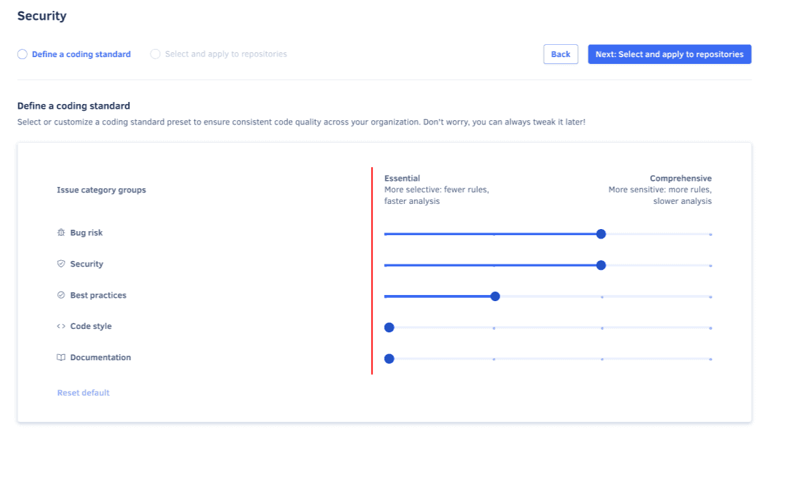
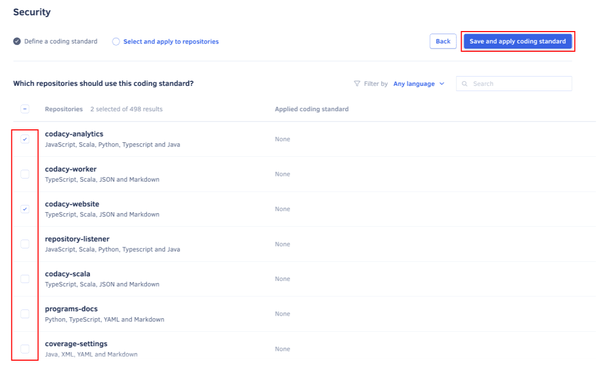

# Using coding standards

Coding standards enable the analysis of multiple repositories with the same tool and code pattern configurations, ensuring consistent code quality across your organization. Multiple coding standards can be applied to the same repository. For example, you can use coding standards to ensure that a group of repositories follow the same security rules or coding conventions.

This page covers the following topics:

-   [Creating a coding standard](#creating)
-   [Configuring a coding standard (guided setup)](#guided-setup)
-   [Configuring a coding standard (advanced setup)](#advanced-settings)
-   [Defining default coding standards](#set-default)
-   [Editing a coding standard](#editing)
-   [Deleting a coding standard](#deleting)
-   [Using a coding standard alongside tool configuration files](#using-with-tool-configuration)
-   [Using a coding standard alongside repository-level customizations](#using-with-repository-configuration)
-   [Using multiple coding standards](#using-multiple)

## Creating a coding standard {: id="creating"}

!!! note
    Codacy currently supports up to 10 coding standards per organization.

To create a coding standard for your organization:

1.  Open your organization **Policies** page, tab **Coding standards**.

1.  Click the button **Create new standard** at the top right-hand corner of the page. This opens the coding standard creation form.

1.  Enter a unique name for the new coding standard.

    Optionally, check **Apply to new repositories** to set the new coding standard as one of your organization's [default coding standards](#set-default), so it applies automatically to new repositories.

1.  Choose whether to create the coding standard using a guided or advanced setup:

    -   The **guided setup** lets you choose preset sensitivity levels for each issue type, turning on relevant patterns in bulk. It's ideal for quickly setting up a coding standard with minimal effort. You can always fine-tune the coding standard by editing it later using the advanced setup.

    -   The **advanced setup** lets you choose individual languages and code patterns to activate. It's ideal for fine-tuning the coding standard to your organization's specific needs, offering more control over the tools and code patterns used.
    
        With the advanced setup, you can optionally **select a repository as the baseline** for the new coding standard. This is useful if you already have a well-configured repository that you wish to use as a template.

    

1.  Click **Create coding standard** to proceed to the [guided setup](#guided-setup) or [advanced setup](#advanced-settings), depending on your choice.

## Configuring a coding standard (guided setup) {: id="guided-setup"}

If you selected **Guided setup** when [creating a new coding standard](#creating), follow these steps:

1.  Adjust the sensitivity of the coding standard from **Essential** to **Comprehensive** for each issue category group:

    -   **Essential**: Focuses on the most important issues by including the most critical code patterns. Ideal for initial integration, to prevent overwhelming developers, and to speed up analysis times.
    -   **Comprehensive**: Detects all issues by including all code patterns, capturing the complete severity spectrum. Ideal for detailed code quality reviews, while reducing emphasis on critical issues. It may increase analysis times.

    !!! tip
        Initially, set the sensitivity to **Essential** for most category groups to focus on critical code patterns. It helps streamline the integration process with Codacy without overwhelming developers with too many reported issues. You can gradually include more patterns as needed.

    

1.  Click **Next: Select and apply to repositories**.

1.  Select existing repositories that should follow the new coding standard and click **Save and apply coding standard**.

    Codacy will start using the new coding standard on the next analysis of each selected repository.

    

## Configuring a coding standard (advanced setup) {: id="advanced-settings"}

If you selected **Advanced setup** when [creating a new coding standard](#creating) or are editing an existing coding standard, follow these steps:

1.  Select the programming languages that the new coding standard should include.

    !!! important
        The coding standard will only control tools that can analyze one or more of the languages selected in this step.

        If a language is omitted in this step, Codacy uses repository-level tool configurations if present or global Codacy defaults otherwise, and may analyze the omitted language. To prevent this:

        1. In this step select all languages, so that the coding standard controls all tools.

        1. In the next step, explicitly disable the tools that you don't want to use.

    

1.  Click **Next: Tools and patterns**.

1.  Configure the tools and patterns of the coding standard:

    -   Toggle the tools to run when Codacy analyzes your code.
    -   For each enabled tool, configure the code patterns to use.
    -   You can also use the **Discover patterns** option to find patterns across all tools.

    !!! tip
        -   Use the filters to find the relevant tools and code patterns. The recommended configurations are manually curated by Codacy or based on tool defaults and are marked with the icon .
        -   To toggle multiple code patterns at once, click the checkbox of the first pattern and **Shift+click** the checkbox of the last pattern in a range.
        -   To toggle all the code patterns visible on the list, click the checkbox on the header of the code patterns list. If there are more code patterns to load on the list, you can click the link **Enable/Disable all &lt;N&gt; patterns** to toggle all patterns matching the current filters.

    

1.  Proceed with the remaining wizard steps to finish [creating](#creating) or [editing](#editing) your coding standard.

## Defining default coding standards {: id="set-default"}

For ease of management, you can define multiple default coding standards that automatically apply to new repositories. In the absence of default coding standards, Codacy applies global defaults to all new repositories.

!!! note
    When Codacy introduces new tools, those are automatically added to the global Codacy defaults but need to be manually added to a default coding standard.

You can mark a new coding standard as default when [creating](#creating) one.

To mark an existing coding standard as default:

1.  Open your organization **Policies** page, tab **Coding standards**.

1.  Toggle **Apply to new repositories** on the relevant coding standard card.

    

## Editing a coding standard {: id="editing"}

!!! note
    Any edits to the configurations of a coding standard are automatically applied on the next analysis of each associated repository.

To edit an existing coding standard or change the repositories that follow that coding standard:

1.  Open your organization **Policies** page, tab **Coding standards**.

1.  Click the edit icon on the coding standard card.

    

1.  Edit the current coding standard configurations and click the button **Next** to advance to the following [configuration pages](#advanced-settings):

    !!! note
        When editing an existing coding standard, the [advanced setup](#advanced-settings) is the default view.

    -   **Select languages**: the programming languages that the coding standard applies to.

        On this page, you can rename the coding standard by clicking the edit icon next to the name of the coding standard.

        

    -   **Choose tools and patterns**: the tool and code pattern configurations of the coding standard.
    -   **Select and apply to repositories**: the repositories that follow the coding standard.

1.  Click the button **Save and apply coding standard** on the repository selection page to save your changes to the coding standard.

    Codacy will start using the updated coding standard on the next analysis of each selected repository.

## Deleting a coding standard {: id="deleting"}

To delete a coding standard:

1.  Open your organization **Policies** page, tab **Coding standards**.

1.  Click the trash can icon on the coding standard card and confirm.

    

## Using a coding standard alongside tool configuration files {: id="using-with-tool-configuration"}

When using a [tool configuration file](../repositories-configure/configuring-code-patterns.md#using-your-own-tool-configuration-files) alongside a coding standard, the configuration file controls the code patterns, while the coding standard controls whether the tool is enabled or disabled.

## Using a coding standard alongside repository-level customizations {: id="using-with-repository-configuration"}

Tools and patterns enabled by a coding standard are enforced and cannot be disabled at the repository level. You can add extra tools and patterns, if these are not already enabled by any applied coding standard.

## Using multiple coding standards {: id="using-multiple"}

When Codacy analyzes your code using multiple coding standards, it merges the tools and patterns from each standard. Enabled tools and patterns in any applied standard will be enforced.

When building your coding standards, think about the structure you'd like to apply, not only for you, but the rest of your team. You can structure standards by frameworks, languages, teams, ....

!!! important
    If the same pattern appears in multiple standards, the version from the most recently created and applied standard (with its parameters) takes precedence.

## See also

-   [Configuring code patterns on each repository](../repositories-configure/configuring-code-patterns.md)
-   [How to implement Google JavaScript style guide with Codacy](https://blog.codacy.com/implement-google-javascript-style-guide-with-codacy/)
