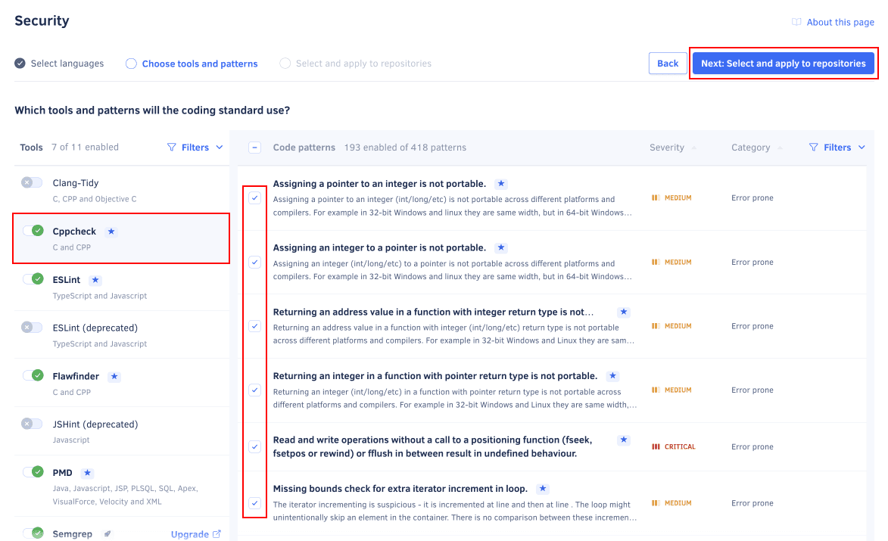

# Using coding standards

<!--TODO

Concept:
-   Intro (also use as meta description)
-   Overview and value of the feature
-   How coding standards work, warning about repositories stopping to follow the coding standard
-   Default coding standard

-->

## Creating a coding standard {: id="creating"}

<!--TODO

-   Isn't it possible to configure the coding standard as the default while creating it?

-->

Organizations on Codacy can have one coding standard. To create a coding standard for your organization:

1.  Open your organization **Coding standards** page, tab **Coding standards**.

1.  Enter the name of the coding standard and click **Create standard**.

    Optionally, select a repository that Codacy will use as a baseline to bootstrap the tool and pattern configurations for the new coding standard. This is useful if you already have a repository with code patterns configured and that you wish to use as a template for the coding standard.

    

1.  Select all the programming languages that the new coding standard will cover and click **Next: Tools and patterns**.

    The coding standard will only include configurations for the tools that support at least one of the selected languages.

    

1.  Configure the tools and patterns of the coding standard and click **Next: Select and apply to repositories**.

    For each tool:

    -   Toggle if Codacy will run the tool when analyzing your code
    -   Configure the code patterns that the tool will use

    You can use the filters to help you find the relevant tools and code patterns.

    

1.  Select existing repositories that should follow the new coding standard and click **Save and apply standard**.

    Codacy will use the new coding standard when analyzing the next commit on each selected repository.

    

## Editing a coding standard {: id="editing"}

<!--TODO

Editing a coding standard (include applying to other repositories)
-   Not possible to delete a coding standard once it's created?

-->

To edit an existing coding standard or change the repositories that follow that coding standard:

1.  Open your organization **Coding standards** page, tab **Coding standards**.

1.  Click the edit icon on the coding standard card.

    

1.  Follow the same steps as when [creating the coding standard](#creating) to update:

    -   The programming languages that the coding standard covers
    -   The tools and patterns of the coding standard
    -   The repositories that follow the coding standard

1.  Click the button **Save and apply standard** on the repository selection screen to save your changes to the coding standard.

    Codacy will use the updated coding standard when analyzing the next commit on each selected repository.

Optionally, you can configure new repositories in your organization to follow the coding standard by default:

