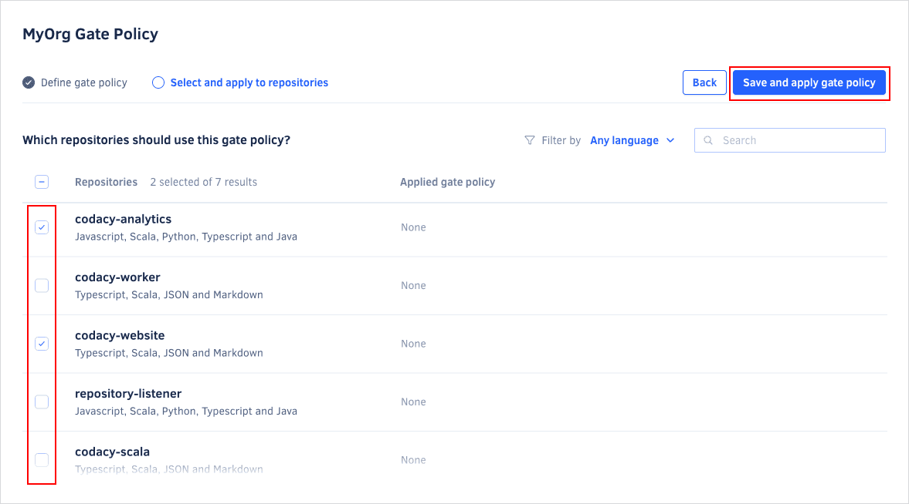

# Using gate policies

Gate policies help you ensure that Codacy uses the same [quality gates](../repositories-configure/adjusting-quality-gates.md) across your organization repositories.

Codacy provides a built-in gate policy, **Codacy Gate Policy**, which sets minimum quality levels for pull requests and commits. By default, Codacy applies this gate policy automatically to newly added repositories. You can then create new gate policies with different quality gates and make them the default for your organization.

## Creating a new gate policy {: id="creating"}

To create a new gate policy for your organization:

1.  Open your organization **Policies** page, tab **Gate policies**.

1.  Click the button **Create new gate policy** at the top right-hand corner of the page. This opens a window with the gate policy creation form.

1.  Enter a unique name and click **Create gate policy**.

    

1.  Set the values for the quality gates and click **Next: Select and apply to repositories**.

    

1.  Select existing repositories that should follow the gate policy and click **Save and apply gate policy**.

    Codacy will start using the new gate policy on the next analysis of each selected repository.

    

## Setting a gate policy as default {: id="set-default"}

To set a gate policy as default:

1.  Open your organization **Policies** page, tab **Gate policies**.

1.  Toggle **Make default** on the relevant gate policy card.

    !!! note
        Only one gate policy at a time can be the default gate policy.

    

    Codacy will start applying the default gate policy to newly added repositories.

## Editing a gate policy {: id="editing"}

To edit the quality gates of an existing gate policy or change the repositories that follow that gate policy:

1.  Open your organization **Policies** page, tab **Gate policies**.

1.  Click the edit icon on the gate policy card.

    

1.  Edit the current quality gate values and click the button **Next: Select and apply to repositories**.

    !!! note
        You can't change the quality gate values of the built-in **Codacy Gate Policy**.

1.  Edit the list of repositories that follow the gate policy.

1.  Click the button **Save and apply gate policy** to save your changes to the gate policy.

    Codacy will start using the updated gate policy on the next analysis of each selected repository.

If you stop applying a gate policy to a repository, Codacy restores the previous quality gates of that repository.

## Deleting a gate policy {: id="deleting"}

!!! note
    You can't delete the built-in **Codacy Gate Policy**.

To delete an organization gate policy:

1.  Open your organization **Policies** page, tab **Gate policies**.

1.  Click the trash can icon on the gate policy card and confirm.

    

When you delete a gate policy:

-   Codacy restores the previous quality gates of each repository following that gate policy.

-   If the deleted gate policy was the default for your organization, Codacy makes the built-in **Codacy Gate Policy** the default.
