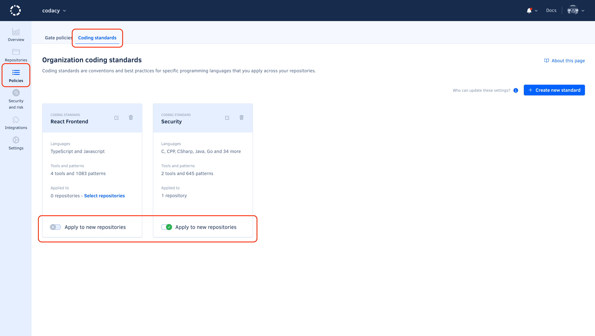

# Using gate policies

<!--TODO PLUTO-505 Complete content-->
Gate policies..

## Creating a new gate policy {: id="creating"}

To create a new gate policy for your organization:

1.  Open your organization **Policies** page, tab **Gate policies**.

1.  ..

## Setting a gate policy as default {: id="set-default"}

To set a gate policy as default:

1.  Open your organization **Policies** page, tab **Gate policies**.

1.  Toggle **Make default** on the relevant gate policy card.

    !!! note
        Only one gate policy at a time can be the default gate policy.

    

## Editing a gate policy {: id="editing"}

To edit an existing gate policy or change the repositories that follow that gate policy:

1.  ..

## Deleting a gate policy {: id="deleting"}

To delete a gate policy:

1.  Open your organization **Policies** page, tab **Gate policies**.

1.  Click the trash can icon on the gate policy card and confirm.

## See also

-   [Adjusting quality gates](../repositories-configure/adjusting-quality-gates.md)
