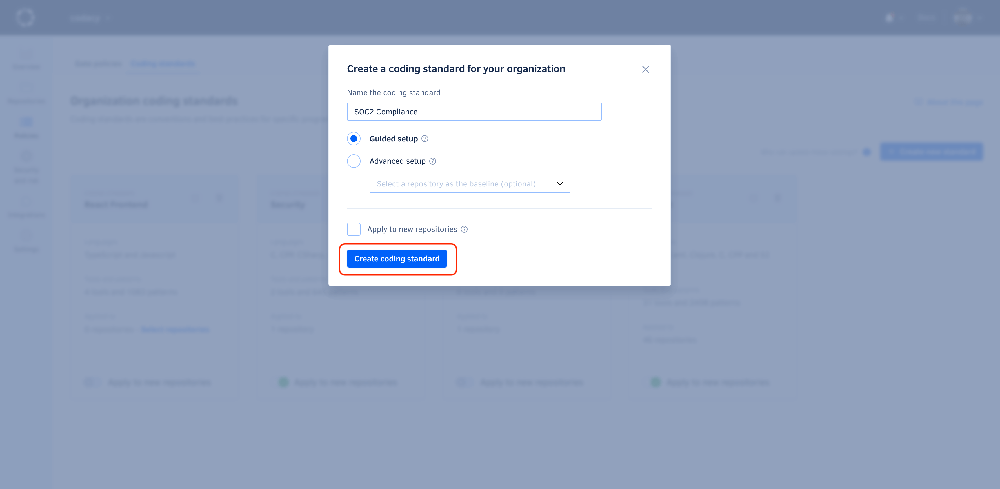

# Using gate policies

<!--TODO PLUTO-505 Complete content-->
Gate policies help you ensure that Codacy uses the same quality gates across your organization repositories.

Codacy provides a built-in gate policy, **Codacy gate policy**, with the default quality gates that define when your pull requests and commits meet the minimum quality levels.

Codacy applies **Codacy gate policy** to newly added repositories (REVIEW, you can set other new gate policy as default). You can then create new gate policies to define different values for your organization quality gates.

## Creating a new gate policy {: id="creating"}

To create a new gate policy for your organization:

1.  Open your organization **Policies** page, tab **Gate policies**.

1.  Click the button **Create new gate policy** at the top right-hand corner of the page. This opens a window with the gate policy creation form.

1.  Enter a unique name and click **Create gate policy**.

    

1.  Set the values for the quality gates and click **Next: Select and apply to repositories**.

1.  Select existing repositories that should follow the gate policy and click **Save and apply gate policy**.

    Codacy will start using the new gate policy on the next analysis of each selected repository.

    

## Setting a gate policy as default {: id="set-default"}

The built-in **Codacy gate policy** is primarily the default gate policy. However, when you create additional gate policies for your organization, you can set another gate policy as the default. When you add new repositories to Codacy, the default gate policy is automatically applied.

To set a gate policy as default:

1.  Open your organization **Policies** page, tab **Gate policies**.

1.  Toggle **Make default** on the relevant gate policy card.

    !!! note
        Only one gate policy at a time can be the default gate policy.

    

## Editing a gate policy {: id="editing"}

To edit an existing gate policy or change the repositories that follow that gate policy:

1.  Open your organization **Policies** page, tab **Gate policies**.

## Deleting a gate policy {: id="deleting"}

To delete a gate policy:

1.  Open your organization **Policies** page, tab **Gate policies**.

1.  Click the trash can icon on the gate policy card and confirm.

## See also

-   [Adjusting quality gates](../repositories-configure/adjusting-quality-gates.md)
